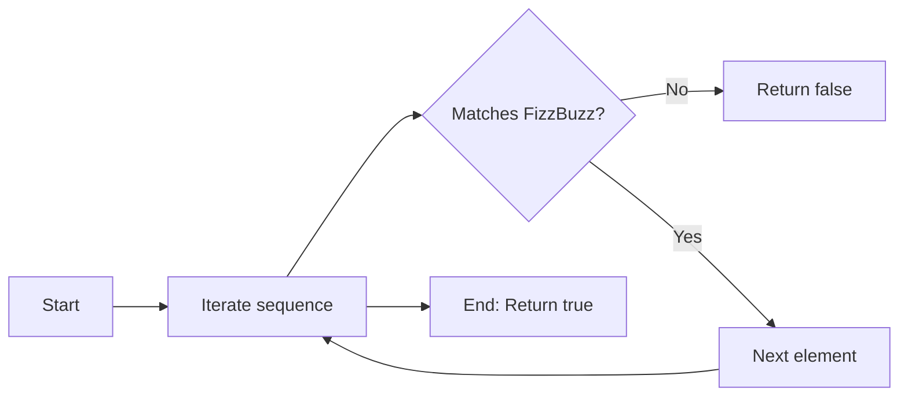

## Introduction

Today's problem is a variant of the classic "FizzBuzz" challenge, which happened to be yesterday's daily problem. In this new task, we must check if a given array strictly follows the FizzBuzz rules from 1 up to the last element.

## Problem Statement

Given an array, determine if it is a valid Fizz Buzz sequence from 1 to the last number in the array. The rules are:

- If the number is divisible by 3, it must be replaced by 'Fizz'.
- If the number is divisible by 5, it must be replaced by 'Buzz'.
- If the number is divisible by both 3 and 5, it must be replaced by 'FizzBuzz'.
- All other numbers must appear as integers in ascending order, starting from 1.
- The sequence must start at 1 and have no missing or extra elements.

**Example of a valid sequence:**

```js
[1, 2, 'Fizz', 4, 'Buzz', 'Fizz', 7, 8, 'Fizz', 'Buzz', 11, 'Fizz', 13, 14, 'FizzBuzz']
```

## Approach & Analysis

The key to solving this problem is to compare each element of the array with the expected value according to its position. For each index, we calculate the corresponding number (index + 1) and determine what should appear in that position based on the FizzBuzz rules.

### Test Cases Considered

- Valid sequence: `[1, 2, 'Fizz', 4, 'Buzz', 'Fizz', 7, 8, 'Fizz', 'Buzz', 11, 'Fizz', 13, 14, 'FizzBuzz']`
- Invalid sequence (No Fizz): `[1, 2, 3, 4]`
- Invalid sequence (Missing element): `[1, 2, 'Fizz', 4, 'Buzz', 7]`
- Invalid sequence (final element incorrect): `[1, 2, 'Fizz', 4, 'Buzz', 'Fizz', 7, 8, 'Fizz', 'Buzz', 11, 'Fizz', 13, 'FizzBuzz', 16]`
- Empty sequence: `[]`
- Single element sequence: `[1]`
- Single invalid element: `['Fizz']`

## Solution Implemented

The algorithm defines a variable num and a variable expected. num is set as index + 1, and expected is the value for multiples of 3 and 5 according to the FizzBuzz rules. Then it iterates through the sequence, and for each position calculates the expected value. If any discrepancy is found, it returns `false`. If everything matches, it returns `true`.

```javascript
function isFizzBuzz(sequence) {
  for (let i = 0; i < sequence.length; i++) {
    const num = i + 1
    let expected

    if (num % 3 === 0 && num % 5 === 0) {
      expected = 'FizzBuzz'
    }
    else if (num % 3 === 0) {
      expected = 'Fizz'
    }
    else if (num % 5 === 0) {
      expected = 'Buzz'
    }
    else {
      expected = num
    }

    if (sequence[i] !== expected) {
      return false
    }
  }
  return true
}
```

### Complexity

- **Time:** $O(n)$, where $n$ is the length of the sequence.
- **Space:** $O(1)$, constant memory usage.

## Algorithm Visualization



## Resources

- [Fizz Buzz on Wikipedia](https://en.wikipedia.org/wiki/Fizz_buzz)
