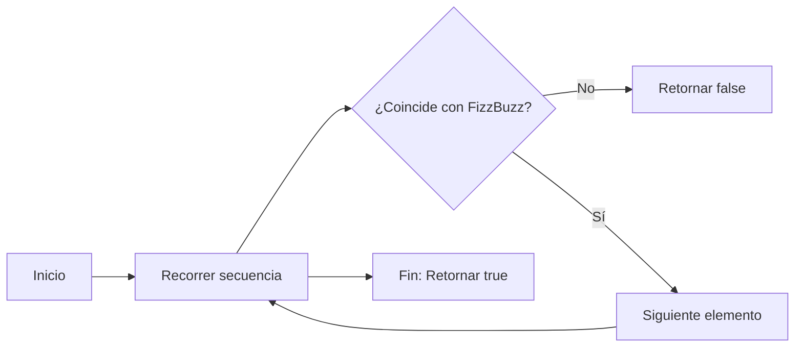

## Introducción

El problema de hoy es una variante del problema "FizzBuzz", que casualmente fue el problea del dia de ayer. En este nuevo desafio debemos chequear que un Array dado sigue exactamente las reglas de FizzBuzz desde el 1 hasta el último elemento.

## Enunciado del Problema

Dado un array, determina si es una cadena válida de Fizz Buzz desde el 1 hasta el último número del array. Las reglas son:

- Si el número es divisible por 3, debe ser reemplazado por 'Fizz'.
- Si el número es divisible por 5, debe ser reemplazado por 'Buzz'.
- Si el número es divisible por ambos 3 y 5, debe ser reemplazado por 'FizzBuzz'.
- Los demás números deben aparecer como enteros en orden ascendente, comenzando desde 1.
- La secuencia debe comenzar en 1 y no debe tener elementos faltantes o adicionales.

**Ejemplo de secuencia válida:**

```js
[1, 2, 'Fizz', 4, 'Buzz', 'Fizz', 7, 8, 'Fizz', 'Buzz', 11, 'Fizz', 13, 14, 'FizzBuzz']
```

## Enfoque y Análisis

La clave para resolver este problema es comparar cada elemento del arreglo con el valor esperado según su posición. Para cada índice, calculamos el número correspondiente (índice + 1) y determinamos qué debería aparecer en esa posición según las reglas de FizzBuzz.

### Casos de Prueba Considerados

- Secuencia válida: `[1, 2, 'Fizz', 4, 'Buzz', 'Fizz', 7, 8, 'Fizz', 'Buzz', 11, 'Fizz', 13, 14, 'FizzBuzz']`
- Secuencia inválida (No hay Fizz): `[1, 2, 3, 4]`
- Secuencia inválida (Se saltea un elemento ): `[1, 2, 'Fizz', 4, 'Buzz', 7]`
- Secuencia inválida (elemento final no corresponde): `[1, 2, 'Fizz', 4, 'Buzz', 'Fizz', 7, 8, 'Fizz', 'Buzz', 11, 'Fizz', 13, 'FizzBuzz', 16]`
- Secuencia vacía: `[]`
- Secuencia con un solo elemento: `[1]`
- Secuencia con un solo elemento inválido: `['Fizz']`

## Solución Implementada

El algoritmo define una variable num y una variable expected, num se define como el índice + 1 y expected como el valor esperado para multiplos de 3 y 5 según las reglas de FizzBuzz. Luego recorre la secuencia y para cada posición calcula el valor esperado. Si encuentra alguna discrepancia, retorna `false`. Si todo coincide, retorna `true`.

```javascript
function isFizzBuzz(sequence) {
  for (let i = 0; i < sequence.length; i++) {
    const num = i + 1
    let expected

    if (num % 3 === 0 && num % 5 === 0) {
      expected = 'FizzBuzz'
    }
    else if (num % 3 === 0) {
      expected = 'Fizz'
    }
    else if (num % 5 === 0) {
      expected = 'Buzz'
    }
    else {
      expected = num
    }

    if (sequence[i] !== expected) {
      return false
    }
  }
  return true
}
```

### Complejidad

- **Tiempo:** $O(n)$, donde $n$ es la longitud de la secuencia.
- **Espacio:** $O(1)$, uso constante de memoria.

## Visualización del Algoritmo



## Recursos

- [Fizz Buzz en Wikipedia](https://en.wikipedia.org/wiki/Fizz_buzz)
