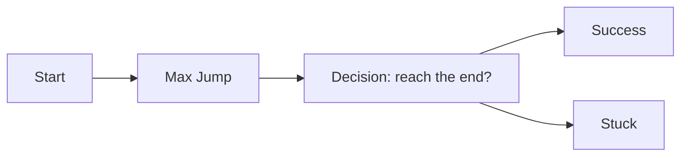
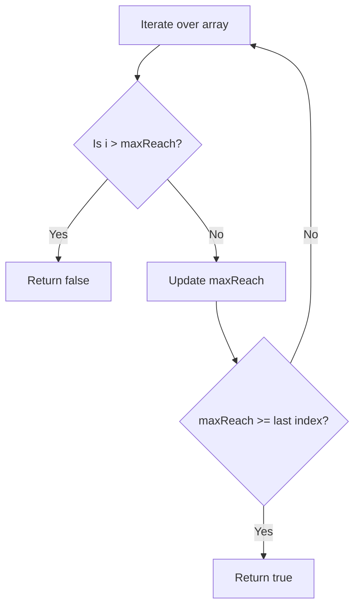
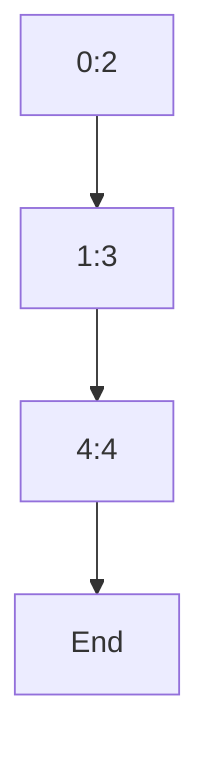

## Jump Game

## Introduction

The "Jump Game" problem challenges us to traverse an array by making variable-length jumps to reach the end. It's a great opportunity to use a greedy algorithm and learn how to apply it effectively.

## Problem Statement

Given an array of integers `nums`, each element represents the maximum distance you can jump from that position. You start at the first index, and your goal is to determine if you can reach the last index.

**Example 1:**

- Input: `[2,3,1,1,4]`
- Output: `true`
- Explanation: Jump from 0 to 1 (2 steps), then from 1 to 4 (3 steps).

**Example 2:**

- Input: `[3,2,1,0,4]`
- Output: `false`
- Explanation: You get stuck at index 3, since its jump is 0.

**Constraints:**

- $1 \leq \text{nums.length} \leq 10^4$
- $0 \leq \text{nums}[i] \leq 10^5$

## Problem Visualization

Let's visualize the decision process as a flowchart:



## Approach & Analysis

### Initial Observations

- Each position gives you a jump range.
- If at any point you can't move forward, the game ends.
- The challenge is to decide if there is a sequence of jumps that gets you to the end.

### Greedy Strategy

The key is to **maximize your reach** at every step. You don't need to check all possible paths; just keep moving as far as you can in each iteration.

**Core idea:**
Keep a variable `maxReach` that indicates the farthest index you can reach. If the current index exceeds `maxReach`, you are stuck.

### Decision Diagram



## Step-by-Step Implementation

```typescript
function canJump(nums: number[]): boolean {
  let maxReach = 0
  const n = nums.length

  for (let i = 0; i < n; i++) {
    if (i > maxReach) {
      return false
    }
    maxReach = Math.max(maxReach, i + nums[i])
    if (maxReach >= n - 1) {
      return true
    }
  }

  return false
}
```

### Code Explanation

- **maxReach**: The farthest index you can reach so far.
- **For loop**: Iterates through each position in the array.
- **Condition `i > maxReach`**: If you reach a position you can't access, return `false`.
- **Update maxReach**: Always take the maximum between the current reach and the new possible jump.
- **Success condition**: If at any point `maxReach` reaches or exceeds the last index, return `true`.

## Complexity Analysis

- **Time**: $O(n)$, where $n$ is the length of the array.
- **Space**: $O(1)$, only auxiliary variables are used.

## Visual Execution

Suppose `nums = [2,3,1,1,4]`:



- From index 0 you can jump up to 2.
- From index 1 you can jump up to 4 (the end).

## Reflections & Lessons Learned

The key is to identify the **invariant**: always move as far as possible and quickly detect if you get stuck. In this case, the invariant is that `maxReach` must always be greater than or equal to the current index to continue.

## Resources & References

- [Greedy Algorithms - GeeksforGeeks](https://www.geeksforgeeks.org/greedy-algorithms/)
