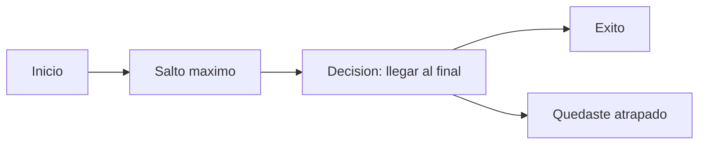
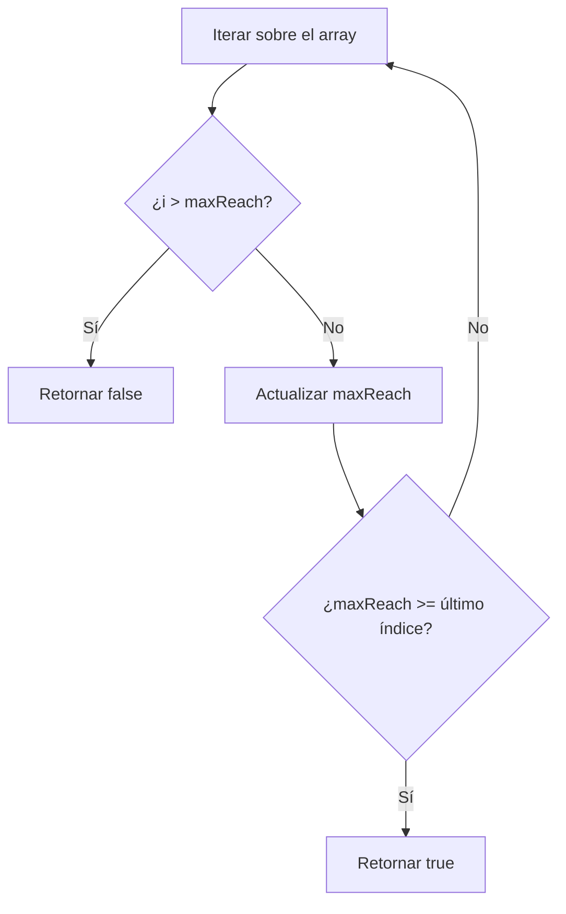
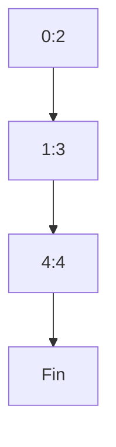

## Jump Game

## Introducción

El problema "Jump Game" nos obliga a pensar en cómo avanzar por un array usando saltos de longitud variable hasta  llegar al final. Es una buena oportunidad para usar un algoritmo greedy y aprender como aplicarlo.

## Enunciado del Problema

Dado un array de enteros `nums`, cada elemento representa la máxima distancia que puedes saltar desde esa posición. Comienzas en el primer índice y tu objetivo es determinar si puedes llegar al último índice.

**Ejemplo 1:**

- Entrada: `[2,3,1,1,4]`
- Salida: `true`
- Explicación: Salta de 0 a 1 (2 pasos), luego de 1 a 4 (3 pasos).

**Ejemplo 2:**

- Entrada: `[3,2,1,0,4]`
- Salida: `false`
- Explicación: Quedas atrapado en el índice 3, ya que su salto es 0.

**Restricciones:**

- $1 \leq \text{nums.length} \leq 10^4$
- $0 \leq \text{nums}[i] \leq 10^5$

## Visualización del Problema

Visualicemos el proceso de decisión como un diagrama de flujo:



## Enfoque y Análisis

### Observaciones Iniciales

- Cada posición te da un rango de salto.
- Si en algún punto no puedes avanzar, el juego termina.
- El reto es decidir si existe una secuencia de saltos que te lleve al final.

### Estrategia Greedy

La clave está en **maximizar el alcance** en cada paso. No es necesario calcular todos los caminos posibles; basta con avanzar lo más lejos posible en cada iteración.

**Idea central:**
Mantén una variable `maxReach` que indique el índice más lejano que puedes alcanzar. Si el índice actual supera `maxReach`, significa que te has quedado atrapado.

### Diagrama de Decisión



## Implementación Paso a Paso

```typescript
function canJump(nums: number[]): boolean {
  let maxReach = 0
  const n = nums.length

  for (let i = 0; i < n; i++) {
    if (i > maxReach) {
      return false
    }
    maxReach = Math.max(maxReach, i + nums[i])
    if (maxReach >= n - 1) {
      return true
    }
  }

  return false
}
```

### Explicación del Código

- **maxReach**: El índice más lejano que puedes alcanzar hasta el momento.
- **Bucle for**: Recorre cada posición del array.
- **Condición `i > maxReach`**: Si llegas a una posición que no puedes alcanzar, retornas `false`.
- **Actualización de maxReach**: Siempre tomas el máximo entre el alcance actual y el nuevo posible salto.
- **Condición de éxito**: Si en algún momento `maxReach` alcanza o supera el último índice, retornas `true`.

## Análisis de Complejidad

- **Tiempo**: $O(n)$, donde $n$ es la longitud del array.
- **Espacio**: $O(1)$, solo se usan variables auxiliares.

## Ejecución Visual

Supongamos `nums = [2,3,1,1,4]`:



- Desde el índice 0 puedes saltar hasta el 2.
- Desde el índice 1 puedes saltar hasta el 4 (final).

## Reflexiones y Aprendizajes

 La clave está en identificar la **invariante**: siempre avanzar lo más lejos posible y detectar rápidamente si quedas atrapado. En este caso la invariante es que `maxReach` siempre debe ser mayor o igual al índice actual para poder continuar.

## Recursos y Referencias

- [Greedy Algorithms - GeeksforGeeks](https://www.geeksforgeeks.org/greedy-algorithms/)
