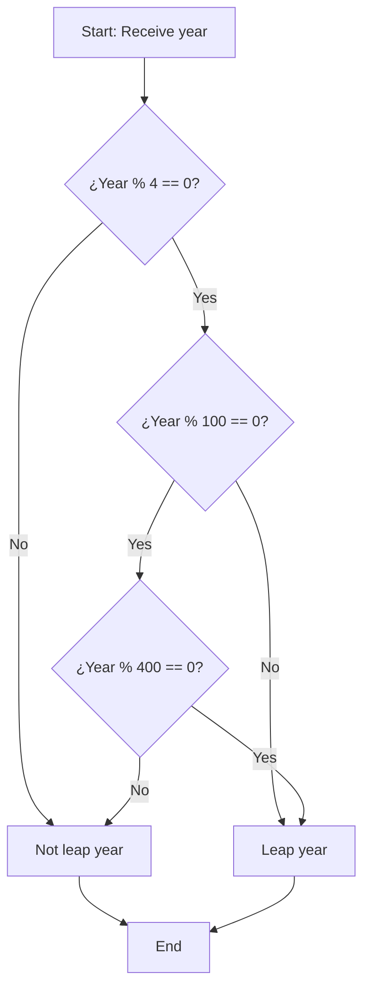

## Introduction

In this post, we solve the "Leap Year Calculator" challenge from FreeCodeCamp's #147 Daily Challenge. The problem involves determining if a given year is a leap year, applying the rules of the Gregorian calendar. We will explore the analysis, JavaScript implementation, and complexity analysis, with examples and diagrams to clarify the process.

## Problem Statement

Given a year (represented as an integer), determine if it is a leap year.

A year is a leap year if it satisfies the following conditions:

- It is divisible by 4.
- However, if the year is divisible by 100, it is not a leap year,
- Unless it is also divisible by 400.

## Initial Analysis

### Understanding the Problem

The problem requires a function that takes a year as input and returns `true` if it is a leap year, `false` otherwise. The Gregorian calendar rules are clear: most years divisible by 4 are leap years, but there are exceptions to maintain astronomical accuracy.

This involves modulo operations to check divisibility, combined with conditional logic. It is an ideal problem to practice arithmetic and boolean operators in JavaScript.

### Identified Test Cases

To validate the solution, we consider these key cases:

1. **Year divisible by 4 but not by 100**: Leap year (e.g., 2024, 2028).
2. **Year divisible by 100 but not by 400**: Not a leap year (e.g., 1900, 2100).
3. **Year divisible by 400**: Leap year (e.g., 2000, 2400).
4. **Year not divisible by 4**: Not a leap year (e.g., 2023, 2025).
5. **Edge cases**: Years like 0, negative years (we assume positive years, but could add validation).

These cases cover all logical branches.

### Logic Diagram

To visualize the decision, we use a flowchart:



This diagram shows the step-by-step decision flow.

## Solution Development

### Chosen Approach

We opt for a concise logical expression that combines the conditions directly. This is efficient and readable, avoiding unnecessary nested structures.

Alternatives:

- **Nested if-else**: More explicit, but more code.
- **Helper function**: For large years, but unnecessary here.

## Implementation

Here is the complete function in JavaScript, with explanatory comments:

```javascript
function isLeapYear(year) {
  return (year % 4 === 0 && year % 100 !== 0) || year % 400 === 0
}
```

This implementation is clear and covers all cases. The concise version is more compact, but the detailed one helps beginners.

### Edge Cases

Let's test with examples:

- `isLeapYear(2024)` → `true` (divisible by 4, not by 100)
- `isLeapYear(1900)` → `false` (divisible by 100, not by 400)
- `isLeapYear(2000)` → `true` (divisible by 400)
- `isLeapYear(2023)` → `false` (not divisible by 4)

For invalid years (e.g., negative), we could add: `if (year < 0) return false;`, but the problem assumes positive years.

## Complexity Analysis

### Time Complexity

O(1): Constant modulo and comparison operations, regardless of the year.

### Space Complexity

O(1): No additional memory.

## Resources and References

- [Leap year rules on Wikipedia](https://en.wikipedia.org/wiki/Leap_year)
- [FreeCodeCamp: Leap Year Calculator](https://www.freecodecamp.org/learn/daily-coding-challenge/2026-01-04/)
- Related algorithms: Date validation, calendar calculations.
