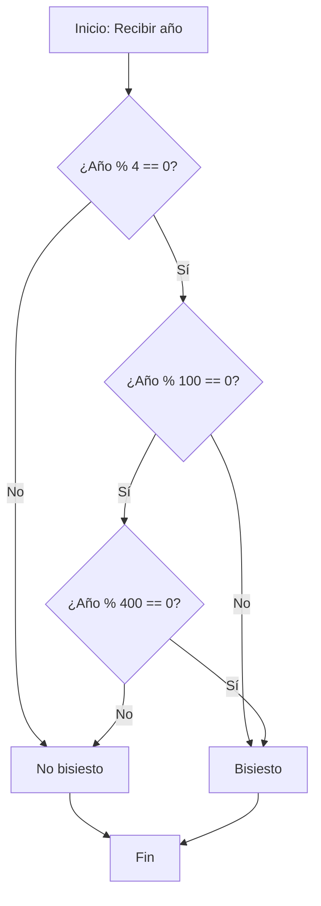

## Introducción

En este post, resolvemos el desafío "Leap Year Calculator" del #147 Daily Challenge de FreeCodeCamp. El problema consiste en determinar si un año dado es bisiesto, aplicando las reglas del calendario gregoriano. Exploraremos el análisis, la implementación en JavaScript y un análisis de complejidad, con ejemplos y diagramas para clarificar el proceso.

## Enunciado del Problema

Dado un año (representado como un número entero), determina si es un año bisiesto.

Un año es bisiesto si satisface las siguientes condiciones:

- Es divisible por 4.
- Sin embargo, si el año es divisible por 100, no es un año bisiesto,
- A menos que también sea divisible por 400.

## Análisis Inicial

### Comprensión del Problema

El problema requiere una función que tome un año como entrada y devuelva `true` si es bisiesto, `false` en caso contrario. Las reglas del calendario gregoriano son claras: la mayoría de los años divisibles por 4 son bisiestos, pero hay excepciones para mantener la precisión astronómica.

Esto implica operaciones de módulo para verificar divisibilidad, combinadas con lógica condicional. Es un problema ideal para practicar operadores aritméticos y booleanos en JavaScript.

### Casos de Prueba Identificados

Para validar la solución, consideramos estos casos clave:

1. **Año divisible por 4 pero no por 100**: Bisiesto (ej. 2024, 2028).
2. **Año divisible por 100 pero no por 400**: No bisiesto (ej. 1900, 2100).
3. **Año divisible por 400**: Bisiesto (ej. 2000, 2400).
4. **Año no divisible por 4**: No bisiesto (ej. 2023, 2025).
5. **Casos edge**: Años como 0, años negativos (asumimos años positivos, pero podríamos agregar validación).

Estos casos cubren todas las ramas lógicas.

### Diagrama de Lógica

Para visualizar la decisión, usamos un diagrama de flujo:



Este diagrama muestra el flujo de decisiones paso a paso.

## Desarrollo de la Solución

### Enfoque Elegido

Optamos por una expresión lógica concisa que combina las condiciones directamente. Esto es eficiente y legible, evitando estructuras anidadas innecesarias.

Alternativas:

- **If-else anidados**: Más explícito, pero más código.
- **Función auxiliar**: Para años grandes, pero innecesario aquí.

## Implementación

Aquí está la función completa en JavaScript, con comentarios explicativos:

```javascript
function isLeapYear(year) {
  return (year % 4 === 0 && year % 100 !== 0) || year % 400 === 0
}
```

Esta implementación es clara y cubre todos los casos. La versión concisa es más compacta, pero la detallada ayuda a principiantes.

### Casos Edge

Probemos con ejemplos:

- `isLeapYear(2024)` → `true` (divisible por 4, no por 100)
- `isLeapYear(1900)` → `false` (divisible por 100, no por 400)
- `isLeapYear(2000)` → `true` (divisible por 400)
- `isLeapYear(2023)` → `false` (no divisible por 4)

Para años inválidos (ej. negativos), podríamos agregar: `if (year < 0) return false;`, pero el problema asume positivos.

## Análisis de Complejidad

### Complejidad Temporal

O(1): Operaciones constantes de módulo y comparación, independientemente del año.

### Complejidad Espacial

O(1): Sin memoria adicional.

## Recursos y Referencias

- [Reglas de años bisiestos en Wikipedia](https://es.wikipedia.org/wiki/A%C3%B1o_bisiesto)
- [FreeCodeCamp: Leap Year Calculator](https://www.freecodecamp.org/learn/daily-coding-challenge/2026-01-04/)
- Algoritmos relacionados: Validación de fechas, cálculos de calendario.
