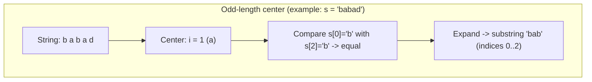
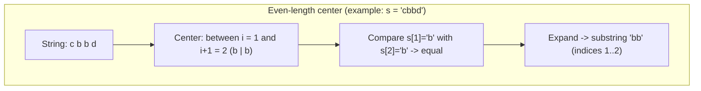

## Longest Palindromic Substring — Analysis and Explanation

## Problem Statement

Given a string `s`, return the longest palindromic substring in `s`. (A substring is palindromic if it reads the same forwards and backwards.)

## Initial Analysis

### Understanding the Problem

We need to find palindromes within a string and determine which one is the longest.

### Example 1

- **Input:** s = "babad"
- **Output:** "bab"
- **Note:** "aba" is also a valid answer.

### Example 2

- **Input:** s = "cbbd"
- **Output:** "bb"

### Constraints

- `1 <= s.length <= 1000`
- `s` consists only of letters and digits (upper and lower case).

**Hint 1:** How can you reuse a palindrome that was already computed to compute a longer one?
**Hint 2:** If "aba" is a palindrome, is "xabax" a palindrome? How about "xabay"?
**Hint 3 (complexity):** If we brute-force all start-end pairs we have $O(n^2)$ pairs and each palindrome check is $O(n)$. Can we reduce palindrome checks to $O(1)$ by reusing previous work?

### Identified Test Cases

- Case A — Odd-length central palindrome:

```js
// Input
s = 'babad'
// Expected output (one valid answer): "bab" or "aba"
```

- Case B — Even-length central palindrome:

```js
// Input
s = 'cbbd'
// Expected output: "bb"
```

- Case C — All characters equal:

```js
// Input
s = 'aaaa'
// Expected output: "aaaa" (the whole string)
```

- Case D — No long palindromes (only single chars):

```js
// Input
s = 'abcde'
// Expected output: any single character, e.g., "a" (length 1)
```

- Case E — Palindrome at the edges:

```js
// Input
s = 'racecarxyz'
// Expected output: "racecar"
```

- Case F — Short strings / boundaries:

```js
// Input
s = 'a' // minimum length
// Expected output: "a"

// Input
s = 'ab' // no palindromes of length > 1
// Expected output: "a" or "b"
```

Notes on test cases:
- They cover both even and odd palindromes.
- Include palindromes occupying the whole string and palindromes at the edges.
- Include trivial cases (length 1) and homogeneous strings to validate optimal behavior.

## Solution Development

### Chosen Approach

The straightforward approach is **expand around center**: for each character in the string, expand to both sides to find the longest palindrome with that character (or pair of characters) as the center.

### Step-by-step Implementation

1. **Expansion function:** Create a helper function that takes an index (or two for even-length cases) and expands while characters match.
2. **Iterate over the string:** For each index, call the expansion helper twice (odd center and even center).
3. **Track the maximum:** Keep the longest palindrome found during expansions.
4. **Return the result:** Finally, return the substring corresponding to the longest palindrome.

#### Explanatory diagrams





> Note: For each index `i` we try **two** expansions: one with center at `i` (odd-length) and one between `i` and `i+1` (even-length). Expansion compares equidistant characters and stops when they differ.

#### Full Code

```typescript
/**
 * LeetCode Problem: Longest Palindromic Substring
 * Difficulty: Medium
 * Topics: strings, two-pointers, expand-around-center
 *
 * Given a string s, return the longest palindromic substring in s.
 * A substring is palindromic if it reads the same forwards and backwards.
 *
 * Example:
 *   Input: "babad"
 *   Output: "bab" (or "aba", both are valid)
 *
 * Constraints:
 *   - 1 <= s.length <= 1000
 *   - s consists of letters and/or digits (upper and lower case)
 *
 * @param {string} s - Input string where we search for the longest palindrome.
 * @returns {string} The longest palindromic substring found in s.
 */
export function longestPalindromic(s: string): string {
  let maxPalindrome = ''

  // Helper that expands from the center and returns the longest palindrome found
  function expandAroundCenter(left: number, right: number): string {
    while (left >= 0 && right < s.length && s[left] === s[right]) {
      left--
      right++
    }
    return s.slice(left + 1, right)
  }

  for (let i = 0; i < s.length; i++) {
    // Odd-length palindrome (center at i)
    const palindrome1 = expandAroundCenter(i, i)
    // Even-length palindrome (center between i and i+1)
    const palindrome2 = expandAroundCenter(i, i + 1)

    // Choose the longer of the two
    const longerPalindrome = palindrome1.length > palindrome2.length ? palindrome1 : palindrome2

    // Update the maximum if needed
    if (longerPalindrome.length > maxPalindrome.length) {
      maxPalindrome = longerPalindrome
    }
  }

  return maxPalindrome
}
```

## Complexity Analysis

### Time Complexity

The algorithm runs in $O(n^2)$ time in the worst case, where $n$ is the length of the string. For each of the $n$ centers we may expand up to $n$ characters. For practical limits (n <= 1000) this is efficient enough.

### Space Complexity

Space complexity is $O(1)$ aside from the output string, since we only use fixed-size variables while scanning.

## Edge Cases & Considerations

- **Minimum length (n=1):** Return the single character.
- **No long palindromes:** At least one character is returned (length 1).
- **Homogeneous strings:** e.g., "aaaa" returns the whole string.
- **Palindromes at edges:** e.g., "racecarxyz" returns "racecar".
- **Case sensitivity:** Problem states letters and digits; the implementation treats 'A' and 'a' as different characters which matches the constraints.

## Reflections & Learnings

### Applied Concepts

- **Two-pointers:** Expansion uses two pointers moving symmetrically from the center.
- **Expand around center:** Efficient technique to avoid unnecessary checks.
- **Systematic iteration:** Trying both odd and even centers guarantees correctness.

### Possible Optimizations

- **Manacher's algorithm:** A linear-time algorithm ($O(n)$) using an array of palindrome radii. More complex to implement but optimal.
- **DP approach:** A dynamic programming table is possible ($O(n^2)$ time and space), but it uses more memory.

## Resources & References

- [LeetCode Problem](https://leetcode.com/problems/longest-palindromic-substring/description/)
- [Blog Post](https://blog-astro-rouge.vercel.app/posts/longest-palindromic-substring/)
- Related algorithm: Manacher's algorithm for linear-time palindromes.
