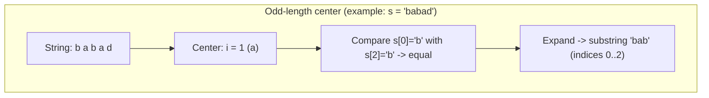
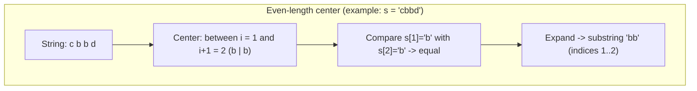

## Subcadena Palindrómica Más Larga — Análisis y explicación

## Enunciado del Problema

Dado un string `s`, retorna la subcadena palindrómica más larga dentro de `s`. (Una subcadena es palindrómica si se lee igual de izquierda a derecha que de derecha a izquierda).

## Análisis Inicial

### Comprensión del Problema

El problema nos pide encontrar palíndromos dentro de un string y determinar cuál es el más largo.

### Ejemplo 1

- **Input:** s = "babad"
- **Output:** "bab"
- **Explicación:** "aba" también es una respuesta válida.

### Ejemplo 2

- **Input:** s = "cbbd"
- **Output:** "bb"

### Restricciones

- `1 <= s.length <= 1000`
- `s` consiste solo de dígitos y letras (mayúsculas y minúsculas).

**Pista 1:** Como se puede reusar un palindromo ya calculado para calcular uno mas largo?
**Pista 2:** Si "aba" es un palindromo, "xabax" lo es? y "xabay" ?
**Pista 3:** Pista basada en la complejidad:
Si usamos fuerza bruta y comprobamos si para cada par inicio‑fin un substring es palíndromo, tenemos $O(n^2)$ pares inicio‑fin y comprobaciones de palíndromo de $O(n)$. ¿Podemos reducir el tiempo de comprobación de palíndromos a $O(1)$ reutilizando algún cálculo previo?

### Casos de Prueba Identificados

A continuación se describen los casos relevantes que cubren escenarios típicos y bordes:

- Caso A — Palíndromo central impar:

```js
// Entrada
s = 'babad'
// Salida esperada (una de las válidas): "bab" o "aba"
```

- Caso B — Palíndromo central par:

```js
// Entrada
s = 'cbbd'
// Salida esperada: "bb"
```

- Caso C — Todos caracteres iguales:

```js
// Entrada
s = 'aaaa'
// Salida esperada: "aaaa" (todo el string)
```

- Caso D — No hay palíndromos largos (solo individuales):

```js
// Entrada
s = 'abcde'
// Salida esperada: cualquiera de los caracteres individuales, p. ej. "a" (longitud 1)
```

- Caso E — Palíndromo en los extremos:

```js
// Entrada
s = 'racecarxyz'
// Salida esperada: "racecar"
```

- Caso F — Cadena corta / límites:

```js
// Entrada
s = 'a' // longitud mínima
// Salida esperada: "a"

// Entrada
s = 'ab' // sin palíndromo de longitud > 1
// Salida esperada: "a" o "b"
```

Notas sobre los casos de prueba:

- Cubren palíndromos de longitud par e impar.
- Incluyen palíndromos que ocupan todo el string y palíndromos localizados en los extremos.
- Incluyen casos triviales (longitud 1) y cadenas homogéneas para validar comportamiento óptimo.

## Desarrollo de la Solución

### Enfoque Elegido

La primera intuición es usar el enfoque de **expansión desde el centro**: para cada carácter en el string intentamos expandir hacia ambos lados para encontrar el palíndromo más largo posible con ese carácter (o par de caracteres) como centro.

### Implementación Paso a Paso

1. **Función de Expansión:** Crear una función auxiliar que tome un índice (o dos para el caso par) y expanda hacia ambos lados mientras los caracteres coincidan.
2. **Iterar sobre el String:** Para cada índice en el string, llamar a la función de expansión dos veces (una para palíndromos impares y otra para pares).
3. **Actualizar el Máximo:** Mantener un registro del palíndromo más largo encontrado durante las expansiones.
4. **Retornar el Resultado:** Al final, retornar el substring correspondiente al palíndromo más largo.

#### Diagramas explicativos





> Nota: En la práctica, para cada índice `i` probamos **dos** expansiones: una considerando `i` como centro (palíndromo impar) y otra considerando el centro entre `i` e `i+1` (palíndromo par). La expansión compara pares de caracteres equidistantes alrededor del centro y se detiene cuando dejan de coincidir.
#### Código Completo

```typescript
/**
 * LeetCode Problem: Longest Palindromic Substring
 * Dificultad: Medium
 * Temas: strings, two-pointers, expansión desde el centro
 *
 * Dado un string s, retorna la subcadena palindrómica más larga dentro de s.
 * Una subcadena es palíndroma si se lee igual de izquierda a derecha que de derecha a izquierda.
 *
 * Ejemplo:
 *   Input: "babad"
 *   Output: "bab" (o "aba", ambas son válidas)
 *
 * Restricciones:
 *   - 1 <= s.length <= 1000
 *   - s consiste solo de letras y/o dígitos (mayúsculas y minúsculas)
 *
 * @param {string} s - Cadena de entrada sobre la que se busca el palíndromo más largo.
 * @returns {string} La subcadena palindrómica más larga encontrada en s.
 */
export function longestPalindromic(s: string): string {
  let maxPalindrome = ''

  // Función auxiliar que expande desde el centro y retorna el palíndromo más largo encontrado
  function expandAroundCenter(left: number, right: number): string {
    while (left >= 0 && right < s.length && s[left] === s[right]) {
      left--
      right++
    }
    return s.slice(left + 1, right)
  }

  for (let i = 0; i < s.length; i++) {
    // Palíndromo impar (centro en i)
    const palindrome1 = expandAroundCenter(i, i)
    // Palíndromo par (centro entre i y i+1)
    const palindrome2 = expandAroundCenter(i, i + 1)

    // Elegimos el más largo de los dos
    const longerPalindrome
      = palindrome1.length > palindrome2.length ? palindrome1 : palindrome2

    // Si es más largo que el máximo actual, lo actualizamos
    if (longerPalindrome.length > maxPalindrome.length) {
      maxPalindrome = longerPalindrome
    }
  }

  return maxPalindrome
}
```

## Análisis de Complejidad

### Complejidad Temporal

El algoritmo tiene una complejidad temporal de $O(n^2)$, donde $n$ es la longitud del string. Esto se debe a que para cada uno de los $n$ índices realizamos expansiones que, en el peor caso, pueden recorrer hasta $n$ caracteres hacia la izquierda y la derecha. Aunque en la práctica es eficiente para $n \leq 1000$, sigue siendo cuadrático porque cada expansión puede realizar $O(n)$ comparaciones.

### Complejidad Espacial

La complejidad espacial es $O(1)$, ya que solo usamos variables fijas (como `maxPalindrome` y los índices en el bucle), sin estructuras de datos adicionales que crezcan con el tamaño de la entrada.

## Casos límite y consideraciones

- **Longitud mínima (n=1):** Retorna el único carácter, que es un palíndromo trivial.
- **Si no hay palíndromos largos:** Siempre retorna al menos un carácter, ya que cualquier subcadena de longitud 1 es un palíndromo.
- **Cadenas homogéneas:** Como "aaaa", el palíndromo más largo es todo el string.
- **Palíndromos en extremos:** El algoritmo los detecta correctamente, como en "racecarxyz".
- **Sensibilidad a mayúsculas/minúsculas:** El problema permite letras y dígitos, pero no especifica insensibilidad a mayúsculas; el código trata 'A' y 'a' como diferentes, lo cual es correcto según las restricciones.

## Reflexiones y Aprendizajes

### Conceptos Aplicados

- **Two-pointers:** La expansión usa dos punteros que se mueven simétricamente desde el centro.
- **Expansión desde el centro:** Técnica eficiente para palíndromos, evitando verificaciones innecesarias.
- **Iteración sistemática:** Prueba todos los posibles centros (impares y pares) para garantizar el máximo.

### Posibles Optimizaciones

- **Manacher's Algorithm:** Un enfoque más avanzado con $O(n)$ tiempo usando un array de radios, pero más complejo de implementar. No necesario aquí dado el límite de $n=1000$.
- **DP alternativo:** Una tabla DP de $O(n^2)$ espacio podría usarse, pero es menos eficiente espacialmente y no mejora el tiempo para este problema.

## Recursos y Referencias

- [LeetCode Problem](https://leetcode.com/problems/longest-palindromic-substring/description/)
- [El algoritmo de Manacher para palíndromos en tiempo lineal.](https://www.boardinfinity.com/blog/a-quick-guide-to-manachers-algorithm/)
