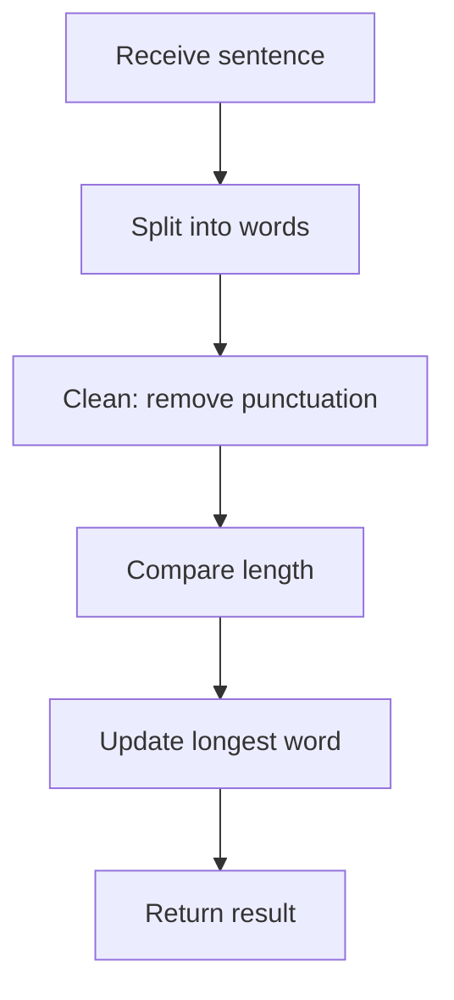

## Longest Word - FreeCodeCamp Daily Challenge

## Problem Statement

Given a string, return the longest word.
**Rules:**

- Words are separated by spaces.
- Only alphabetic characters (a-z, case-insensitive) are considered.
- If there is a tie, return the first longest word.
- The word is returned without punctuation marks.

**Examples:**

| Input                                                        | Output      |
|--------------------------------------------------------------|-------------|
| `"The quick red fox"`                                        | `quick`     |
| `"Hello coding challenge."`                                  | `challenge` |
| `"Do Try This At Home."`                                     | `This`      |
| `"This sentence... has commas, ellipses, and an exlamation point!"` | `exlamation`|
| `"A tie? No way!"`                                           | `tie`       |
| `"Wouldn't you like to know."`                               | `Wouldnt`   |

## Analysis & Strategy

We break down the problem into clear steps:



1. **Splitting:** Use `split(' ')` to get the words.
2. **Cleaning:** Remove punctuation marks with a regular expression.
3. **Comparison:** Find the word with the greatest length.
4. **Return:** Return the longest word found.

## JavaScript Solution

### Imperative Implementation

```javascript
/**
 * Finds the longest word in a sentence.
 * @param {string} sentence The input sentence containing words.
 * @returns {string}  The longest word found in the sentence.
 */
function longestWord(sentence) {
  const words = sentence.split(' ')
  let longest = ''
  for (let word of words) {
    const cleaned = word.replace(/[^a-z]/gi, '')
    if (cleaned.length > longest.length) {
      longest = cleaned
    }
  }
  return longest
}
```

### Imperative Solution Explanation

1. **Splitting:**
   `split(' ')` separates the sentence into words.

2. **Cleaning:**
   `replace(/[^a-zA-Z]/g, '')` removes everything that is not a letter.

3. **Reduction:**
   `reduce` compares the length of each cleaned word and keeps the longest.

This solution is imperative because it uses an explicit loop to iterate over the words and update the state of the `longest` variable. It is called an explicit loop because the programmer directly controls the iteration and comparison logic.

### Functional Implementation

```javascript
function longestWord(sentence) {
  return sentence
    .split(' ')
    .map(word => word.replace(/[^a-z]/gi, ''))
    .reduce((longest, current) =>
      current.length > longest.length ? current : longest, '')
}
```

### Functional Solution Explanation

1. **Splitting:** `split(' ')` separates the sentence into words.
2. **Mapping:** `map` applies cleaning to each word.
3. **Cleaning:** `replace(/[^a-zA-Z]/g, '')` removes everything that is not a letter.
4. **Reduction:** `reduce` compares the length of each cleaned word and keeps the longest. Initializes longest as an empty string.

This solution is functional because it uses higher-order methods (`map` and `reduce`) to transform and reduce the data without mutating external state. Higher-order methods are functions that take other functions as arguments. Map and reduce are examples because both take functions as arguments to process array elements.

## Algorithm Complexity

Both solutions have the same complexity:

- **Time:** $O(n)$, where $n$ is the number of characters in the sentence.
- **Space:** $O(w)$, where $w$ is the number of words.

The difference is not in performance but in programming style: imperative vs functional.

## Test Cases and Edge Cases

- Sentences with only one word.
- Sentences with multiple words of equal length.
- Sentences with punctuation attached to words.
- Empty sentences (returns empty string).

## Resources and Links

- [String.split()](https://developer.mozilla.org/en-US/docs/Web/JavaScript/Reference/Global_Objects/String/split)
- [String.replace()](https://developer.mozilla.org/en-US/docs/Web/JavaScript/Reference/Global_Objects/String/replace)
- [Array.reduce()](https://developer.mozilla.org/en-US/docs/Web/JavaScript/Reference/Global_Objects/Array/reduce)
- [Regular Expressions in JavaScript](https://developer.mozilla.org/en-US/docs/Web/JavaScript/Guide/Regular_Expressions)
- [High Order Functions in JavaScript](https://developer.mozilla.org/en-US/docs/Web/JavaScript/Guide/Functions#higher-order_functions)
