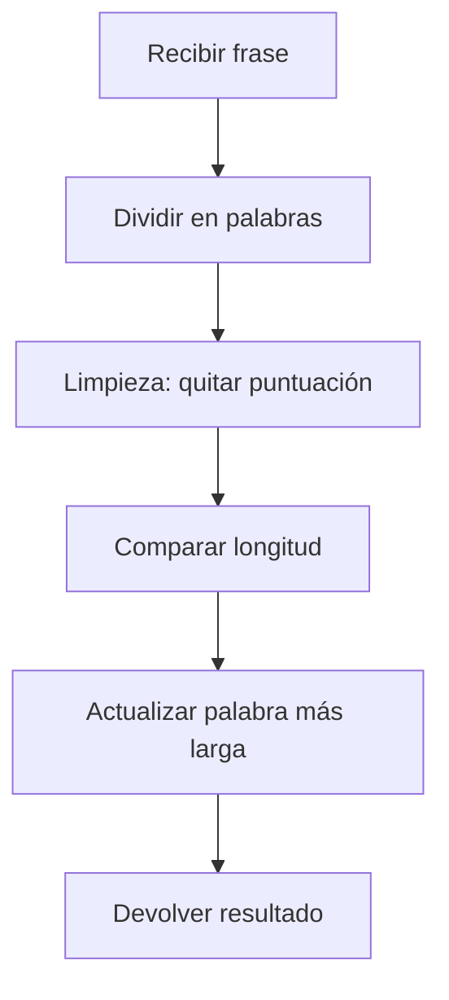

## La Palabra Mas Larga - FreeCodeCamp Daily Challenge

## Enunciado del Problema

Dada una cadena de texto, devuelve la palabra más larga.
**Reglas:**

- Las palabras están separadas por espacios.
- Solo se consideran caracteres alfabéticos (a-z, sin distinguir mayúsculas).
- Si hay empate, retorna la primera palabra más larga.
- La palabra se devuelve sin signos de puntuación.

**Ejemplos:**

| Entrada                                                      | Salida      |
|--------------------------------------------------------------|-------------|
| `"The quick red fox"`                                        | `quick`     |
| `"Hello coding challenge."`                                  | `challenge` |
| `"Do Try This At Home."`                                     | `This`      |
| `"This sentence... has commas, ellipses, and an exlamation point!"` | `exlamation`|
| `"A tie? No way!"`                                           | `tie`       |
| `"Wouldn't you like to know."`                               | `Wouldnt`   |

## Análisis y Estrategia

Descomponemos el problema en pasos claros:



1. **División:** Usamos `split(' ')` para obtener las palabras.
2. **Limpieza:** Eliminamos signos de puntuación con una expresión regular.
3. **Comparación:** Buscamos la palabra de mayor longitud.
4. **Retorno:** Devolvemos la palabra más larga encontrada.

## Solución en JavaScript

### Implementación Imperativa

```javascript
/**
 * Encuentra la palabra más larga en una frase.
 * @param {string} sentence The input sentence containing words.
 * @returns {string}  The longest word found in the sentence.
 */
function longestWord(sentence) {
  const words = sentence.split(' ')
  let longest = ''
  for (let word of words) {
    const cleaned = word.replace(/[^a-z]/gi, '')
    if (cleaned.length > longest.length) {
      longest = cleaned
    }
  }
  return longest
}
```

### Explicación Solucion Imperativa

1. **División:**
   `split(' ')` separa la frase en palabras.

2. **Limpieza:**
   `replace(/[^a-zA-Z]/g, '')` elimina todo lo que no sea letra.

3. **Reducción:**
   `reduce` compara la longitud de cada palabra limpia y conserva la más larga.

Esta solucion es imperativa por que utiliza un bucle explícito para iterar sobre las palabras y actualizar el estado de la variable `longest`. Se dice que es un bucle explicito porque el programador controla directamente la iteración y la lógica de comparación.

### Implementación Funcional

```javascript
function longestWord(sentence) {
  return sentence
    .split(' ')
    .map(word => word.replace(/[^a-z]/gi, ''))
    .reduce((longest, current) =>
      current.length > longest.length ? current : longest, '')
}
```

### Explicación Solucion Funcional

1. **División:**`split(' ')` separa la frase en palabras.
2. **Mapeo:** `map` aplica la limpieza a cada palabra.
3. **Limpieza:** `replace(/[^a-zA-Z]/g, '')` elimina todo lo que no sea letra.
4. **Reducción:** `reduce` compara la longitud de cada palabra limpia y conserva la más larga. Inicializa longest como cadena vacía.

Esta solucion es funcional porque utiliza métodos de orden superior (`map` y `reduce`) para transformar y reducir los datos sin mutar el estado externo. Metodos de orden superior son funciones que toman otras funciones como argumentos. Map y reduce son ejemplos por que ambos toman funciones como argumentos para procesar los elementos de un array.

## Complejidad Algorítmica

Ambas soluciones tienen la misma complejidad:

- **Tiempo:** $O(n)$, donde $n$ es la cantidad de caracteres en la frase.
- **Espacio:** $O(w)$, donde $w$ es el número de palabras.

La diferencia no esta en el rendimiento sino que radica en el estilo de programación: imperativo vs funcional.

## Casos de Prueba y Edge Cases

- Frases con solo una palabra.
- Frases con múltiples palabras de igual longitud.
- Frases con signos de puntuación pegados a las palabras.
- Frases vacías (retorna cadena vacía).

## Recursos y Enlaces

- [String.split()](https://developer.mozilla.org/en-US/docs/Web/JavaScript/Reference/Global_Objects/String/split)
- [String.replace()](https://developer.mozilla.org/en-US/docs/Web/JavaScript/Reference/Global_Objects/String/replace)
- [Array.reduce()](https://developer.mozilla.org/en-US/docs/Web/JavaScript/Reference/Global_Objects/Array/reduce)
- [Expresiones Regulares en JavaScript](https://developer.mozilla.org/en-US/docs/Web/JavaScript/Guide/Regular_Expressions)
- [High Order Functions in JavaScript](https://developer.mozilla.org/en-US/docs/Web/JavaScript/Guide/Functions#higher-order_functions)
