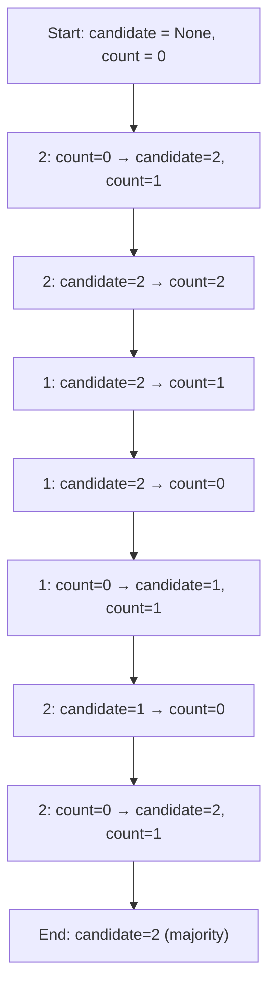

## Majority Element - LeetCode #169

### Problem Statement

Given an integer array `nums` of size $n$, find the majority element.
The majority element is the one that appears more than $\left\lfloor \frac{n}{2} \right\rfloor$ times.
You may assume that a majority element always exists in the array.

**Challenge:** Can you solve it in linear time and $O(1)$ space?

### Understanding the Problem

The goal is to identify the number that appears more than $n/2$ times in the given array, seeking an efficient solution in both time and space.

### First Approach

An initial approach is to use a hashmap to count the occurrences of each number, then compare the most frequent one with $n/2$ to determine if it is the majority.

```typescript
function majorityElement(nums: number[]): number {
  const hashMap: Record<number, number> = {}
  const n = nums.length
  for (const num of nums) {
    hashMap[num] = (hashMap[num] || 0) + 1
    if (hashMap[num] > Math.floor(n / 2)) {
      return num
    }
  }
  return -1
}
```

#### Complexity Analysis

- **Time:** $O(n)$, we traverse the array once.
- **Space:** $O(n)$ in the worst case (all numbers are different).

This approach does not meet the $O(1)$ space requirement.

### Optimal Solution: Boyer-Moore Voting Algorithm

To achieve $O(1)$ space, we use the Boyer-Moore Voting algorithm.
It works in two phases: first, it finds a candidate and then verifies if it is actually the majority.

**Main idea:**
Keep a "candidate" and a "counter".
Iterate through the array:

- If the counter is zero, choose the current number as the candidate.
- If the current number equals the candidate, increment the counter.
- If it is different, decrement the counter.

**Why it works:**
The majority element appears more than $n/2$ times, so it can never be completely eliminated by the other elements.

#### Step-by-step Example

Suppose: `nums = [2,2,1,1,1,2,2]`



#### Pseudocode

```text
Initialize candidate = null
Initialize count = 0

For each num in nums:
    If count == 0:
        candidate = num
        count = 1
    Else if num == candidate:
        count += 1
    Else:
        count -= 1

Return candidate
```

#### Complexity

- **Time:** $O(n)$
- **Space:** $O(1)$

### Concepts Applied

Frequency counting and algorithmic patterns are applied. The Boyer-Moore algorithm is efficient for finding the majority element in a sequence, using only a candidate and a counter.

### Resources and References

- [Boyer-Moore Majority Vote Algorithm (GeeksforGeeks)](https://www.geeksforgeeks.org/dsa/boyer-moore-algorithm-for-pattern-searching/)
- [LeetCode Problem 169 - Majority Element](https://leetcode.com/problems/majority-element/)
- [HashMap Approach Explanation](https://www.programiz.com/dsa/hash-table)
