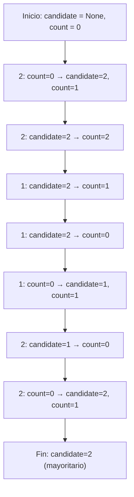

## Majority Element - LeetCode #169

### Enunciado del Problema

Dado un array de enteros `nums` de tamaño $n$, encuentra el elemento mayoritario.
El elemento mayoritario es aquel que aparece más de $\left\lfloor \frac{n}{2} \right\rfloor$ veces.
Puedes asumir que siempre existe un elemento mayoritario en el array.

**Desafío:** ¿Puedes resolverlo en tiempo lineal y espacio $O(1)$?

### Comprensión del Problema

El objetivo es identificar el número que aparece más de $n/2$ veces en el array dado, buscando una solución eficiente en tiempo y espacio.

### Primer Enfoque

Un enfoque inicial consiste en usar un hashmap para contar las ocurrencias de cada número y luego comparar el más frecuente con $n/2$ para determinar si es mayoritario.

```typescript
function majorityElement(nums: number[]): number {
  const hashMap: Record<number, number> = {}
  const n = nums.length
  for (const num of nums) {
    hashMap[num] = (hashMap[num] || 0) + 1
    if (hashMap[num] > Math.floor(n / 2)) {
      return num
    }
  }
  return -1
}
```

#### Análisis de Complejidad

- **Tiempo:** $O(n)$, recorremos el array una vez.
- **Espacio:** $O(n)$ en el peor caso (todos los números diferentes).

Este enfoque no cumple con el requisito de espacio $O(1)$.

### Solución Óptima: Algoritmo de Boyer-Moore Voting

Para lograr espacio $O(1)$, utilizamos el algoritmo de Boyer-Moore Voting.
Funciona en dos fases: primero encuentra un candidato y luego verifica si realmente es mayoritario.

**Idea principal:**
Mantén un "candidato" y un "contador".
Recorre el array:

- Si el contador es cero, elige el número actual como candidato.
- Si el número actual es igual al candidato, incrementa el contador.
- Si es diferente, decrementa el contador.

**Por qué funciona:**
El elemento mayoritario aparece más de $n/2$ veces, por lo que nunca puede ser eliminado completamente por los otros elementos.

#### Ejemplo paso a paso

Supongamos: `nums = [2,2,1,1,1,2,2]`



#### Pseudocódigo

```text
Inicializar candidate = null
Inicializar count = 0

Para cada num en nums:
    Si count == 0:
        candidate = num
        count = 1
    Sino si num == candidate:
        count += 1
    Sino:
        count -= 1

Retornar candidate
```

#### Complejidad

- **Tiempo:** $O(n)$
- **Espacio:** $O(1)$

### Conceptos Aplicados

Se aplican conceptos de conteo de frecuencias y patrones algorítmicos. El algoritmo de Boyer-Moore es eficiente para encontrar el elemento mayoritario en una secuencia, usando solo un candidato y un contador.

### Recursos y Referencias

- [Boyer-Moore Majority Vote Algorithm (GeeksforGeeks)](https://www.geeksforgeeks.org/dsa/boyer-moore-algorithm-for-pattern-searching/)
- [LeetCode Problem 169 - Majority Element](https://leetcode.com/problems/majority-element/)
- [HashMap Approach Explanation](https://www.programiz.com/dsa/hash-table)
