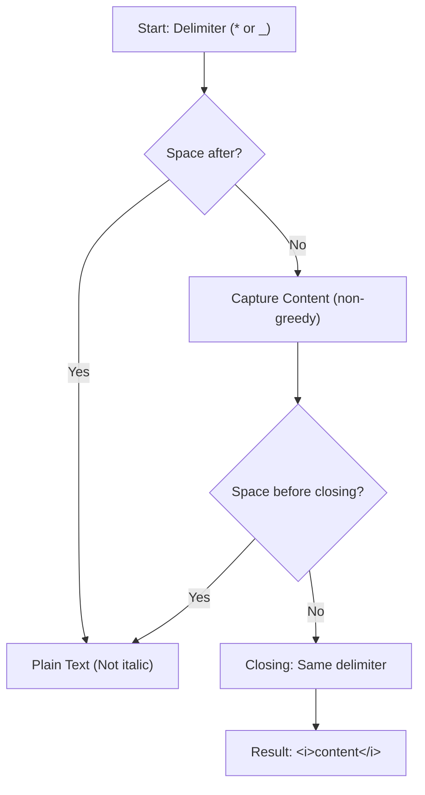

## Markdown Italic Parser - Analysis and Explanation

## Problem Statement

Given a string that may include italic text in Markdown format, the goal is to return the equivalent HTML string.

- Italics in Markdown is any text that starts and ends with an asterisk (`*`) or an underscore (`_`).
- There can be no spaces between the delimiter and the text, although there can be spaces within the text.
- You must convert all occurrences to the HTML `<i>` tag.

**Example:**
- Input: `"_This is italic_"`
- Output: `"<i>This is italic</i>"`

## Initial Analysis

### Understanding the Problem

The goal is to create a simple parser that converts Markdown italic syntax (`*text*` or `_text_`) to HTML `<i>text</i>` tags.

The critical rules for text to be considered italic are:

1. **Delimiters:** It must start and end with the same character (`*` or `_`).
2. **No spaces at the edges:** There cannot be a space immediately after the opening delimiter, nor immediately before the closing delimiter.
3. **Content:** The internal text can contain spaces, as long as the edge rules are respected.
4. **Multiple occurrences:** A single string can contain several italic sections that must be processed.

### Process Visualization



### Identified Test Cases

1. **Simple italics with asterisks:** `*italic*` -> `<i>italic</i>`.
2. **Simple italics with underscores:** `_italic_` -> `<i>italic</i>`.
3. **Space at the beginning (Invalid):** `_ italic_` -> Should not change.
4. **Space at the end (Invalid):** `*italic *` -> Should not change.
5. **Mixed multiple occurrences:** `The *quick* brown fox _jumps_...` -> Should convert all valid ones.
6. **Text with internal spaces:** `*This is italic*` -> Valid, should convert.

## Solution Development

### Chosen Approach

For this problem, the most efficient and readable approach is to use **Regular Expressions (RegExp)** with JavaScript's `replace()` method.

The RegExp logic should:

- Capture the delimiter (`*` or `_`).
- Ensure the first character of the content is not a space (using negative *lookahead*).
- Capture the content in a non-greedy way.
- Ensure the last character of the content is not a space (using negative *lookbehind*).
- Reference the initial delimiter for the closing.

### Implementation

```typescript
/**
 * Converts Markdown italic syntax to HTML <i> tags.
 * @param markdown The input string with Markdown formatting.
 * @returns The processed string with HTML tags.
 */
function markdownItalicParser(markdown: string): string {
  // RegExp Explanation:
  // (\*|_)      -> Group 1: Captures the initial delimiter (* or _)
  // (?!\s)      -> Negative Lookahead: The next character must not be a space
  // (.+?)       -> Group 2: Captures the content (minimum 1 character, non-greedy)
  // (?<!\s)     -> Negative Lookbehind: The previous character must not be a space
  // \1          -> Reference to Group 1: The closing must match the opening
  const regex = /(\*|_)(?!\s)(.+?)(?<!\s)\1/g

  return markdown.replace(regex, '<i>$2</i>')
}
```

## Complexity Analysis

### Time Complexity

$O(n)$, where $n$ is the length of the input string.

Although regular expressions can lead to exponential times (a phenomenon known as *Catastrophic Backtracking*), this implementation remains linear for two reasons:

1. **Non-Greedy Quantifiers (`.+?`):** By stopping at the first match of the closing delimiter, we prevent the engine from unnecessarily traversing the rest of the string and having to backtrack massively.
2. **Clear Boundaries:** The use of *lookarounds* and the `\1` reference define precise boundaries, which reduces ambiguity and allows the RegExp engine to efficiently discard invalid matches as it moves forward.

### Space Complexity

$O(n)$. The `replace` method generates a new string with the substitutions made. In the worst case (where much of the text is italic), the new string will have a size proportional to the original, slightly increased by the `<i>` and `</i>` tags.

## Edge Cases and Considerations

- **Empty italics:** A case like `**` or `__` will not be captured by `(.+?)` as it requires at least one character. This is correct according to most Markdown specifications.
- **Mixed delimiters:** `*text_` will not be converted because `\1` requires the closing to match the opening.
- **Spaces at the edges:** The cases `* text*` and `*text *` remain as plain text, fulfilling the requirement.

## Reflections and Learnings

### Applied Concepts

#### 1. Backreferences

The use of `\1` is fundamental to guarantee the symmetry of the delimiters. A **backreference** allows the regular expression to "remember" what it captured in a previous group (in this case, the first group `(\*|_)`) and require that exactly the same thing appears later. This prevents text starting with `*` from trying to close with `_`.

#### 2. Lookarounds

**Lookarounds** allow validating context conditions without "consuming" characters from the string, which is ideal for edge validations:

- **Negative Lookahead (`(?!\s)`):** Looks ahead from the current position to ensure the next character is **not** a space. It is used right after the opening delimiter.
- **Negative Lookbehind (`(?<!\s)`):** Looks back from the current position to ensure the previous character was **not** a space. It is used right before the closing delimiter.

### Possible Optimizations

For a full Markdown parser, you would need to handle character escaping (e.g., `\*not italic\*`) and the priority of other tags (like bold `**`). However, for the scope of this problem, the RegExp solution is the most balanced between simplicity and effectiveness.

## Resources and References

- [MDN - Regular Expressions](https://developer.mozilla.org/en-US/docs/Web/JavaScript/Guide/Regular_Expressions)
- [CommonMark Spec - Emphasis and strong emphasis](https://spec.commonmark.org/0.30/#emphasis-and-strong-emphasis) (Reference for standard italic behavior).
- [RegEx101](https://regex101.com/) - Essential tool for testing and debugging regular expressions.
