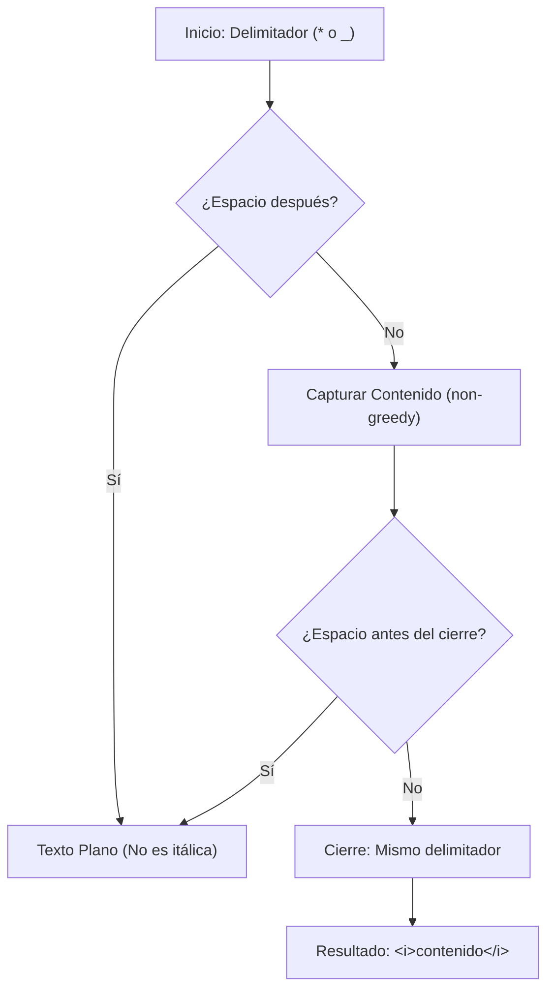

## Markdown Italic Parser - Análisis y Explicación

## Enunciado del Problema

Dado un string que puede incluir texto en itálica en formato Markdown, el objetivo es retornar el string HTML equivalente.

- La itálica en Markdown es cualquier texto que comience y termine con un asterisco (`*`) o un guion bajo (`_`).
- No pueden haber espacios entre el delimitador y el texto, aunque sí puede haber espacios dentro del texto.
- Debes convertir todas las ocurrencias a la etiqueta HTML `<i>`.

**Ejemplo:**
- Entrada: `"_This is italic_"`
- Salida: `"<i>This is italic</i>"`

## Análisis Inicial

### Comprensión del Problema

El objetivo es crear un parser simple que convierta la sintaxis de itálicas de Markdown (`*texto*` o `_texto_`) a etiquetas HTML `<i>texto</i>`.

Las reglas críticas para que el texto sea considerado itálica son:

1. **Delimitadores:** Debe comenzar y terminar con el mismo carácter (`*` o `_`).
2. **Sin espacios en los bordes:** No puede haber un espacio inmediatamente después del delimitador de apertura, ni inmediatamente antes del delimitador de cierre.
3. **Contenido:** El texto interno puede contener espacios, siempre que se respeten las reglas de los bordes.
4. **Múltiples ocurrencias:** Un mismo string puede contener varias secciones en itálica que deben ser procesadas.

### Visualización del Proceso



### Casos de Prueba Identificados

1. **Itálica simple con asteriscos:** `*italic*` -> `<i>italic</i>`.
2. **Itálica simple con guiones bajos:** `_italic_` -> `<i>italic</i>`.
3. **Espacio al inicio (Inválido):** `_ italic_` -> No debe cambiar.
4. **Espacio al final (Inválido):** `*italic *` -> No debe cambiar.
5. **Múltiples ocurrencias mixtas:** `The *quick* brown fox _jumps_...` -> Debe convertir todas las válidas.
6. **Texto con espacios internos:** `*This is italic*` -> Válido, debe convertir.

## Desarrollo de la Solución

### Enfoque Elegido

Para este problema, el enfoque más eficiente y legible es utilizar **Expresiones Regulares (RegExp)** con el método `replace()` de JavaScript.

La lógica de la RegExp debe:

- Capturar el delimitador (`*` o `_`).
- Asegurar que el primer carácter del contenido no sea un espacio (usando *lookahead* negativo).
- Capturar el contenido de forma no codiciosa (*non-greedy*).
- Asegurar que el último carácter del contenido no sea un espacio (usando *lookbehind* negativo).
- Referenciar el delimitador inicial para el cierre.

### Implementación

```typescript
/**
 * Convierte sintaxis de itálica Markdown a etiquetas HTML <i>.
 * @param markdown El string de entrada con formato Markdown.
 * @returns El string procesado con etiquetas HTML.
 */
function markdownItalicParser(markdown: string): string {
  // Explicación de la RegExp:
  // (\*|_)      -> Grupo 1: Captura el delimitador inicial (* o _)
  // (?!\s)      -> Lookahead negativo: El siguiente carácter no debe ser un espacio
  // (.+?)       -> Grupo 2: Captura el contenido (mínimo 1 carácter, no codicioso)
  // (?<!\s)     -> Lookbehind negativo: El carácter anterior no debe ser un espacio
  // \1          -> Referencia al Grupo 1: El cierre debe coincidir con la apertura
  const regex = /(\*|_)(?!\s)(.+?)(?<!\s)\1/g

  return markdown.replace(regex, '<i>$2</i>')
}
```

## Análisis de Complejidad

### Complejidad Temporal

$O(n)$, donde $n$ es la longitud del string de entrada.

Aunque las expresiones regulares pueden derivar en tiempos exponenciales (fenómeno conocido como *Catastrophic Backtracking*), esta implementación se mantiene lineal por dos razones:

1. **Cuantificadores No Codiciosos (`.+?`):** Al detenerse en la primera coincidencia del delimitador de cierre, evitamos que el motor recorra innecesariamente el resto del string y tenga que retroceder masivamente.
2. **Límites Claros:** El uso de *lookarounds* y la referencia `\1` definen fronteras precisas, lo que reduce la ambigüedad y permite que el motor de RegExp descarte coincidencias inválidas de forma eficiente mientras avanza.

### Complejidad Espacial

$O(n)$. El método `replace` genera un nuevo string con las sustituciones realizadas. En el peor de los casos (donde gran parte del texto es itálica), el nuevo string tendrá un tamaño proporcional al original, incrementado ligeramente por las etiquetas `<i>` y `</i>`.

## Casos Edge y Consideraciones

- **Itálicas vacías:** Un caso como `**` o `__` no será capturado por `(.+?)` ya que requiere al menos un carácter. Esto es correcto según la mayoría de especificaciones de Markdown.
- **Delimitadores mezclados:** `*texto_` no se convertirá porque `\1` exige que el cierre coincida con la apertura.
- **Espacios en los bordes:** Los casos `* texto*` y `*texto *` se mantienen como texto plano, cumpliendo con la consigna.

## Reflexiones y Aprendizajes

### Conceptos Aplicados

#### 1. Backreferences (Referencias hacia atrás)

El uso de `\1` es fundamental para garantizar la simetría de los delimitadores. Una **backreference** permite que la expresión regular "recuerde" lo que capturó en un grupo anterior (en este caso, el primer grupo `(\*|_)`) y exija que aparezca exactamente lo mismo más adelante. Esto evita que un texto que empieza con `*` intente cerrar con `_`.

#### 2. Lookarounds (Búsquedas de entorno)

Los **lookarounds** permiten validar condiciones de contexto sin "consumir" caracteres del string, lo cual es ideal para validaciones de bordes:

- **Negative Lookahead (`(?!\s)`):** Mira hacia adelante desde la posición actual para asegurar que el siguiente carácter **no** sea un espacio. Se usa justo después del delimitador de apertura.
- **Negative Lookbehind (`(?<!\s)`):** Mira hacia atrás desde la posición actual para asegurar que el carácter anterior **no** haya sido un espacio. Se usa justo antes del delimitador de cierre.

### Posibles Optimizaciones

Para un parser de Markdown completo, se necesitaría manejar el escape de caracteres (ej: `\*no itálica\*`) y la prioridad de otras etiquetas (como negritas `**`). Sin embargo, para el alcance de este problema, la solución con RegExp es la más balanceada entre simplicidad y efectividad.

## Recursos y Referencias

- [MDN - Regular Expressions](https://developer.mozilla.org/es/docs/Web/JavaScript/Guide/Regular_Expressions)
- [CommonMark Spec - Emphasis and strong emphasis](https://spec.commonmark.org/0.30/#emphasis-and-strong-emphasis) (Referencia para el comportamiento estándar de itálicas).
- [RegEx101](https://regex101.com/) - Herramienta esencial para probar y depurar expresiones regulares.
