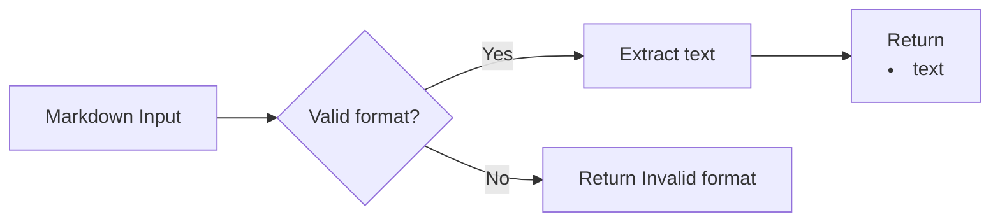

## Introduction

In today’s challenge, we tackle converting a Markdown ordered list item to its equivalent HTML format. The task is to validate the input string’s format and return the requested result or an error message as appropriate.

To solve it, we first identify the necessary conditions and then process the string to efficiently produce the expected output.

## Problem Statement

Given a string representing a Markdown ordered list item, convert it to the corresponding HTML string. The valid format requires:

- Zero or more leading spaces
- A number (1 or greater) followed by a dot
- At least one space after the dot
- The list item text

If the string does not exactly match this format, return "Invalid format". If it is valid, extract the text and wrap it in `<li>` tags.

Example: for `"1. My item"`, the output should be `"<li>My item</li>"`.

## Approach & Analysis

The first step is to validate the Markdown format of the list item. If it meets the requirements, we convert it to HTML; if not, we return an error message. Key points:

1. Optional leading spaces
2. Number (1 or greater) followed by a dot
3. At least one space after the dot
4. List item text (can be empty or any character)
5. Output: `<li>text</li>` if valid, "Invalid format" if not

### Test Cases

| Input                   | Expected Output             | Description                                      |
| ----------------------- | -------------------------- | ------------------------------------------------ |
| "1. My item"            | "<li>My item</li>"          | Valid, no leading spaces                         |
| " 2. Another item"      | "<li>Another item</li>"     | Valid, with leading spaces                       |
| "3.Item without space"  | "Invalid format"            | Missing space after dot                          |
| "0. Invalid number"     | "Invalid format"            | Number less than 1                               |
| "4. "                   | "<li></li>"                  | Valid, empty text                                |
| "5. Item with spaces"   | "<li>Item with spaces</li>" | Valid, text with spaces                          |
| "Not a list item"       | "Invalid format"            | Completely invalid                               |

## Solution

### Validation and Extraction with Regex

We use a regular expression to validate the format and extract the list item text:

1. `^\s*` — Optional leading spaces
2. `([1-9]\d*)\.` — Number (1 or greater) followed by a dot
3. `\s+` — At least one space after the dot
4. `(.*)$` — List item text

Full regex: `/^\s*([1-9]\d*)\.\s+(.*)$/`

### JavaScript Implementation

```javascript
function convertListItem(markdown) {
  const regex = /^\s*([1-9]\d*)\.\s+(.*)$/
  const match = markdown.match(regex)
  if (match) {
    const itemText = match[2]
    return `<li>${itemText}</li>`
  }
  return 'Invalid format'
}
```

## Complexity

**Time:** $O(n)$, where $n$ is the length of the string. The regular expression scans the string once.

**Space:** $O(1)$ additional, since only simple variables are stored. Output space depends on the size of the extracted text.

## Flow Visualization



## Conclusion

This challenge helps practice format validation and regular expressions in JavaScript. The solution is efficient and easy to maintain. The pattern can be applied to other text format conversion problems.
