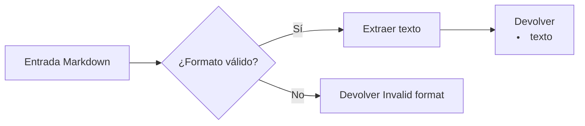

## Introducción

En el desafío de hoy, abordamos la conversión de un ítem de lista ordenada en Markdown a su formato HTML equivalente. El reto consiste en validar el formato del string recibido y devolver el resultado solicitado o un mensaje de error, según corresponda.

Para resolverlo, primero identificamos las condiciones necesarias y luego procesamos el string para obtener la salida esperada de forma eficiente.

## Enunciado del Problema

Dado un string que representa un ítem de lista ordenada en Markdown, debemos convertirlo al string HTML correspondiente. El formato válido requiere:

- Cero o más espacios iniciales
- Un número (1 o mayor) seguido de un punto
- Al menos un espacio después del punto
- El texto del ítem de la lista

Si el string no cumple exactamente con este formato, devolvemos "Invalid format". Si es válido, extraemos el texto y lo envolvemos en etiquetas `<li>`.

Ejemplo: para `"1. My item"`, la salida debe ser `"<li>My item</li>"`.

## Análisis y Estrategia

El primer paso es validar el formato Markdown del ítem de lista. Si cumple con los requisitos, lo convertimos a HTML; si no, devolvemos un mensaje de error. Los puntos clave son:

1. Espacios iniciales opcionales
2. Número (mayor o igual a 1) seguido de punto
3. Al menos un espacio tras el punto
4. Texto del ítem (puede estar vacío o contener cualquier carácter)
5. Salida: `<li>texto</li>` si es válido, "Invalid format" si no

### Casos de Prueba

| Entrada                | Salida Esperada              | Descripción                                      |
| ---------------------- | ---------------------------- | ------------------------------------------------ |
| "1. My item"           | "<li>My item</li>"           | Válido, sin espacios iniciales                   |
| " 2. Another item"     | "<li>Another item</li>"      | Válido, con espacios iniciales                   |
| "3.Item without space" | "Invalid format"             | Falta espacio tras el punto                      |
| "0. Invalid number"    | "Invalid format"             | Número menor que 1                               |
| "4. "                  | "<li></li>"                  | Válido, texto vacío                              |
| "5. Item with spaces"  | "<li>Item with spaces</li>"  | Válido, texto con espacios                       |
| "Not a list item"      | "Invalid format"             | Completamente inválido                           |

## Solución

### Validación y Extracción con Regex

Utilizamos una expresión regular para validar el formato y extraer el texto del ítem:

1. `^\s*` — Espacios iniciales opcionales
2. `([1-9]\d*)\.` — Número (1 o mayor) seguido de punto
3. `\s+` — Al menos un espacio tras el punto
4. `(.*)$` — Texto del ítem

Regex completo: `/^\s*([1-9]\d*)\.\s+(.*)$/`

### Implementación en JavaScript

```javascript
function convertListItem(markdown) {
  const regex = /^\s*([1-9]\d*)\.\s+(.*)$/
  const match = markdown.match(regex)
  if (match) {
    const itemText = match[2]
    return `<li>${itemText}</li>`
  }
  return 'Invalid format'
}
```

## Complejidad

**Tiempo:** $O(n)$, donde $n$ es la longitud del string. La expresión regular recorre el string una vez.

**Espacio:** $O(1)$ adicional, ya que solo se almacenan variables simples. El espacio de salida depende del tamaño del texto extraído.

## Visualización del Flujo



## Conclusión

Este desafío nos ayuda a practicar la validación de formatos y el uso de expresiones regulares en JavaScript. La solución es eficiente y fácil de mantener. El patrón puede aplicarse a otros problemas de conversión de formatos en texto.
