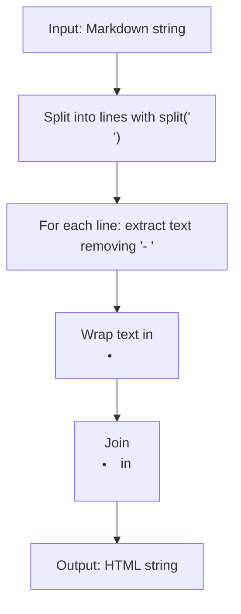

## Introduction

In this post, we solve the "Markdown Unordered List Parser" challenge from FreeCodeCamp's #150 Daily Challenge. The problem requires converting a string representing a valid unordered list in Markdown to its HTML equivalent. We'll explore the analysis, JavaScript implementation, and reflections on the process.

## Problem Statement

Given a string of a valid unordered list in Markdown, return the equivalent HTML string.

An unordered list consists of one or more list items. Each valid item:
- Appears on its own line.
- Starts with a dash ("-").
- Followed by at least one space.
- Then the item text.

The list is provided as a single string, with items separated by "\n". Do not include newline characters in the item text.

Wrap each item in `<li>` and the entire list in `<ul>`.

Example: For `"- Item A\n- Item B"`, return `"<ul><li>Item A</li><li>Item B</li></ul>"`.

## Initial Analysis

### Understanding the Problem

The challenge involves simple parsing: identify items starting with "- " (or more spaces), extract the text, and generate HTML. The input guarantees validity, so we don't need complex validations.

### Test Cases

1. **Basic case**: `"- Item A\n- Item B"` → `"<ul><li>Item A</li><li>Item B</li></ul>"`
2. **Extra spaces**: `"-  JavaScript\n-  Python"` → `"<ul><li>JavaScript</li><li>Python</li></ul>"`
3. **Longer list**: `"- 2 C Flour\n- 1/2 C Sugar\n- 1 Tsp Vanilla"` → `"<ul><li>2 C Flour</li><li>1/2 C Sugar</li><li>1 Tsp Vanilla</li></ul>"`
4. **Dashes in text**: `"- A-1\n- A-2\n- B-1"` → `"<ul><li>A-1</li><li>A-2</li><li>B-1</li></ul>"`

## Solution Development

We chose a string manipulation approach: split into lines, extract text, and build HTML. It's efficient and straightforward.



## Implementation

```javascript
function parseUnorderedList(markdown) {
  // Split the string into lines
  const lines = markdown.split('\n')

  // Process each line: remove prefix and wrap in <li>
  const listItems = lines.map((line) => {
    // Use regex to remove one or more dashes followed by spaces
    const text = line.replace(/^-+\s+/, '')
    return `<li>${text}</li>`
  })

  // Join the items in a <ul> list
  return `<ul>${listItems.join('')}</ul>`
}
```

The code is simple: `split` separates lines, `map` transforms each by removing the prefix with regex, and `join` builds the HTML.

## Complexity Analysis

- **Time**: O(n), where n is the string length. Linear operations on the input.
- **Space**: O(n), due to created arrays. Suitable for typical lists.

## Edge Cases

- Handles extra spaces correctly (flexible regex).
- Dashes in text don't interfere, as only the initial prefix is removed.
- Assumes valid input, no empty items or malformed lines.

## Reflections and Learnings

We applied basic string manipulation and regex. This pattern is useful for simple parsing. Possible optimizations: use `substring` instead of regex for more control, but the current code is readable and efficient.

## Resources

- [FreeCodeCamp Daily Challenge](https://www.freecodecamp.org/learn/daily-coding-challenge/2026-01-07/)
- [MDN: String.split](https://developer.mozilla.org/en-US/docs/Web/JavaScript/Reference/Global_Objects/String/split)
- [Markdown Specification](https://spec.commonmark.org/)
