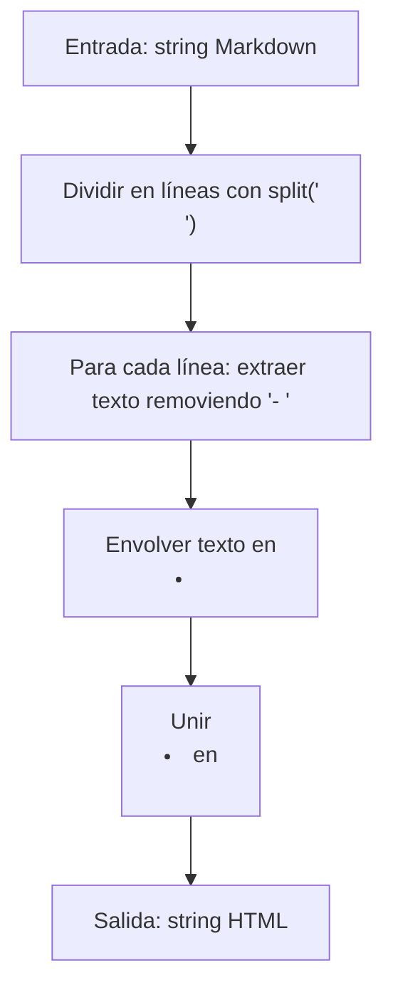

## Introducción

En este post, resolvemos el desafío "Markdown Unordered List Parser" del #150 Daily Challenge de FreeCodeCamp. El problema requiere convertir una cadena que representa una lista desordenada válida en Markdown a su equivalente en HTML. Exploraremos el análisis, la implementación en JavaScript y reflexiones sobre el proceso.

## Enunciado del Problema

Dado un string de una lista desordenada válida en Markdown, retorna el string equivalente en HTML.

Una lista desordenada consiste en uno o más ítems de lista. Cada ítem válido:
- Aparece en su propia línea.
- Comienza con un guion ("-").
- Seguido de al menos un espacio.
- Luego, el texto del ítem.

La lista se proporciona como un string único, con ítems separados por "\n". No incluyas los caracteres de nueva línea en el texto del ítem.

Envuelve cada ítem en `<li>` y toda la lista en `<ul>`.

Ejemplo: Para `"- Item A\n- Item B"`, retorna `"<ul><li>Item A</li><li>Item B</li></ul>"`.

## Análisis Inicial

### Comprensión del Problema

El desafío implica parsing simple: identificar ítems que empiezan con "- " (o más espacios), extraer el texto y generar HTML. La entrada garantiza validez, así que no necesitamos validaciones complejas.

### Casos de Prueba

1. **Caso básico**: `"- Item A\n- Item B"` → `"<ul><li>Item A</li><li>Item B</li></ul>"`
2. **Espacios extra**: `"-  JavaScript\n-  Python"` → `"<ul><li>JavaScript</li><li>Python</li></ul>"`
3. **Lista más larga**: `"- 2 C Flour\n- 1/2 C Sugar\n- 1 Tsp Vanilla"` → `"<ul><li>2 C Flour</li><li>1/2 C Sugar</li><li>1 Tsp Vanilla</li></ul>"`
4. **Guiones en texto**: `"- A-1\n- A-2\n- B-1"` → `"<ul><li>A-1</li><li>A-2</li><li>B-1</li></ul>"`

## Desarrollo de la Solución

Elegimos un enfoque de manipulación de strings: dividir en líneas, extraer texto y construir HTML. Es eficiente y directo.



## Implementación

```javascript
function parseUnorderedList(markdown) {
  // Dividir la cadena en líneas
  const lines = markdown.split('\n')

  // Procesar cada línea: remover prefijo y envolver en <li>
  const listItems = lines.map((line) => {
    // Usar regex para remover uno o más guiones seguidos de espacios
    const text = line.replace(/^-+\s+/, '')
    return `<li>${text}</li>`
  })

  // Unir los ítems en una lista <ul>
  return `<ul>${listItems.join('')}</ul>`
}
```

El código es simple: `split` separa líneas, `map` transforma cada una removiendo el prefijo con regex, y `join` construye el HTML.

## Análisis de Complejidad

- **Espacial**: O(n), por los arrays creados. Adecuado para listas típicas.

## Casos Edge

- Maneja espacios extra correctamente (regex flexible).
- Guiones en texto no interfieren, ya que solo remueve el prefijo inicial.
- Asume entrada válida, sin ítems vacíos o líneas malformadas.

## Reflexiones y Aprendizajes

Aplicamos manipulación de strings y regex básicos. Este patrón es útil para parsing simple. Optimizaciones posibles: usar `substring` en lugar de regex para más control, pero el código actual es legible y eficiente.

## Recursos

- [FreeCodeCamp Daily Challenge](https://www.freecodecamp.org/learn/daily-coding-challenge/2026-01-07/)
- [MDN: String.split](https://developer.mozilla.org/es/docs/Web/JavaScript/Reference/Global_Objects/String/split)
- [Especificación Markdown](https://spec.commonmark.org/)
