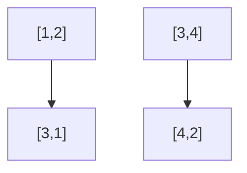

## Matrix Rotate - FreeCodeCamp #27

### 🚩 Problem Statement

Given a matrix (array of arrays), rotate it 90° clockwise. Example: for `[[1,2],[3,4]]`, the output should be `[[3,1],[4,2]]`.

---

## 1. Initial Analysis

What does it mean to rotate a matrix 90°? Each row of the original becomes a column in the new one, but in reverse order. Visualize it like this:



### Key Test Cases

- **1x1:** Input: `[[1]]` → Output: `[[1]]`
- **2x2:** Input: `[[1,2],[3,4]]` → Output: `[[3,1],[4,2]]`
- **3x3:** Input: `[[1,2,3],[4,5,6],[7,8,9]]` → Output: `[[7,4,1],[8,5,2],[9,6,3]]`
- **With zeros:** Input: `[[0,1,0],[1,0,1],[0,0,0]]` → Output: `[[0,1,0],[0,0,1],[0,1,0]}`

---

## 2. Strategy & Step by Step

How do we solve it? The clearest way is to create a new empty matrix and map each element to its new position. The trick is in the indices:

- The element at `(i, j)` in the original goes to `(j, n-1-i)` in the rotated, where `n` is the number of rows.

### Algorithm:

1. Get dimensions: rows `n`, columns `m`.
2. Create an empty matrix of size `m x n`.
3. For each element `(i, j)`, place it at `(j, n-1-i)`.
4. Return the rotated matrix.

---

## 3. JavaScript Implementation

```js
function rotate(matrix) {
  if (!matrix.length || !matrix[0].length)
    return []
  const n = matrix.length
  const m = matrix[0].length
  const rotated = Array.from({ length: m }, () => new Array(n))
  for (let i = 0; i < n; i++) {
    for (let j = 0; j < m; j++) {
      rotated[j][n - 1 - i] = matrix[i][j]
    }
  }
  return rotated
}
```

---

## 4. Complexity & Edge Cases

### Complexity

- **Time:** $O(n \times m)$ (we visit every element)
- **Space:** $O(n \times m)$ (new matrix)

### Edge Cases

- Empty matrix: `[]` → `[]`
- Empty rows: `[[ ]]` → `[]`
- 1x1: remains the same
- Non-square: works for any shape

---

## 5. Reflections & Learnings

What did we learn?

- Index manipulation and 2D arrays
- Nested loops and position mapping
- Input validation and edge cases
- Complexity analysis

### Can it be optimized?

If the matrix is square and you can modify it, you can rotate in-place: first transpose, then reverse each row. But for rectangular matrices or if you want to preserve the original, the presented method is the safest and clearest.

---

## 6. Resources

- [MDN Arrays](https://developer.mozilla.org/en-US/docs/Web/JavaScript/Reference/Global_Objects/Array)
- [GeeksForGeeks: Rotate matrix](https://www.geeksforgeeks.org/rotate-matrix-90-degree-without-using-extra-space-set-2/)
- [LeetCode: Rotate Image](https://leetcode.com/problems/rotate-image/)

---

Ready to try with a bigger matrix? What if the matrix is very rectangular? 🤔
