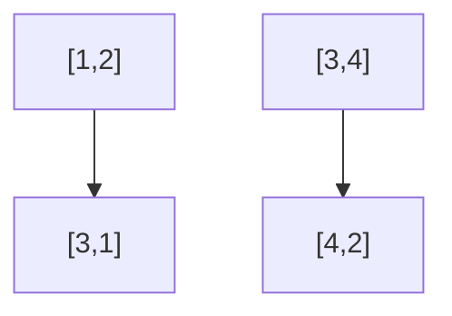

## Matrix Rotate - FreeCodeCamp #27

### 🚩 Enunciado

Dada una matriz (array de arrays), rotarla 90° en sentido horario. Ejemplo: para `[[1,2],[3,4]]`, la salida debe ser `[[3,1],[4,2]]`.

---

## 1. Análisis Inicial

¿Qué significa rotar una matriz 90°? Cada fila de la original se convierte en una columna de la nueva, pero en orden invertido. Visualízalo así:



### Casos de Prueba Clave

- **1x1:** Entrada: `[[1]]` → Salida: `[[1]]`
- **2x2:** Entrada: `[[1,2],[3,4]]` → Salida: `[[3,1],[4,2]]`
- **3x3:** Entrada: `[[1,2,3],[4,5,6],[7,8,9]]` → Salida: `[[7,4,1],[8,5,2],[9,6,3]]`
- **Con ceros:** Entrada: `[[0,1,0],[1,0,1],[0,0,0]]` → Salida: `[[0,1,0],[0,0,1],[0,1,0]}`

---

## 2. Estrategia y Paso a Paso

¿Cómo lo resolvemos? La forma más clara es crear una nueva matriz vacía y mapear cada elemento a su nueva posición. El truco está en los índices:

- El elemento en `(i, j)` de la original va a `(j, n-1-i)` en la rotada, donde `n` es el número de filas.

### Algoritmo:

1. Obtener dimensiones: filas `n`, columnas `m`.
2. Crear matriz vacía de tamaño `m x n`.
3. Recorrer cada elemento `(i, j)` y ubicarlo en `(j, n-1-i)`.
4. Devolver la matriz rotada.

---

## 3. Implementación en JavaScript

```js
function rotate(matrix) {
  if (!matrix.length || !matrix[0].length)
    return []
  const n = matrix.length
  const m = matrix[0].length
  const rotated = Array.from({ length: m }, () => new Array(n))
  for (let i = 0; i < n; i++) {
    for (let j = 0; j < m; j++) {
      rotated[j][n - 1 - i] = matrix[i][j]
    }
  }
  return rotated
}
```

---

## 4. Complejidad y Edge Cases

### Complejidad

- **Tiempo:** $O(n \times m)$ (recorremos todos los elementos)
- **Espacio:** $O(n \times m)$ (nueva matriz)

### Casos Edge

- Matriz vacía: `[]` → `[]`
- Filas vacías: `[[ ]]` → `[]`
- 1x1: se mantiene igual
- No cuadrada: funciona para cualquier forma

---

## 5. Reflexiones y Aprendizajes

¿Qué aprendimos?

- Manipulación de índices y arrays bidimensionales
- Bucles anidados y mapeo de posiciones
- Validación de entradas y casos edge
- Análisis de complejidad

---

## 6. Recursos

- [MDN Arrays](https://developer.mozilla.org/es/docs/Web/JavaScript/Reference/Global_Objects/Array)
- [GeeksForGeeks: Rotar matriz](https://www.geeksforgeeks.org/rotate-matrix-90-degree-without-using-extra-space-set-2/)
- [LeetCode: Rotate Image](https://leetcode.com/problems/rotate-image/)

---
