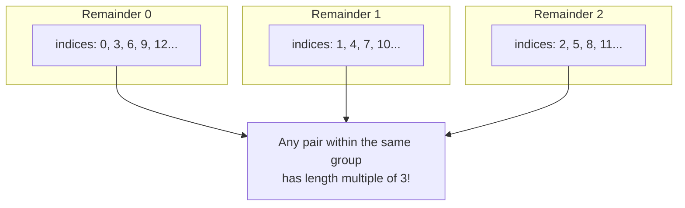
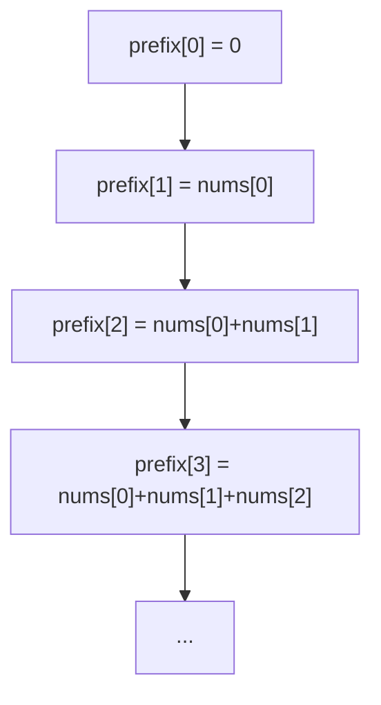

## Maximum Subarray Sum with Length Divisible by K

### LeetCode Daily Challenge – November 27, 2025

One of those problems that seem impossible until you find the trick!
Let's go from scratch—with diagrams.

## The Problem

Given an array and a number `k`, find the largest contiguous subarray **whose length is a multiple of k** (k, 2k, 3k…)

Example:
`nums = [1, -2, 3, 4, -1]`, `k = 3`
The only valid subarrays are those of length 3:

- `[1,-2,3]` → sum 2
- `[-2,3,4]` → sum 5
- `[3,4,-1]` → sum 6 ← winner

## Modular Arithmetic Principles

### What does "a ≡ b (mod k)" mean?

It means: **when you divide a and b by k, the remainder is the same**.

Examples with k = 3:

- 7 ÷ 3 → quotient 2, remainder 1 → 7 ≡ 1 (mod 3)
- 10 ÷ 3 → quotient 3, remainder 1 → 10 ≡ 1 (mod 3)
- 12 ÷ 3 → quotient 4, remainder 0 → 12 ≡ 0 (mod 3)



If two indices `i` and `j` have the same remainder when divided by k → then `j - i` is a multiple of k.

## Step by Step: How We Solve It

### 1. We use prefix sum (cumulative sum)



The sum of the subarray from `i` to `j-1` is simply:
$$ \text{prefix}[j] - \text{prefix}[i] $$

### 2. The Algorithm in Words

1. Add the current element → new `prefix`
2. Calculate the remainder of the current length: `(index + 1) % k`
3. Ask: "Have I seen this remainder before?"
   - Yes → I can form a valid subarray with length multiple of k
   - Use the **smallest** prefix stored for that remainder
   - The difference is a candidate sum → update the maximum
4. Then, store (or update) the smallest prefix seen for this remainder

## Final Code

```ts
function maxSubarraySumDivByK(nums: number[], k: number): number {
  let prefixSum = 0
  let maxSum = -Infinity

  // Store the SMALLEST prefix seen for each possible remainder
  const minPrefix = new Array(k).fill(Infinity)
  minPrefix[0] = 0 // before starting: length 0, sum 0

  for (let i = 0; i < nums.length; i++) {
    prefixSum += nums[i]
    const remainder = (i + 1) % k

    // If we've seen this remainder → there's a valid subarray
    if (minPrefix[remainder] !== Infinity) {
      const candidate = prefixSum - minPrefix[remainder]
      maxSum = Math.max(maxSum, candidate)
    }

    // Update the smallest prefix for this remainder
    minPrefix[remainder] = Math.min(minPrefix[remainder], prefixSum)
  }

  return maxSum === -Infinity ? 0 : maxSum
}
```

## Full Example Step by Step

`nums = [1, -2, 3, 4, -1]`, `k = 3`

| i | num | prefix | length | remainder | candidate | maxSum |
|---|-----|--------|--------|-----------|-----------|--------|
| 0 | 1   | 1      | 1      | 1         | -         | -      |
| 1 | -2  | -1     | 2      | 2         | -         | -      |
| 2 | 3   | 2      | 3      | 0         | 2-0 = 2   | 2      |
| 3 | 4   | 6      | 4      | 1         | 6-1 = 5   | 5      |
| 4 | -1  | 5      | 5      | 2         | 5-(-1)=6  | 6 ← winner |

## Conclusion

With a single, simple mathematical idea (**same remainder → length multiple of k**) we turn a problem that seemed O(n²) into a solution with **O(n) time and O(k) space**.
