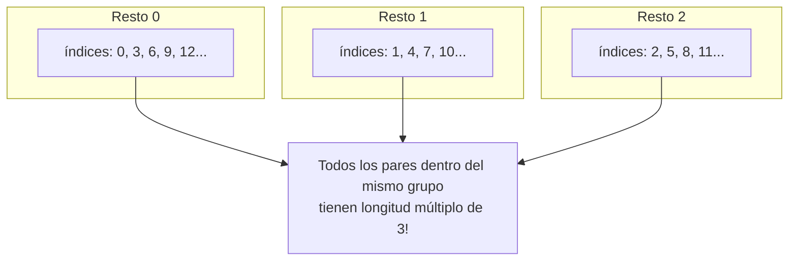
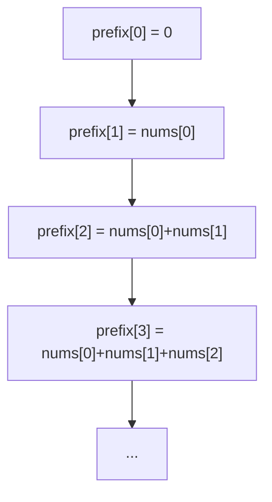

## Máxima Suma de SubArray con Longitud Divisible por K

### LeetCode Daily Challenge – 27 de noviembre 2025

¡Uno de esos problemas que parecen imposibles hasta que le agarrás la vuelta!
Vamos desde cero y con dibujitos.

## El problema

Dado un array y un número `k`, encontrá el subarray contiguo más grande **pero cuya longitud sea múltiplo de k** (k, 2k, 3k…)

Ejemplo:
`nums = [1, -2, 3, 4, -1]`, `k = 3`
Los únicos subarrays válidos son los de longitud 3:

- `[1,-2,3]` → suma 2
- `[-2,3,4]` → suma 5
- `[3,4,-1]` → suma 6 ← ganador

## Principios  de matemática modular

### ¿Qué significa "a ≡ b (mod k)"?

Quiere decir: **cuando dividís a y b por k, te sobra lo mismo**.

Ejemplos con k = 3:

- 7 ÷ 3 → cociente 2, resto 1 → 7 ≡ 1 (mod 3)
- 10 ÷ 3 → cociente 3, resto 1 → 10 ≡ 1 (mod 3)
- 12 ÷ 3 → cociente 4, resto 0 → 12 ≡ 0 (mod 3)



Si dos índices `i` y `j` tienen el mismo resto al dividir por k → entonces `j - i` es múltiplo de k.

## Paso a paso: cómo lo resolvemos

### 1. Usamos prefix sum (suma acumulada)



La suma del subarray de `i` a `j-1` es simplemente:
$$ \text{prefix}[j] - \text{prefix}[i] $$

### 2. El algoritmo en palabras

1. Sumamos el elemento actual → nuevo `prefix`
2. Calculamos el resto de la longitud actual: `(índice + 1) % k`
3. Preguntamos: "¿Ya vi antes este resto?"
   - Sí → puedo formar un subarray válido con longitud múltiplo de k
   - Usamos el **menor** prefix que guardé para ese resto
   - La diferencia es una suma candidata → actualizo el máximo
4. Después, guardo (o actualizo) el menor prefix visto para este resto

## El código final

```ts
function maxSubarraySumDivByK(nums: number[], k: number): number {
  let prefixSum = 0
  let maxSum = -Infinity

  // Guardamos el MENOR prefix visto por cada resto posible
  const minPrefix = new Array(k).fill(Infinity)
  minPrefix[0] = 0 // antes de empezar: longitud 0, suma 0

  for (let i = 0; i < nums.length; i++) {
    prefixSum += nums[i]
    const remainder = (i + 1) % k

    // Si ya vimos este resto → hay subarray válido
    if (minPrefix[remainder] !== Infinity) {
      const candidate = prefixSum - minPrefix[remainder]
      maxSum = Math.max(maxSum, candidate)
    }

    // Actualizamos el menor prefix para este resto
    minPrefix[remainder] = Math.min(minPrefix[remainder], prefixSum)
  }

  return maxSum === -Infinity ? 0 : maxSum
}
```

## Ejemplo completo paso a paso

`nums = [1, -2, 3, 4, -1]`, `k = 3`

| i | num | prefix | longitud | resto | candidato | maxSum |
|---|-----|--------|----------|-------|-----------|--------|
| 0 | 1   | 1      | 1        | 1     | -         | -      |
| 1 | -2  | -1     | 2        | 2     | -         | -      |
| 2 | 3   | 2      | 3        | 0     | 2-0 = 2   | 2      |
| 3 | 4   | 6      | 4        | 1     | 6-1 = 5   | 5      |
| 4 | -1  | 5      | 5        | 2     | 5-(-1)=6  | 6 ← ganador |

## Conclusión

Con una sola idea matemática sencilla (**mismo resto → longitud múltiplo de k**) convertimos un problema que parecía O(n²) en una solución de **O(n) tiempo y O(k) espacio**.
