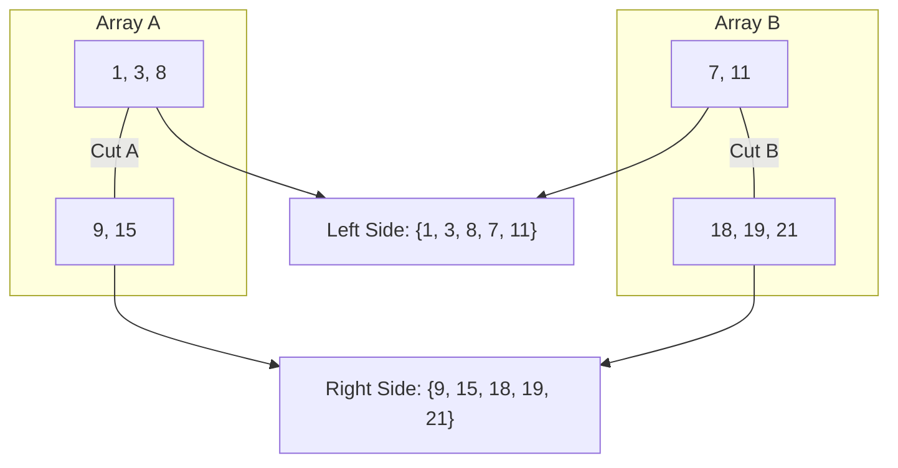
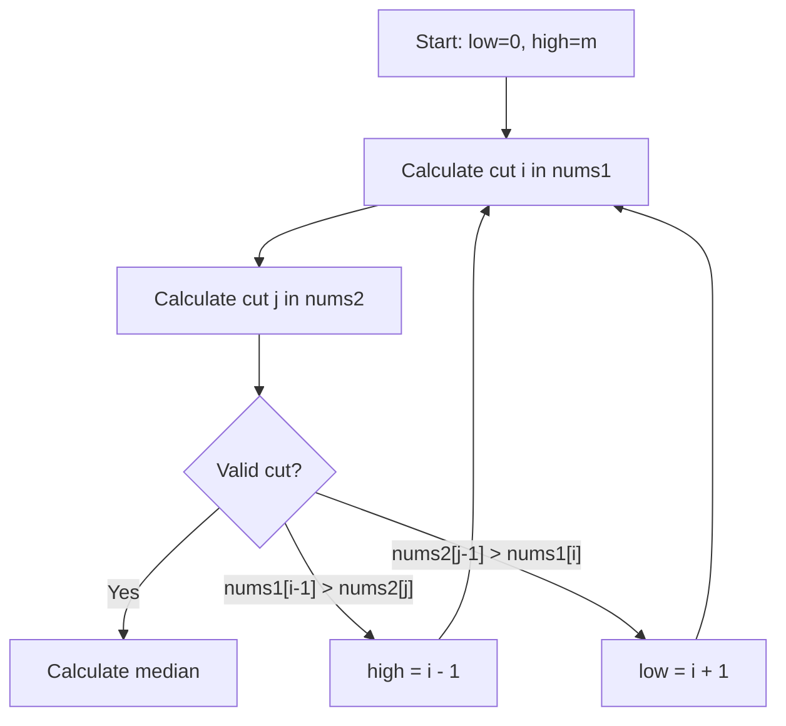

## Problem Statement

Given two sorted arrays, `nums1` and `nums2`, of sizes $m$ and $n$ respectively, return the median of the combined set of both arrays, maintaining order. The solution must have a time complexity of $O(\log(m+n))$.

**Example:**
```
nums1 = [1, 3]
nums2 = [2]

If we merge them: [1, 2, 3]
The median is: 2 (the middle one)
```

## What is the Median?

The median is **the middle number** when you sort all values:

- **Odd quantity** of numbers → the middle one
  - `[1, 2, 3]` → median = 2
- **Even quantity** of numbers → average of the two middle ones
  - `[1, 2, 3, 4]` → median = (2 + 3) / 2 = 2.5

## The Challenge: Finding the Center Without Merging Everything

Imagine you have two bookshelves, both already sorted by size. Your mission is to find the book that would be right in the middle if you combined both shelves into one.

The obvious solution would be:
1. Merge all the books
2. Sort everything
3. Take the middle element

But this would be **slow** ($O(m+n)$). The challenge asks for efficiency of $O(\log(m+n))$, which means we can't afford to look at every book.

## The Key Idea: The "Magic Cut"

Instead of merging the arrays, we'll imagine a **cut** in each one. This cut divides the elements into two groups: **Left** and **Right**.



### When is the Cut "Perfect"?

A cut is perfect when it meets two conditions:

1. **Balance**: The total elements on the left equals those on the right (or one more if the total is odd).
2. **Order**: All numbers on the left side are less than or equal to all those on the right side.

To verify **Order**, we only need to compare the elements right at the cut:

- The largest on the left of A $\le$ the smallest on the right of B.
- The largest on the left of B $\le$ the smallest on the right of A.

## How to Find the Cut: Binary Search

We use **binary search** on the smaller array (to be more efficient). In each iteration:

1. **Choose where to cut**: We try cutting in the middle of the current range
2. **Calculate the other cut**: It's automatically calculated in the second array to maintain balance
3. **Check if it works**: We verify if the order condition is met
4. **Adjust if necessary**:
   - If the number on the left is too large → move cut to the left
   - If it's too small → move cut to the right



## Step-by-Step Example

Let's see a complete example to understand how it works:

```
nums1 = [1, 3, 8, 9, 15]
nums2 = [7, 11, 18, 19, 21, 25]
Total: 11 elements → we need 6 on the left (or 5), 5 on the right (or 6)
```

### Attempt 1: Cut nums1 at position 2

```
nums1: [1, 3 | 8, 9, 15]          (2 on left)
nums2: [7, 11, 18 | 19, 21, 25]   (4 on left)
Total left: 6 ✓

Check order:
- max(left nums1) = 3
- min(right nums2) = 19
- 3 ≤ 19 ✓

- max(left nums2) = 18
- min(right nums1) = 8
- 18 > 8 ✗ → Doesn't work!
```

**Problem**: The 18 (left of nums2) is greater than 8 (right of nums1). We need to move the nums1 cut **to the right**.

### Attempt 2: Cut nums1 at position 4

```
nums1: [1, 3, 8, 9 | 15]          (4 on left)
nums2: [7, 11 | 18, 19, 21, 25]   (2 on left)
Total left: 6 ✓

Check order:
- max(left nums1) = 9
- min(right nums2) = 18
- 9 ≤ 18 ✓

- max(left nums2) = 11
- min(right nums1) = 15
- 11 ≤ 15 ✓

It works! ✓
```

**Median calculation**: Since the total is odd (11), the median is the largest on the left:
```
median = max(9, 11) = 11
```

## TypeScript Implementation

Here's the solution with step-by-step comments:

```typescript
/**
 * LeetCode Problem: Median Of Two Sorted Arrays
 * Difficulty: Hard
 * Topics: Array, Binary Search, Divide and Conquer
 *
 * Find the median of two sorted arrays in O(log(min(m,n)))
 *
 * @param {number[]} nums1 - First sorted array
 * @param {number[]} nums2 - Second sorted array
 * @returns {number} The median of both combined arrays
 */
export function findMedianSortedArrays(
  nums1: number[],
  nums2: number[]
): number {
  // ========================================
  // STEP 1: Ensure nums1 is the smaller one
  // ========================================
  // We always do binary search on the smaller array
  // to make it more efficient O(log(min(m,n)))
  if (nums1.length > nums2.length) {
    return findMedianSortedArrays(nums2, nums1)
  }

  const m = nums1.length // size of smaller array
  const n = nums2.length // size of larger array

  // ========================================
  // STEP 2: Set up binary search
  // ========================================
  // We're going to find the correct "cut" position in nums1
  // low and high represent the range of possible cuts
  let low = 0 // minimum: 0 elements from nums1 on the left
  let high = m // maximum: all elements from nums1 on the left

  while (low <= high) {
    // ========================================
    // STEP 3: Calculate cut positions
    // ========================================
    // i = how many elements from nums1 go to the left
    const i = Math.floor((low + high) / 2)

    // j = how many elements from nums2 go to the left
    // Calculated so the total elements on the left is half
    const j = Math.floor((m + n + 1) / 2) - i

    // ========================================
    // STEP 4: Get values at the cut edges
    // ========================================
    // For nums1:
    // - nums1LeftMax: the last element going to the left
    // - nums1RightMin: the first element going to the right
    const nums1LeftMax = i === 0 ? -Infinity : nums1[i - 1]
    const nums1RightMin = i === m ? Infinity : nums1[i]

    // For nums2:
    // - nums2LeftMax: the last element going to the left
    // - nums2RightMin: the first element going to the right
    const nums2LeftMax = j === 0 ? -Infinity : nums2[j - 1]
    const nums2RightMin = j === n ? Infinity : nums2[j]

    // ========================================
    // STEP 5: Check if we found the correct cut
    // ========================================
    // The cut is correct if:
    // - Everything on the left of nums1 ≤ everything on the right of nums2
    // - Everything on the left of nums2 ≤ everything on the right of nums1
    if (nums1LeftMax <= nums2RightMin && nums2LeftMax <= nums1RightMin) {
      // WE FOUND THE CORRECT CUT! 🎉

      // If the total quantity is ODD:
      // The median is the largest on the left
      if ((m + n) % 2 === 1) {
        return Math.max(nums1LeftMax, nums2LeftMax)
      }

      // If the total quantity is EVEN:
      // The median is the average between:
      // - the largest on the left
      // - the smallest on the right
      return (
        (Math.max(nums1LeftMax, nums2LeftMax)
          + Math.min(nums1RightMin, nums2RightMin))
        / 2
      )
    }

    // ========================================
    // STEP 6: Adjust the cut if it's not correct
    // ========================================
    else if (nums1LeftMax > nums2RightMin) {
      // Problem: the last element on the left of nums1 is greater
      // than the first element on the right of nums2
      // Solution: move the nums1 cut to the LEFT
      // (take fewer elements from nums1)
      high = i - 1
    }
    else {
      // Problem: nums2LeftMax > nums1RightMin
      // The last element on the left of nums2 is greater
      // than the first element on the right of nums1
      // Solution: move the nums1 cut to the RIGHT
      // (take more elements from nums1)
      low = i + 1
    }
  }

  // This point should never be reached if the arrays are valid
  throw new Error('Input arrays are not sorted or invalid')
}
```

### Key Implementation Details

#### 1. Using Infinities

When the cut is at an extreme, we use infinities to simplify comparisons:

- `-Infinity` when there are no elements on the left
- `Infinity` when there are no elements on the right

This avoids having to handle multiple special cases.

#### 2. Formula for the cut in nums2

The formula `j = Math.floor((m + n + 1) / 2) - i` guarantees that:
- If the total is odd, the left half has one more element
- If the total is even, both halves have the same quantity

The `+ 1` is key to correctly handling odd cases.

## Edge Cases and Considerations

It's important to verify that the solution correctly handles these cases:

### 1. Empty array

```javascript
nums1 = []
nums2 = [1, 2, 3]
// median = 2
```

### 2. Single-element arrays

```javascript
nums1 = [1]
nums2 = [2]
// median = (1 + 2) / 2 = 1.5
```

### 3. Non-overlapping elements

```javascript
nums1 = [1, 2]
nums2 = [10, 11]
// median = (2 + 10) / 2 = 6
```

### 4. Arrays with repeated elements

```javascript
nums1 = [1, 2, 2]
nums2 = [2, 2, 3]
// Repeated elements are handled without problems
// median = 2
```

## Complexity Analysis

### Time Complexity: $O(\log(\min(m, n)))$

By doing binary search only on the shorter array, the algorithm is incredibly fast:

- With 8 elements → maximum 3 iterations ($\log_2(8) = 3$)
- With 16 elements → maximum 4 iterations ($\log_2(16) = 4$)
- With 1,000,000 elements → maximum 20 iterations

Each iteration performs only $O(1)$ operations (comparisons and assignments).

### Space Complexity: $O(1)$

We don't create new arrays or data structures. We only use a few variables for indices and edge values.

## Reflections and Learnings

### Key Concepts

This problem is an excellent example of:

1. **Non-traditional binary search**: We're not searching for a value, but for an optimal partition position
2. **Divide and conquer**: We divide the problem into smaller subproblems
3. **Smart use of sentinels**: `Infinity` and `-Infinity` simplify the code
4. **Complexity optimization**: From $O(m+n)$ to $O(\log(\min(m,n)))$

### Why is it a "Hard" Problem

- It requires understanding the partition property
- Binary search is not about values, but about positions
- Handling edge cases (empty arrays, extremes) can be tricky
- The formula to calculate `j` is not obvious

### Alternatives Considered

**Brute force solution** (doesn't meet requirements):
```typescript
// O(m+n) time, O(m+n) space
function findMedianBruteForce(nums1: number[], nums2: number[]): number {
  const merged = [...nums1, ...nums2].sort((a, b) => a - b)
  const mid = Math.floor(merged.length / 2)
  return merged.length % 2 === 1
    ? merged[mid]
    : (merged[mid - 1] + merged[mid]) / 2
}
```

This solution works but is too slow and uses too much memory.

## Resources and References

- [LeetCode Problem #4](https://leetcode.com/problems/median-of-two-sorted-arrays/)
- [Binary Search](https://en.wikipedia.org/wiki/Binary_search_algorithm) - Wikipedia
- This problem frequently appears in interviews at companies like Google, Facebook, and Amazon
