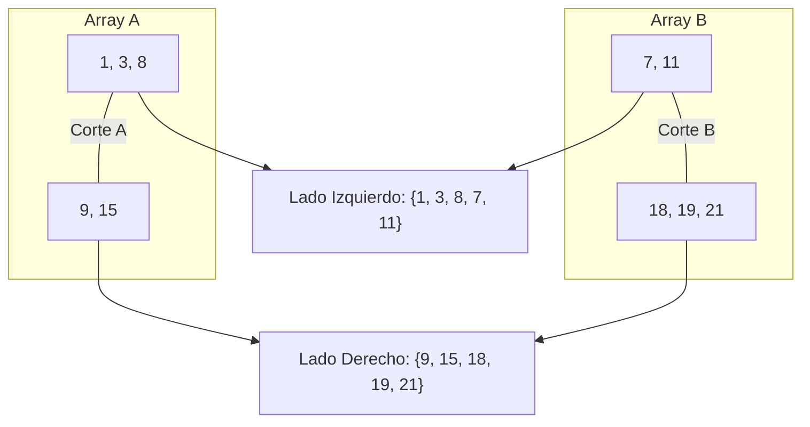
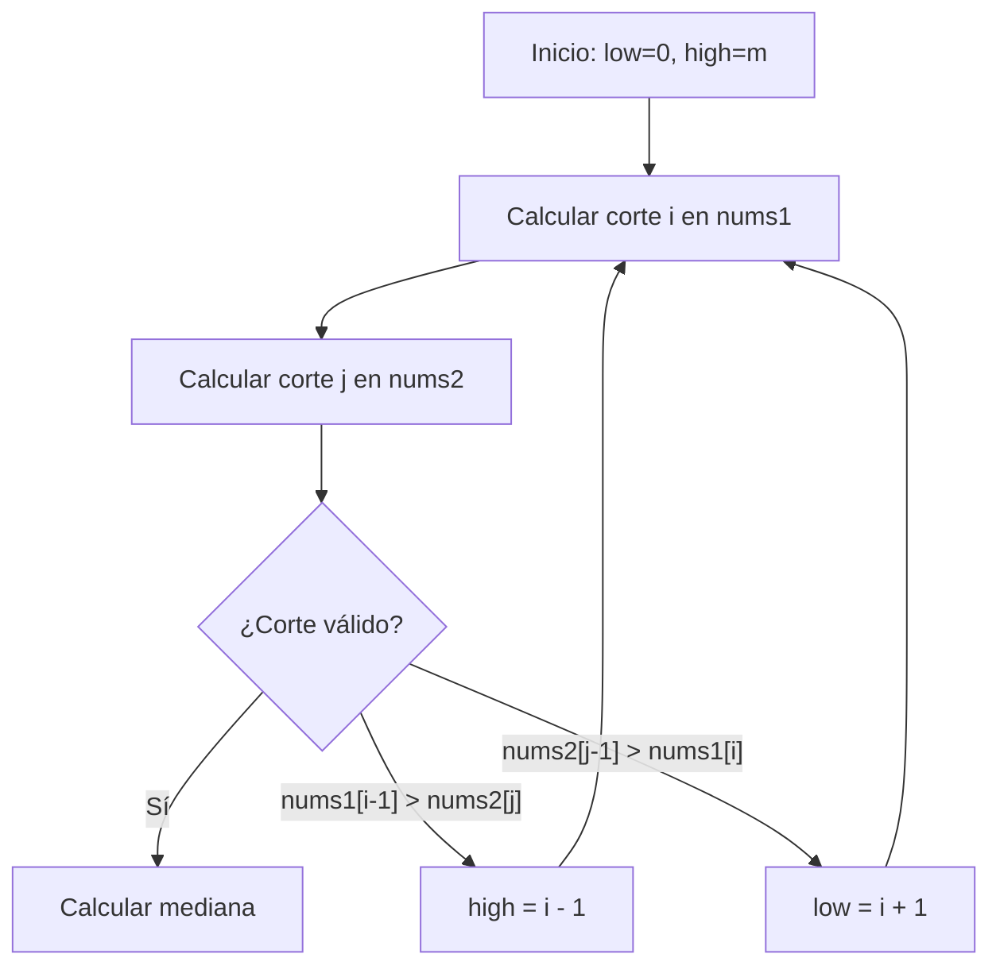

## Enunciado del Problema

Dados dos arrays ordenados, `nums1` y `nums2`, de tamaños $m$ y $n$ respectivamente, se pide devolver la mediana del conjunto combinado de ambos arrays, manteniendo el orden. Es requisito que la solución tenga una complejidad temporal de $O(\log(m+n))$.

**Ejemplo:**
```
nums1 = [1, 3]
nums2 = [2]

Si los juntamos: [1, 2, 3]
La mediana es: 2 (el del medio)
```

## ¿Qué es la Mediana?

La mediana es **el número del medio** cuando ordenas todos los valores:

- **Cantidad impar** de números → el del medio
  - `[1, 2, 3]` → mediana = 2
- **Cantidad par** de números → promedio de los dos del medio
  - `[1, 2, 3, 4]` → mediana = (2 + 3) / 2 = 2.5

## El Desafío: Encontrar el Centro sin Mezclar Todo

Imagina que tienes dos estanterías de libros, ambas ya ordenadas por tamaño. Tu misión es encontrar el libro que quedaría justo en el medio si combinaras ambas estanterías en una sola.

La solución obvia sería:
1. Juntar todos los libros
2. Ordenar todo
3. Sacar el elemento del medio

Pero esto sería **lento** ($O(m+n)$). El reto nos pide una eficiencia de $O(\log(m+n))$, lo que significa que no podemos permitirnos mirar cada libro.

## La Idea Clave: El "Corte Mágico"

En lugar de mezclar los arrays, vamos a imaginar un **corte** en cada uno. Este corte divide los elementos en dos grupos: **Izquierda** y **Derecha**.



### ¿Cuándo es "Perfecto" el Corte?

Un corte es perfecto cuando cumple dos condiciones:

1. **Equilibrio**: El total de elementos a la izquierda es igual al total a la derecha (o uno más si el total es impar).
2. **Orden**: Todos los números en el lado izquierdo son menores o iguales a todos los del lado derecho.

Para verificar el **Orden**, solo necesitamos comparar los elementos justo al lado del corte:

- El mayor de la izquierda de A $\le$ el menor de la derecha de B.
- El mayor de la izquierda de B $\le$ el menor de la derecha de A.

## Cómo Encontrar el Corte: Búsqueda Binaria

Usamos **búsqueda binaria** en el array más pequeño (para ser más eficientes). En cada iteración:

1. **Elegir dónde cortar**: Probamos cortar en la mitad del rango actual
2. **Calcular el otro corte**: Se calcula automáticamente en el segundo array para mantener el equilibrio
3. **Verificar si funciona**: Comprobamos si se cumple la condición de orden
4. **Ajustar si es necesario**:
   - Si el número de la izquierda es muy grande → mover corte a la izquierda
   - Si es muy pequeño → mover corte a la derecha



## Ejemplo Paso a Paso

Veamos un ejemplo completo para entender cómo funciona:

```
nums1 = [1, 3, 8, 9, 15]
nums2 = [7, 11, 18, 19, 21, 25]
Total: 11 elementos → necesitamos 6 a la izquierda (o 5), 5 a la derecha (o 6)
```

### Intento 1: Cortar nums1 en posición 2

```
nums1: [1, 3 | 8, 9, 15]          (2 en izq)
nums2: [7, 11, 18 | 19, 21, 25]   (4 en izq)
Total izquierda: 6 ✓

Verificar orden:
- max(izq nums1) = 3
- min(der nums2) = 19
- 3 ≤ 19 ✓

- max(izq nums2) = 18
- min(der nums1) = 8
- 18 > 8 ✗ → ¡No funciona!
```

**Problema**: El 18 (izquierda de nums2) es mayor que el 8 (derecha de nums1). Necesitamos mover el corte de nums1 **hacia la derecha**.

### Intento 2: Cortar nums1 en posición 4

```
nums1: [1, 3, 8, 9 | 15]          (4 en izq)
nums2: [7, 11 | 18, 19, 21, 25]   (2 en izq)
Total izquierda: 6 ✓

Verificar orden:
- max(izq nums1) = 9
- min(der nums2) = 18
- 9 ≤ 18 ✓

- max(izq nums2) = 11
- min(der nums1) = 15
- 11 ≤ 15 ✓

¡Funciona! ✓
```

**Cálculo de mediana**: Como el total es impar (11), la mediana es el mayor de la izquierda:
```
mediana = max(9, 11) = 11
```

## Implementación en TypeScript

Aquí tienes la solución comentada paso a paso:

```typescript
/**
 * LeetCode Problem: Median Of Two Sorted Arrays
 * Difficulty: Hard
 * Topics: Array, Binary Search, Divide and Conquer
 *
 * Encuentra la mediana de dos arrays ordenados en O(log(min(m,n)))
 *
 * @param {number[]} nums1 - Primer array ordenado
 * @param {number[]} nums2 - Segundo array ordenado
 * @returns {number} La mediana de ambos arrays combinados
 */
export function findMedianSortedArrays(
  nums1: number[],
  nums2: number[]
): number {
  // ========================================
  // PASO 1: Asegurar que nums1 sea el más pequeño
  // ========================================
  // Siempre hacemos búsqueda binaria en el array más pequeño
  // para que sea más eficiente O(log(min(m,n)))
  if (nums1.length > nums2.length) {
    return findMedianSortedArrays(nums2, nums1)
  }

  const m = nums1.length // tamaño del array pequeño
  const n = nums2.length // tamaño del array grande

  // ========================================
  // PASO 2: Configurar búsqueda binaria
  // ========================================
  // Vamos a buscar la posición correcta del "corte" en nums1
  // low y high representan el rango de posibles cortes
  let low = 0 // mínimo: 0 elementos de nums1 a la izquierda
  let high = m // máximo: todos los elementos de nums1 a la izquierda

  while (low <= high) {
    // ========================================
    // PASO 3: Calcular las posiciones del corte
    // ========================================
    // i = cuántos elementos de nums1 van a la izquierda
    const i = Math.floor((low + high) / 2)

    // j = cuántos elementos de nums2 van a la izquierda
    // Se calcula para que el total de elementos a la izquierda sea la mitad
    const j = Math.floor((m + n + 1) / 2) - i

    // ========================================
    // PASO 4: Obtener los valores en los bordes del corte
    // ========================================
    // Para nums1:
    // - nums1LeftMax: el último elemento que va a la izquierda
    // - nums1RightMin: el primer elemento que va a la derecha
    const nums1LeftMax = i === 0 ? -Infinity : nums1[i - 1]
    const nums1RightMin = i === m ? Infinity : nums1[i]

    // Para nums2:
    // - nums2LeftMax: el último elemento que va a la izquierda
    // - nums2RightMin: el primer elemento que va a la derecha
    const nums2LeftMax = j === 0 ? -Infinity : nums2[j - 1]
    const nums2RightMin = j === n ? Infinity : nums2[j]

    // ========================================
    // PASO 5: Verificar si encontramos el corte correcto
    // ========================================
    // El corte es correcto si:
    // - Todo lo de la izquierda de nums1 ≤ todo lo de la derecha de nums2
    // - Todo lo de la izquierda de nums2 ≤ todo lo de la derecha de nums1
    if (nums1LeftMax <= nums2RightMin && nums2LeftMax <= nums1RightMin) {
      // ¡ENCONTRAMOS EL CORTE CORRECTO! 🎉

      // Si la cantidad total es IMPAR:
      // La mediana es el mayor de la izquierda
      if ((m + n) % 2 === 1) {
        return Math.max(nums1LeftMax, nums2LeftMax)
      }

      // Si la cantidad total es PAR:
      // La mediana es el promedio entre:
      // - el mayor de la izquierda
      // - el menor de la derecha
      return (
        (Math.max(nums1LeftMax, nums2LeftMax)
          + Math.min(nums1RightMin, nums2RightMin))
        / 2
      )
    }

    // ========================================
    // PASO 6: Ajustar el corte si no es correcto
    // ========================================
    else if (nums1LeftMax > nums2RightMin) {
      // Problema: el último elemento de la izquierda de nums1 es mayor
      // que el primer elemento de la derecha de nums2
      // Solución: mover el corte de nums1 hacia la IZQUIERDA
      // (tomar menos elementos de nums1)
      high = i - 1
    }
    else {
      // Problema: nums2LeftMax > nums1RightMin
      // El último elemento de la izquierda de nums2 es mayor
      // que el primer elemento de la derecha de nums1
      // Solución: mover el corte de nums1 hacia la DERECHA
      // (tomar más elementos de nums1)
      low = i + 1
    }
  }

  // Este punto nunca debería alcanzarse si los arrays son válidos
  throw new Error('Input arrays are not sorted or invalid')
}
```

### Detalles Clave de la Implementación

#### 1. Uso de Infinitos

Cuando el corte está en un extremo, usamos infinitos para simplificar las comparaciones:

- `-Infinity` cuando no hay elementos a la izquierda
- `Infinity` cuando no hay elementos a la derecha

Esto evita tener que manejar múltiples casos especiales.

#### 2. Fórmula para el corte en nums2

La fórmula `j = Math.floor((m + n + 1) / 2) - i` garantiza que:
- Si el total es impar, la mitad izquierda tiene un elemento más
- Si el total es par, ambas mitades tienen la misma cantidad

El `+ 1` es clave para manejar correctamente los casos impares.

## Casos Edge y Consideraciones

Es importante verificar que la solución maneja correctamente estos casos:

### 1. Un array vacío

```javascript
nums1 = []
nums2 = [1, 2, 3]
// mediana = 2
```

### 2. Arrays de un solo elemento

```javascript
nums1 = [1]
nums2 = [2]
// mediana = (1 + 2) / 2 = 1.5
```

### 3. Elementos no solapados

```javascript
nums1 = [1, 2]
nums2 = [10, 11]
// mediana = (2 + 10) / 2 = 6
```

### 4. Arrays con elementos repetidos

```javascript
nums1 = [1, 2, 2]
nums2 = [2, 2, 3]
// Los repetidos se manejan sin problemas
// mediana = 2
```

## Análisis de Complejidad

### Complejidad Temporal: $O(\log(\min(m, n)))$

Al hacer búsqueda binaria solo en el array más corto, el algoritmo es increíblemente rápido:

- Con 8 elementos → máximo 3 iteraciones ($\log_2(8) = 3$)
- Con 16 elementos → máximo 4 iteraciones ($\log_2(16) = 4$)
- Con 1,000,000 elementos → máximo 20 iteraciones

Cada iteración realiza solo operaciones $O(1)$ (comparaciones y asignaciones).

### Complejidad Espacial: $O(1)$

No creamos nuevos arrays ni estructuras de datos. Solo usamos unas pocas variables para los índices y valores de los bordes.

## Reflexiones y Aprendizajes

### Conceptos Clave

Este problema es un excelente ejemplo de:

1. **Búsqueda binaria no tradicional**: No buscamos un valor, sino una posición de partición óptima
2. **Divide y conquista**: Dividimos el problema en subproblemas más pequeños
3. **Uso inteligente de sentinelas**: `Infinity` y `-Infinity` simplifican el código
4. **Optimización de complejidad**: De $O(m+n)$ a $O(\log(\min(m,n)))$

### Por Qué es un Problema "Hard"

- Requiere entender la propiedad de partición
- La búsqueda binaria no es sobre valores, sino sobre posiciones
- Manejar casos edge (arrays vacíos, extremos) puede ser complicado
- La fórmula para calcular `j` no es obvia

### Alternativas Consideradas

**Solución de fuerza bruta** (no cumple requisitos):
```typescript
// O(m+n) tiempo, O(m+n) espacio
function findMedianBruteForce(nums1: number[], nums2: number[]): number {
  const merged = [...nums1, ...nums2].sort((a, b) => a - b)
  const mid = Math.floor(merged.length / 2)
  return merged.length % 2 === 1
    ? merged[mid]
    : (merged[mid - 1] + merged[mid]) / 2
}
```

Esta solución funciona pero es demasiado lenta y usa mucha memoria.

## Recursos y Referencias

- [LeetCode Problem #4](https://leetcode.com/problems/median-of-two-sorted-arrays/)
- [Búsqueda Binaria](https://es.wikipedia.org/wiki/B%C3%BAsqueda_binaria) - Wikipedia
- Este problema aparece frecuentemente en entrevistas de empresas como Google, Facebook y Amazon
