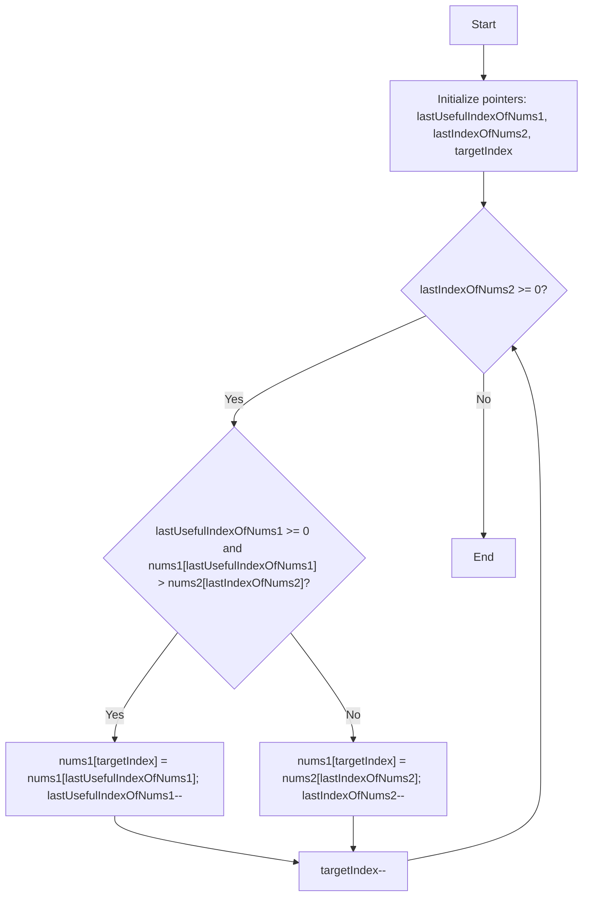

## Introduction

This is the first article in a series dedicated to solving problems from LeetCode's "Top Interview 150 Study Plan". In this series, we'll tackle each problem with detailed analysis, explaining the approach used, time and space complexity, and providing implementations in TypeScript.

## Problem Statement

### LeetCode 88: Merge Sorted Array

We are given two integer arrays `nums1` and `nums2`, sorted in non-decreasing order, and two integers `m` and `n` representing the number of elements in `nums1` and `nums2` respectively.

We must merge `nums1` and `nums2` into a single array sorted in non-decreasing order. The final sorted array should not be returned by the function, but instead stored inside the array `nums1`.

### Constraints

- `nums1.length == m + n`
- `nums2.length == n`
- `0 <= m, n <= 200`
- `1 <= m + n <= 200`
- `-10^9 <= nums1[i], nums2[j] <= 10^9`

### Examples

**Example 1:**

```bash
Input: nums1 = [1,2,3,0,0,0], m = 3, nums2 = [2,5,6], n = 3
Output: [1,2,2,3,5,6]
```

**Example 2:**

```bash
Input: nums1 = [1], m = 1, nums2 = [], n = 0
Output: [1]
```

**Example 3:**

```bash
Input: nums1 = [0], m = 0, nums2 = [1], n = 1
Output: [1]
```

## Problem Analysis

### Key Observations

1. **Special structure of nums1**: The array `nums1` has length `m + n`, where the first `m` elements are valid and the last `n` elements are zeros that should be ignored.
2. **In-place modification**: We must modify `nums1` directly without creating a new array.
3. **Already sorted arrays**: Both input arrays are sorted, which is a significant advantage.
4. **No return value**: The function must modify `nums1` directly.

### The Two Pointers Pattern

- **Definition**: The Two Pointers pattern involves using two indices that traverse the array (or arrays) to solve problems related to searching, comparing, or merging.
- **Application here**: We'll use two pointers to traverse `nums1` and `nums2` from end to beginning, allowing us to place the largest elements in their correct positions without overwriting important data.
- **Advantages**:
  - Time efficiency: O(m + n)
  - Space efficiency: O(1) (in-place modification)
  - Natural handling of edge cases (empty arrays, duplicates, etc.)
  - Implementation simplicity
  - Avoids the need for additional data structures

Our approach will leverage these observations and the Two Pointers pattern to implement an efficient and clear solution to the problem of merging two sorted arrays.

### Step by Step



First, we define three variables:

1. `lastUsefulIndexOfNums1`: Points to the last valid element in `nums1` (position m-1)
2. `lastIndexOfNums2`: Points to the last element in `nums2` (position n-1)
3. `targetIndex`: Points to where we write the result (position m+n-1)

Then we compare the elements pointed to by `lastUsefulIndexOfNums1` and `lastIndexOfNums2`. We place the larger one at position `targetIndex` and move the corresponding pointers to the left. We repeat this process until all elements from `nums2` have been processed.

### Why Does It Work?

- **Order preserved**: We always take the largest available element
- **No collisions**: We write from right to left, reading from right to left
- **Edge cases covered**:
  - If `nums2` runs out first: `nums1` is already in place
  - If `nums1` runs out first: we copy the rest of `nums2`

## Complexity

- **Time**: O(m + n) - we visit each element exactly once
- **Space**: O(1) - we only use additional variables, in-place modification

## Implementation

```typescript
export function merge(
  nums1: number[],
  m: number,
  nums2: number[],
  n: number
): void {
  let lastUsefulIndexOfNums1 = m - 1
  let lastIndexOfNums2 = n - 1
  let targetIndex = m + n - 1

  while (lastIndexOfNums2 >= 0) {
    if (
      lastUsefulIndexOfNums1 >= 0
      && nums1[lastUsefulIndexOfNums1] > nums2[lastIndexOfNums2]
    ) {
      nums1[targetIndex] = nums1[lastUsefulIndexOfNums1]
      lastUsefulIndexOfNums1--
    }
    else {
      nums1[targetIndex] = nums2[lastIndexOfNums2]
      lastIndexOfNums2--
    }
    targetIndex--
  }
}
```

## Lessons Learned

1. **Direction matters**: Merging from the end avoids overwriting data
2. **Leverage constraints**: The extra space in `nums1` is key
3. **Two Pointers is versatile**: Not just for simple arrays, but for merge operations
4. **Descriptive names**: Clear variables make the algorithm self-explanatory
