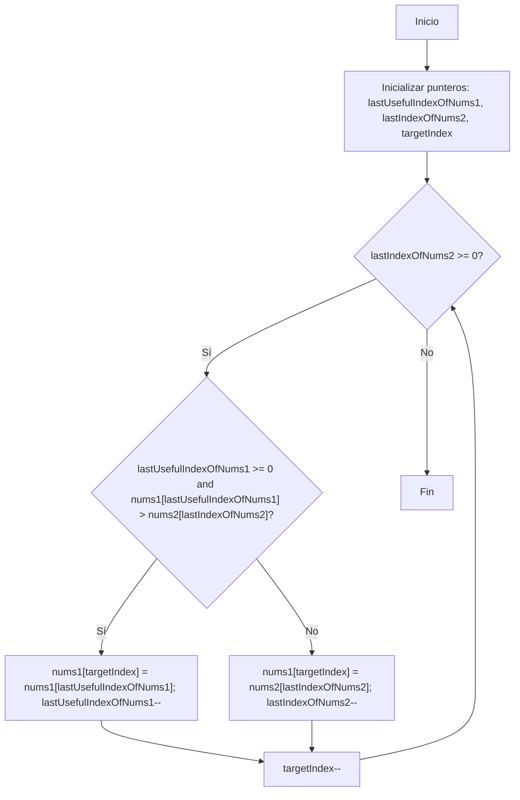

## Introducción

Este es el primer artículo de una serie dedicada a resolver los problemas del "Top Interview 150 Study Plan" de LeetCode. En esta serie abordaremos cada problema con un análisis detallado, explicando el enfoque utilizado, la complejidad temporal y espacial, y proporcionando implementaciones en TypeScript.

## Enunciado del Problema

### LeetCode 88: Merge Sorted Array

Se nos proporcionan dos arrays de enteros `nums1` y `nums2`, ordenados en orden no decreciente, y dos enteros `m` y `n` que representan el número de elementos en `nums1` y `nums2` respectivamente.

Debemos fusionar `nums1` y `nums2` en un solo array ordenado en orden no decreciente. El array final ordenado no debe ser devuelto por la función, sino almacenarse dentro del array `nums1`.

### Restricciones

- `nums1.length == m + n`
- `nums2.length == n`
- `0 <= m, n <= 200`
- `1 <= m + n <= 200`
- `-10^9 <= nums1[i], nums2[j] <= 10^9`

### Ejemplos

**Ejemplo 1:**

```bash
Input: nums1 = [1,2,3,0,0,0], m = 3, nums2 = [2,5,6], n = 3
Output: [1,2,2,3,5,6]
```

**Ejemplo 2:**

```bash
Input: nums1 = [1], m = 1, nums2 = [], n = 0
Output: [1]
```

**Ejemplo 3:**

```bash
Input: nums1 = [0], m = 0, nums2 = [1], n = 1
Output: [1]
```

## Análisis del Problema

### Observaciones Clave

1. **Estructura especial de nums1**: El array `nums1` tiene longitud `m + n`, donde los primeros `m` elementos son válidos y los últimos `n` elementos son ceros que deben ser ignorados.
2. **Modificación in-place**: Debemos modificar `nums1` directamente, sin crear un nuevo array.
3. **Arrays ya ordenados**: Ambos arrays de entrada están ordenados, lo cual es una ventaja significativa.
4. **No debemos devolver nada**: La función debe modificar `nums1` directamente.

### El Patrón Two Pointers

- **Definición**: El patrón Two Pointers implica usar dos índices que recorren el array (o arrays) para resolver problemas relacionados con búsqueda, comparación o combinación.
- **Aplicación aquí**: Utilizaremos dos punteros para recorrer `nums1` y `nums2` desde el final hacia el principio, lo que nos permite colocar los elementos más grandes en su posición correcta sin sobrescribir datos importantes.
- **Ventajas**:
  - Eficiencia en tiempo: O(m + n)
  - Eficiencia en espacio: O(1) (modificación in-place)
  - Manejo natural de casos edge (arrays vacíos, duplicados, etc.)
  - Simplicidad en la implementación
  - Evita la necesidad de estructuras de datos adicionales

Nuestro enfoque aprovechará estas observaciones y el patrón Two Pointers para implementar una solución eficiente y clara al problema de fusionar dos arrays ordenados.

### Paso a Paso



Primero definimos tres variables:

1. `lastUsefulIndexOfNums1`: Apunta al último elemento válido en `nums1` (posición m-1)
2. `lastIndexOfNums2`: Apunta al último elemento en `nums2` (posición n-1)
3. `targetIndex`: Apunta a dónde escribimos el resultado (posición m+n-1)

Luego comparamos los elementos apuntados por `lastUsefulIndexOfNums1` y `lastIndexOfNums2`. Colocamos el mayor en la posición `targetIndex` y movemos los punteros correspondientes hacia la izquierda. Repetimos este proceso hasta que todos los elementos de `nums2` hayan sido procesados.

### ¿Por qué funciona?

- **Orden preservado**: Siempre tomamos el elemento mayor disponible
- **Sin colisiones**: Escribimos de derecha a izquierda, leyendo de derecha a izquierda
- **Casos edge cubiertos**:
  - Si `nums2` se agota primero: `nums1` ya está en su lugar
  - Si `nums1` se agota primero: copiamos el resto de `nums2`

## Complejidad

- **Tiempo**: O(m + n) - visitamos cada elemento exactamente una vez
- **Espacio**: O(1) - solo usamos variables adicionales, modificación in-place

## Implementación

```typescript
export function merge(
  nums1: number[],
  m: number,
  nums2: number[],
  n: number
): void {
  let lastUsefulIndexOfNums1 = m - 1
  let lastIndexOfNums2 = n - 1
  let targetIndex = m + n - 1

  while (lastIndexOfNums2 >= 0) {
    if (
      lastUsefulIndexOfNums1 >= 0
      && nums1[lastUsefulIndexOfNums1] > nums2[lastIndexOfNums2]
    ) {
      nums1[targetIndex] = nums1[lastUsefulIndexOfNums1]
      lastUsefulIndexOfNums1--
    }
    else {
      nums1[targetIndex] = nums2[lastIndexOfNums2]
      lastIndexOfNums2--
    }
    targetIndex--
  }
}
```

## Lecciones Aprendidas

1. **La dirección importa**: Fusionar desde el final evita sobrescribir datos
2. **Aprovecha las restricciones**: El espacio extra en `nums1` es clave
3. **Two Pointers es versátil**: No solo para arrays simples, sino para operaciones de fusión
4. **Nombres descriptivos**: Variables claras hacen el algoritmo autoexplicativo
