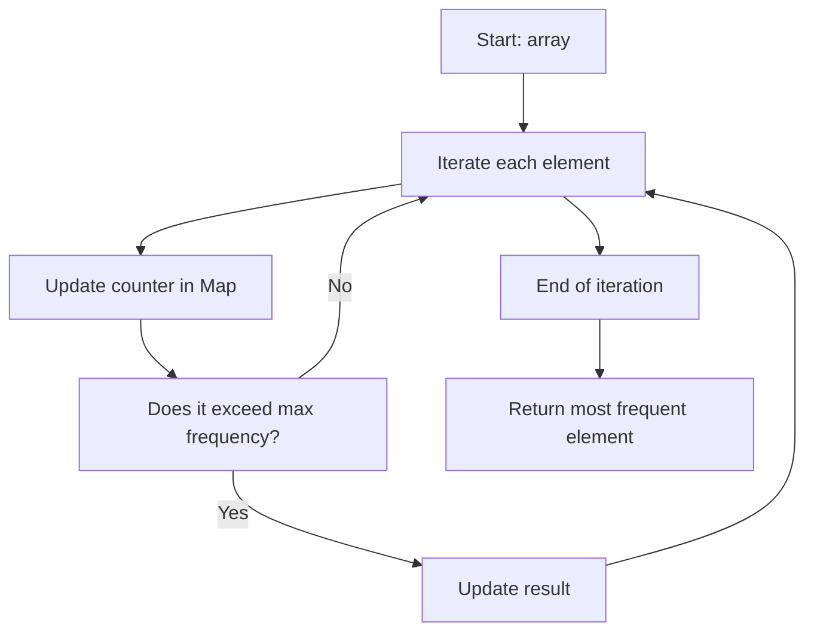

## Most Frequent - Analysis & Explanation

## Problem Statement

Given an array of elements, return the element that appears most frequently.

There will always be a single most frequent element.

### Example

Input: `[2, 3, 2, 5, 2, 3]`
Output: `2`

Input: `["a", true, "a", false, true, "a"]`
Output: `"a"`

## Initial Analysis

### Understanding the Problem

To solve this, we need to count how many times each element appears in the array and then identify the one with the highest frequency. We'll use a `Map` structure, which allows any data type as a key and avoids type conversion issues. As we iterate through the array, we increment each element's counter in the `Map` and update the most frequent element found so far. At the end, we return the element with the highest frequency.

In JavaScript, the `Map` structure lets us store key–value pairs and perform fast lookups, using any data type as a key (numbers, strings, booleans, etc.). This avoids ambiguities and respects the original type of each value, unlike plain objects that only accept strings or symbols as keys.

### Identified Test Cases

To ensure the function works correctly, consider these test cases:

- An array with repeated elements, where one appears more than the others.
- An array of numbers, where the most frequent number should be returned.
- An array with booleans and strings, to verify correct type distinction.
- An array where the most frequent element appears in different positions.

These cases help validate that the function correctly identifies the most frequent element, regardless of type or position in the array.

## Solution Development

### Chosen Approach

We use a frequency counting approach with JavaScript's `Map` structure. A `Map` lets us use any data type as a key (numbers, strings, booleans, etc.), avoiding type conversion issues and simplifying the code. We iterate through the array once, incrementing each element's counter in the `Map` and updating the most frequent element found so far. This method is efficient, clear, and robust for arrays with elements of any type.

#### Flow Diagram



### Step-by-Step Implementation

1. Create an empty `Map` to store the frequency of each element.
2. Iterate through the array, incrementing each element's counter in the `Map`.
3. Keep variables to track the most frequent element and its count.
4. Each time an element's frequency is updated, check if it exceeds the current max frequency and update the result if so.
5. After the loop, return the most frequent element found.

Complete function code:

```javascript
function mostFrequent(arr) {
  const freq = new Map()
  let maxCount = 0
  let result
  for (const el of arr) {
    const count = (freq.get(el) || 0) + 1
    freq.set(el, count)
    if (count > maxCount) {
      maxCount = count
      result = el
    }
  }
  return result
}
```

## Complexity Analysis

### Time Complexity

The algorithm iterates through the array once to count frequencies, and each iteration performs constant-time operations in the `Map`. So, the time complexity is $O(n)$, where $n$ is the array length.

### Space Complexity

A `Map` is used to store the frequency of each distinct element. In the worst case, if all elements are different, the space required is proportional to the number of elements, i.e., $O(n)$.

## Edge Cases & Considerations

- If the array contains elements of different types but with the same textual value (e.g., `2` and `"2"`), the algorithm treats them as distinct thanks to `Map`.
- If the array has a single element, that will be the most frequent.
- If all elements are different, any of them could be the result, but the statement guarantees a unique most frequent element.
- The algorithm works with any data type: numbers, strings, booleans, objects (note: distinct objects with the same content are considered different by reference).

## Reflections & Learnings

### Concepts Applied

- Using data structures like `Map` for efficient frequency counting.
- Linear iteration to optimize execution time.
- Handling mixed data types in JavaScript.

### Possible Optimizations

- The algorithm is already optimal in time and space for this problem.
- If less space is needed and you know the data is a single primitive type, a plain object could be used, but you'd lose robustness for mixed types.

## Resources & References

- [JavaScript Map Documentation (MDN)](https://developer.mozilla.org/en-US/docs/Web/JavaScript/Reference/Global_Objects/Map)
- [Hash Table - Wikipedia](https://en.wikipedia.org/wiki/Hash_table)
