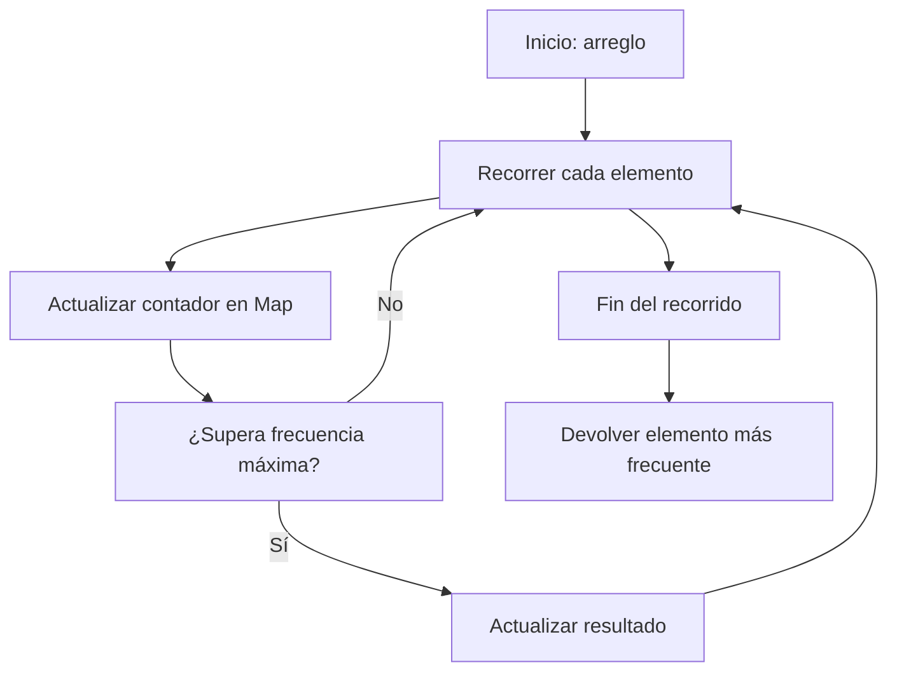

## Most Frequent - Análisis y Explicación

## Enunciado del Problema

Dado un arreglo de elementos, devuelve el elemento que aparece con mayor frecuencia.

Siempre habrá un único elemento más frecuente.

### Ejemplo

Entrada: `[2, 3, 2, 5, 2, 3]`
Salida: `2`

Entrada: `["a", true, "a", false, true, "a"]`
Salida: `"a"`

## Análisis Inicial

### Comprensión del Problema

En JavaScript, la estructura `Map` permite almacenar pares clave–valor y realizar búsquedas rápidas, usando cualquier tipo de dato como clave (números, strings, booleanos, etc.). Esto evita ambigüedades y respeta el tipo original de cada valor, a diferencia de los objetos simples que solo aceptan strings o symbols como clave.

### Casos de Prueba Identificados

Para asegurarnos de que la función funciona correctamente, podemos considerar los siguientes casos de prueba:

- Un arreglo con elementos repetidos, donde uno aparece más veces que los demás.
- Un arreglo con números, donde el número más frecuente debe ser devuelto.
- Un arreglo con valores booleanos y strings, para verificar que se distinguen correctamente los tipos.
- Un arreglo donde el elemento más frecuente aparece en diferentes posiciones.

Estos casos nos permiten validar que la función identifica correctamente el elemento más frecuente, sin importar el tipo de dato o la posición en el arreglo.

## Desarrollo de la Solución

### Enfoque Elegido

Para resolver el problema, utilizamos un enfoque basado en conteo de frecuencias empleando la estructura `Map` de JavaScript. Un `Map` nos permite usar cualquier tipo de dato como clave (números, strings, booleanos, etc.), evitando así problemas de conversión de tipos y simplificando el código. Recorremos el arreglo una sola vez y, para cada elemento, incrementamos su contador en el `Map`. Al mismo tiempo, vamos actualizando el elemento más frecuente encontrado hasta el momento. Este método es eficiente, claro y robusto para arreglos con elementos de cualquier tipo.

#### Diagrama de Flujo



### Implementación Paso a Paso

1. Crear un `Map` vacío para almacenar la frecuencia de cada elemento.
2. Recorrer el arreglo y, por cada elemento, incrementar su contador en el `Map`.
3. Mantener variables para llevar el seguimiento del elemento más frecuente y su cantidad.
4. Cada vez que actualizamos la frecuencia de un elemento, verificamos si supera la máxima frecuencia encontrada hasta el momento y, de ser así, actualizamos el resultado.
5. Al finalizar el recorrido, devolvemos el elemento más frecuente encontrado.

Código completo de la función:

```javascript
function mostFrequent(arr) {
  const freq = new Map()
  let maxCount = 0
  let result
  for (const el of arr) {
    const count = (freq.get(el) || 0) + 1
    freq.set(el, count)
    if (count > maxCount) {
      maxCount = count
      result = el
    }
  }
  return result
}
```

## Análisis de Complejidad

### Complejidad Temporal

El algoritmo recorre el arreglo una sola vez para contar las frecuencias y, en cada iteración, realiza operaciones de inserción y consulta en el `Map`, que son de tiempo constante en promedio. Por lo tanto, la complejidad temporal es $O(n)$, donde $n$ es la longitud del arreglo.

### Complejidad Espacial

Se utiliza un `Map` para almacenar la frecuencia de cada elemento distinto del arreglo. En el peor caso, si todos los elementos son diferentes, el espacio requerido es proporcional al número de elementos, es decir, $O(n)$.

## Casos Edge y Consideraciones

- Si el arreglo contiene elementos de diferentes tipos pero con el mismo valor textual (por ejemplo, `2` y `"2"`), el algoritmo los trata como elementos distintos gracias al uso de `Map`.
- Si el arreglo tiene un solo elemento, ese será el más frecuente.
- Si todos los elementos son diferentes, cualquiera de ellos podría ser el resultado, pero el enunciado garantiza que siempre habrá un único elemento más frecuente.
- El algoritmo funciona correctamente con cualquier tipo de dato: números, strings, booleanos, objetos (aunque para objetos distintos con el mismo contenido, se consideran diferentes por referencia).

## Reflexiones y Aprendizajes

### Conceptos Aplicados

- Uso de estructuras de datos como `Map` para conteo eficiente de frecuencias.
- Recorridos lineales para optimizar tiempo de ejecución.
- Manejo de tipos de datos mixtos en JavaScript.

### Posibles Optimizaciones

- El algoritmo ya es óptimo en cuanto a tiempo y espacio para este problema.
- Si se requiere aún menos espacio y se sabe que los datos son de un solo tipo primitivo, se podría usar un objeto simple, aunque se perdería la robustez ante tipos mixtos.

## Recursos y Referencias

- [Documentación de Map en JavaScript (MDN)](https://developer.mozilla.org/es/docs/Web/JavaScript/Reference/Global_Objects/Map)
- [Hash Table - Wikipedia](https://es.wikipedia.org/wiki/Tabla_hash)
