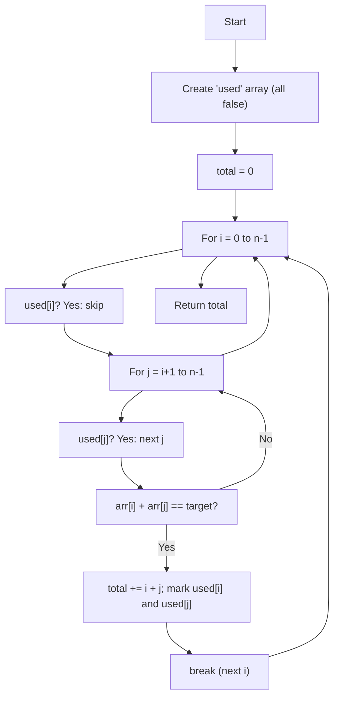

## Pairwise - Analysis, Visuals & Explanation

## Problem Statement

Given an array of integers and a target number, find all pairs of elements whose values sum exactly to the target. For each pair, sum the indices of both elements. Each element can only be used once. Return the total sum of the indices of all valid pairs.

Example:

- Array: `[2, 3, 4, 6, 8]`, target: `10`
- Valid pairs: `(2,8)` → indices 0 and 4; `(4,6)` → indices 2 and 3
- Index sum: `0 + 4 + 2 + 3 = 9`

## Initial Analysis

### What does the problem ask?

Identify all pairs of numbers that sum to the target, without reusing elements, and sum the indices of each pair. The result is the total sum of those indices.

### Key Test Cases

1. `pairwise([2, 3, 4, 6, 8], 10)` → **9**
   - Pairs: (2,8) → 0 and 4; (4,6) → 2 and 3; sum: 0+4+2+3 = 9
2. `pairwise([4, 1, 5, 2, 6, 3], 7)` → **15**
   - Pairs: (1,6) → 1 and 4; (4,3) → 0 and 5; (5,2) → 2 and 3; sum: 1+4+0+5+2+3 = 15
3. `pairwise([-30, -15, 5, 10, 15, -5, 20, -40], -20)` → **22**
   - Pairs: (-30,10) → 0 and 3; (-15,-5) → 1 and 5; (20,-40) → 6 and 7; sum: 0+3+1+5+6+7 = 22
4. `pairwise([7, 9, 13, 19, 21, 6, 3, 1, 4, 8, 12, 22], 24)` → **10**
   - Pairs: (21,3) → 4 and 6; sum: 4+6 = 10

## Solution Development

### Approach & Justification

A double (nested) loop is used to search for all possible pairs, marking used elements with an auxiliary array. This way, each element is used only once.

**Why this method?**

- It's straightforward and easy to understand.
- Guarantees no element is reused in multiple pairs.
- The $O(n^2)$ complexity is acceptable for moderate sizes.

**Alternatives:**

- Hashmap: more efficient, but complicates index management and single-use restriction.
- Two pointers: useful if the array is sorted, but here the order matters and the original array can't be modified.

### Flowchart (Mermaid)



### Final Code (Commented)

```javascript
/**
 * Returns the sum of indices of all pairs whose values add up to the target.
 * Each element can be used at most once.
 * @param {number[]} arr - Input array
 * @param {number} target - Target sum
 * @returns {number} - Sum of indices of valid pairs
 */
function pairwise(arr, target) {
  let used = Array.from({ length: arr.length }).fill(false)
  let total = 0
  for (let i = 0; i < arr.length; i++) {
    if (used[i])
      continue
    for (let j = i + 1; j < arr.length; j++) {
      if (!used[j] && arr[i] + arr[j] === target) {
        total += i + j
        used[i] = true
        used[j] = true
        break // Move to next i after pairing
      }
    }
  }
  return total
}
```

## Complexity Analysis

### Time Complexity

The algorithm is $O(n^2)$, where $n$ is the length of the array:

$$
\text{Complexity} = O(n^2)
$$

For each element, it searches for a pair by traversing the rest of the array. Even though it stops after pairing, the worst case remains quadratic.

### Space Complexity

An auxiliary array `used` of size $O(n)$ is used to mark paired elements. No additional significant structures are required.

## Edge Cases & Considerations

- Empty array → returns 0
- No pair sums to target → returns 0
- Repeated elements → only used once per pair
- All elements equal and target = double the value → pairs formed until elements run out
- Pairs with the same value (e.g., even target and two equal elements) → allowed if both indices are available

## Reflections & Learnings

**Concepts applied:**
- Double (nested) loop for pair search
- Auxiliary array for single-use control
- Greedy: pair the first valid match for each element

**Can it be optimized?**
For very large arrays, a hashmap could reduce complexity, but complicates index management and single-use restriction. The quadratic solution is simpler and robust for most practical cases.

## Resources & References

- [Official FreeCodeCamp explanation](https://forum.freecodecamp.org/t/freecodecamp-algorithm-challenge-guide-pairwise/16015)
- [Pairwise blog article](https://blog-astro-rouge.vercel.app/posts/pairwise/)
- Related problems: Two Sum, Pair Sum, array pair combinatorics

---
