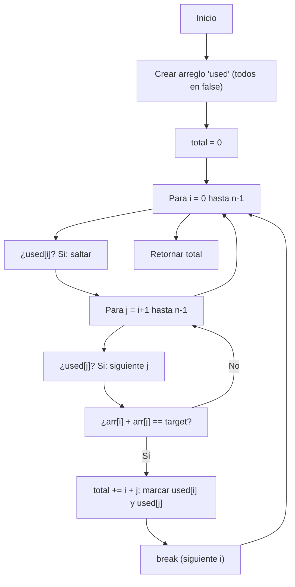

## Pairwise - Análisis, Visuales y Explicación

## Enunciado del Problema

Dado un arreglo de enteros y un número objetivo, encuentra todos los pares de elementos cuyos valores sumen exactamente ese objetivo. Por cada par, suma los índices de ambos elementos. Cada elemento solo puede usarse una vez. Devuelve la suma total de los índices de todos los pares válidos.

Ejemplo:

- Arreglo: `[2, 3, 4, 6, 8]`, objetivo: `10`
- Pares válidos: `(2,8)` → índices 0 y 4; `(4,6)` → índices 2 y 3
- Suma de índices: `0 + 4 + 2 + 3 = 9`

## Análisis Inicial

### ¿Qué pide el problema?

Identificar todos los pares de números que suman el objetivo, sin reutilizar elementos, y sumar los índices de cada par. El resultado es la suma total de esos índices.

### Casos de Prueba Clave

1. `pairwise([2, 3, 4, 6, 8], 10)` → **9**
  - Pares: (2,8) → 0 y 4; (4,6) → 2 y 3; suma: 0+4+2+3 = 9
2. `pairwise([4, 1, 5, 2, 6, 3], 7)` → **15**
  - Pares: (1,6) → 1 y 4; (4,3) → 0 y 5; (5,2) → 2 y 3; suma: 1+4+0+5+2+3 = 15
3. `pairwise([-30, -15, 5, 10, 15, -5, 20, -40], -20)` → **22**
  - Pares: (-30,10) → 0 y 3; (-15,-5) → 1 y 5; (20,-40) → 6 y 7; suma: 0+3+1+5+6+7 = 22
4. `pairwise([7, 9, 13, 19, 21, 6, 3, 1, 4, 8, 12, 22], 24)` → **10**
  - Pares: (21,3) → 4 y 6; suma: 4+6 = 10

## Desarrollo de la Solución

### Enfoque y Justificación

Se utiliza un doble recorrido (anidado) para buscar todos los pares posibles, marcando los elementos ya usados con un arreglo auxiliar. Así, cada elemento se usa solo una vez.

**¿Por qué este método?**

- Es directo y fácil de entender.
- Garantiza que no se repitan elementos en varios pares.
- La complejidad $O(n^2)$ es aceptable para tamaños moderados.

**Alternativas:**

- Hashmap: más eficiente, pero complica el manejo de índices y la restricción de uso único.
- Dos punteros: útil si el arreglo está ordenado, pero aquí el orden importa y no se puede modificar el arreglo original.

### Diagrama de Flujo (Mermaid)



### Código Final (Comentado)

```javascript
/**
 * Suma los índices de todos los pares que suman el objetivo.
 * Cada elemento se usa como máximo una vez.
 * @param {number[]} arr - Arreglo de entrada
 * @param {number} target - Suma objetivo
 * @returns {number} - Suma de índices de los pares válidos
 */
function pairwise(arr, target) {
  let used = Array.from({ length: arr.length }).fill(false)
  let total = 0
  for (let i = 0; i < arr.length; i++) {
    if (used[i])
      continue
    for (let j = i + 1; j < arr.length; j++) {
      if (!used[j] && arr[i] + arr[j] === target) {
        total += i + j
        used[i] = true
        used[j] = true
        break // Salta a siguiente i tras emparejar
      }
    }
  }
  return total
}
```

## Análisis de Complejidad

### Complejidad Temporal

El algoritmo es $O(n^2)$, donde $n$ es la longitud del arreglo:

$$
	ext{Complejidad} = O(n^2)
$$

Para cada elemento, se busca un par recorriendo el resto del arreglo. Si bien se detiene al emparejar, el peor caso sigue siendo cuadrático.

### Complejidad Espacial

Se utiliza un arreglo auxiliar `used` de tamaño $O(n)$ para marcar los elementos ya emparejados. No se requieren estructuras adicionales.

## Casos Edge y Consideraciones

- Arreglo vacío → retorna 0
- Ningún par suma el objetivo → retorna 0
- Elementos repetidos → solo se usan una vez por par
- Todos iguales y objetivo = doble del valor → solo se forman pares hasta agotar elementos
- Pares con el mismo valor (ej: objetivo par y dos iguales) → permitido si ambos índices están libres

## Reflexiones y Aprendizajes

**Conceptos aplicados:**
- Recorrido doble (anidado) para búsqueda de pares
- Arreglo auxiliar para uso único
- Greedy: se empareja el primer par válido para cada elemento

**¿Se puede optimizar?**
Para arreglos muy grandes, un hashmap puede reducir la complejidad, pero complica el manejo de índices y la restricción de uso único. La solución cuadrática es más simple y robusta para la mayoría de casos prácticos.

## Recursos y Referencias

- [Explicación oficial FreeCodeCamp (en inglés)](https://forum.freecodecamp.org/t/freecodecamp-algorithm-challenge-guide-pairwise/16015)
- [Artículo de blog sobre pairwise](https://blog-astro-rouge.vercel.app/posts/pairwise/)
- Problemas relacionados: Two Sum, Pair Sum, combinatoria de pares en arreglos
