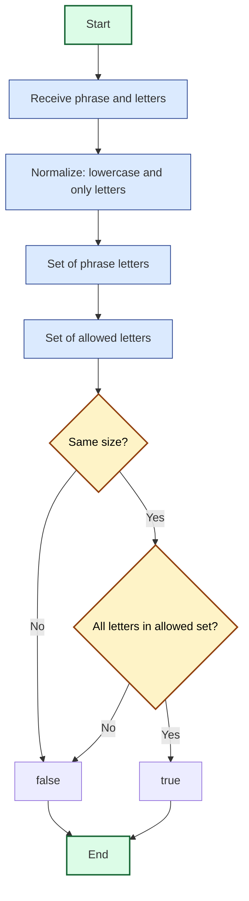

## Pangram: Analysis and Explanation

## Problem Statement

Given a word or phrase and a string of lowercase letters, determine if the phrase:

- Uses **all** the letters from the set at least once.
- **Does not** use any letter outside that set.

Uppercase, spaces, and punctuation should be ignored.

## Initial Analysis

### Understanding the Problem

The function receives:

1. A word or phrase (may include uppercase, spaces, and punctuation).
2. A string with the allowed letters (lowercase).

What must the phrase satisfy?

- Use all allowed letters at least once.
- Not use any extra letter.
- Ignore uppercase, spaces, and punctuation.

### Key Test Cases

| Phrase        | Letters | Expected | Reason                                 |
|--------------|---------|----------|----------------------------------------|
| "abc cab"    | "abc"   | true     | Uses only a, b, c and all at least once|
| "aabbcc"     | "abc"   | true     | All present, no extras                 |
| "abcx"       | "abc"   | false    | Uses a letter outside the set          |
| "ab cab"     | "abc"   | true     | All present, no extras                 |
| "aabb"       | "abc"   | false    | Missing letter c                       |
| ""           | "abc"   | false    | No letters                             |
| "a b c!"     | "abc"   | true     | Ignores spaces and punctuation         |

## Solution Development

### Strategy

We use `Set` to compare the unique letters in the phrase with the allowed ones:

1. Normalize the phrase: lowercase and only letters.
2. Create a Set with the unique letters from the phrase.
3. Create a Set with the allowed letters.
4. Compare both Sets:
   - If they have the same size **and** all letters from the phrase are in the allowed set, it's a valid pangram.
   - Otherwise, it's invalid.

### Flowchart (Mermaid)



### Final Code

```javascript
/**
 * Determines if a phrase is an exact pangram for a given set of letters.
 * @param {string} sentence - Phrase to analyze
 * @param {string} letters - Allowed letters (lowercase)
 * @returns {boolean}
 */
function isPangram(sentence, letters) {
  // 1. Normalize: lowercase and only letters
  const normalized = sentence.toLowerCase().replace(/[^a-z]/g, '')
  // 2. Set of unique letters in the phrase
  const sentenceSet = new Set(normalized)
  // 3. Set of allowed letters
  const lettersSet = new Set(letters)
  // 4. Compare size and content
  if (sentenceSet.size !== lettersSet.size)
    return false
  return [...sentenceSet].every(l => lettersSet.has(l))
}
export default isPangram
```

## Complexity Analysis

### Time Complexity

- **Time:** $O(n + m)$, where $n$ is the length of the phrase and $m$ is the length of the allowed letters. We traverse the phrase to clean and extract letters, and the set of letters to compare.
- **Space:** $O(m)$, for the two Sets (allowed and present letters).

## Edge Cases and Considerations

- Empty phrase: false
- Missing any letter: false
- Extra letter present: false
- Uppercase, spaces, and punctuation are ignored
- Empty allowed letters: false

## Reflections and Learnings

**What did we learn?**

- `Set` is ideal for validating uniqueness and membership.
- Cleaning and normalizing strings is key in text problems.
- Comparing sets is a powerful technique for exact validations.

**Can it be optimized?**

- The `Set` approach is already optimal for this case.
- If you validate many phrases with the same set, precompute the allowed set once.

## Resources and References

- [MDN Set Documentation](https://developer.mozilla.org/en-US/docs/Web/JavaScript/Reference/Global_Objects/Set)
- [JavaScript Regular Expressions](https://developer.mozilla.org/en-US/docs/Web/JavaScript/Guide/Regular_Expressions)
