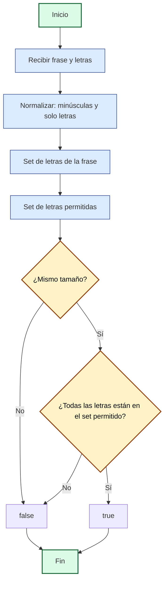

## Pangram: Análisis y Explicación

## Enunciado del Problema

Dada una palabra o frase y un string de letras minúsculas, determina si la frase:

- Usa **todas** las letras del conjunto al menos una vez.
- **No** utiliza ninguna letra fuera de ese conjunto.

Se deben ignorar mayúsculas, espacios y signos de puntuación.

## Análisis Inicial

### Comprensión del Problema

La función recibe:

1. Una palabra o frase (puede tener mayúsculas, espacios y signos).
2. Un string con las letras permitidas (en minúscula).

¿Qué debe cumplir la frase?

- Usar todas las letras permitidas al menos una vez.
- No usar ninguna letra extra.
- Ignorar mayúsculas, espacios y signos.

### Casos de Prueba Clave

| Frase         | Letras | Esperado | Motivo                                 |
|--------------|--------|----------|----------------------------------------|
| "abc cab"    | "abc"  | true     | Usa solo a, b, c y todas al menos una |
| "aabbcc"     | "abc"  | true     | Todas presentes, ninguna extra         |
| "abcx"       | "abc"  | false    | Usa letra fuera del conjunto           |
| "ab cab"     | "abc"  | true     | Todas presentes, ninguna extra         |
| "aabb"       | "abc"  | false    | Falta la letra c                       |
| ""           | "abc"  | false    | No hay letras                          |
| "a b c!"     | "abc"  | true     | Ignora espacios y signos               |

## Desarrollo de la Solución

### Estrategia

Usamos `Set` para comparar las letras únicas de la frase con las permitidas:

1. Normalizar la frase: minúsculas y solo letras.
2. Crear un Set con las letras únicas de la frase.
3. Crear un Set con las letras permitidas.
4. Comparar ambos Sets:
  - Si tienen el mismo tamaño **y** todas las letras de la frase están en el conjunto permitido, es pangrama válido.
  - Si no, es inválido.

### Diagrama de Flujo (Mermaid)



### Código Final

```javascript
/**
 * Determina si una frase es un pangrama exacto para un conjunto de letras.
 * @param {string} sentence - Frase a analizar
 * @param {string} letters - Letras permitidas (minúsculas)
 * @returns {boolean}
 */
function isPangram(sentence, letters) {
  // 1. Normalizar: minúsculas y solo letras
  const normalized = sentence.toLowerCase().replace(/[^a-z]/g, '')
  // 2. Set de letras únicas en la frase
  const sentenceSet = new Set(normalized)
  // 3. Set de letras permitidas
  const lettersSet = new Set(letters)
  // 4. Comparar tamaño y contenido
  if (sentenceSet.size !== lettersSet.size)
    return false
  return [...sentenceSet].every(l => lettersSet.has(l))
}
export default isPangram
```

## Análisis de Complejidad

### Complejidad Temporal

- **Tiempo:** $O(n + m)$, donde $n$ es la longitud de la frase y $m$ la de las letras permitidas. Se recorre la frase para limpiar y extraer letras, y el set de letras para comparar.
- **Espacio:** $O(m)$, por los dos Sets (letras permitidas y presentes).

## Casos Edge y Consideraciones

- Frase vacía: false
- Falta alguna letra: false
- Hay letra extra: false
- Se ignoran mayúsculas, espacios y signos
- Letras permitidas vacío: false

## Reflexiones y Aprendizajes

**¿Qué aprendimos?**

- `Set` es ideal para validar unicidad y pertenencia.
- Limpiar y normalizar strings es clave en problemas de texto.
- Comparar conjuntos es una técnica poderosa para validaciones exactas.

**¿Se puede optimizar?**

- El enfoque con `Set` ya es óptimo para este caso.
- Si validas muchas frases con el mismo set, precalcula el set de letras una vez.

## Recursos y Referencias

- [Documentación de Set en MDN](https://developer.mozilla.org/es/docs/Web/JavaScript/Reference/Global_Objects/Set)
- [Expresiones regulares en JavaScript](https://developer.mozilla.org/es/docs/Web/JavaScript/Guide/Regular_Expressions)
