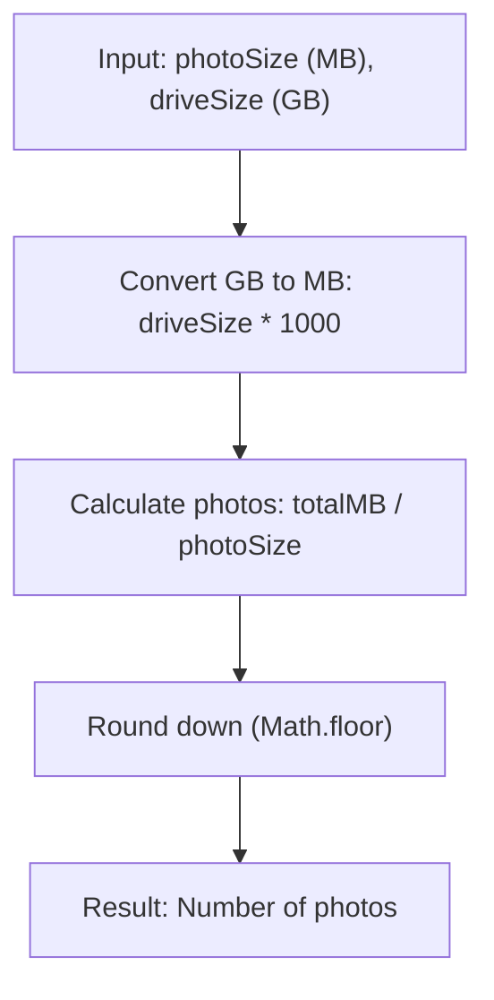

## Photo Storage - Analysis and Explanation

## Problem Statement

Given the size of a photo in megabytes (MB) and the capacity of a hard drive in gigabytes (GB), the goal is to determine how many complete photos can be stored on the disk following these rules:

- $1$ gigabyte (GB) is equal to $1000$ megabytes (MB).
- You must return the number of whole photos (no decimals).

## Initial Analysis

### Understanding the Problem

The logic requires converting the disk capacity from GB to MB and then dividing that total by the size of each photo. Since we are only interested in complete photos, we must round the result down.

### Process Visualization



### Identified Test Cases

1. **Basic:** `photoSize = 1`, `driveSize = 1` $\rightarrow$ $1000$ photos.
2. **Exact division:** `photoSize = 2`, `driveSize = 1` $\rightarrow$ $500$ photos.
3. **With decimals:** `photoSize = 3.5`, `driveSize = 5.5` $\rightarrow$ $\lfloor \frac{5.5 \times 1000}{3.5} \rfloor = 1571$ photos.
4. **Edge Case:** If the photo size is $0$ or negative, we must avoid division by zero.

## Solution Development

### Chosen Approach

We will use a direct arithmetic formula. It is important to perform the unit conversion first and then apply the JavaScript rounding function to ensure the result is an integer.

### Implementation

```typescript
/**
 * Calculates how many complete photos fit on a hard drive.
 * @param photoSizeMb Size of each photo in MB.
 * @param hardDriveSizeGb Disk capacity in GB.
 * @returns Number of whole photos.
 */
function numberOfPhotos(photoSizeMb: number, hardDriveSizeGb: number): number {
  if (photoSizeMb <= 0)
    return 0

  const totalMb = hardDriveSizeGb * 1000
  return Math.floor(totalMb / photoSizeMb)
}
```

## Complexity Analysis

### Time Complexity

$O(1)$. The function performs a constant number of basic arithmetic operations, regardless of the magnitude of the input values.

### Space Complexity

$O(1)$. No additional storage is required that depends on the input; only constant local variables are used.

## Edge Cases and Considerations

- **Division by zero:** We validate that `photoSizeMb` is greater than zero to avoid execution errors or infinite results.
- **Unit conversion:** The challenge specifies $1$ GB = $1000$ MB. Although $1024$ is sometimes used in computing, we must stick to the problem requirements.
- **Precision:** When working with floating-point numbers in JavaScript, `Math.floor` is the safest way to obtain the required integer part.

## Reflections and Learnings

### Applied Concepts

- **Unit Conversion:** Transforming scales to operate with the same magnitude.
- **Controlled Rounding:** Using `Math.floor` to comply with the "complete photos" constraint.

### Possible Improvements

In a real-world environment, validations could be added to ensure inputs are positive numbers and handle potential precision errors in very long decimal numbers, although for this challenge, the direct solution is optimal.

## Resources and References

- [MDN - Math.floor()](https://developer.mozilla.org/en-US/docs/Web/JavaScript/Reference/Global_Objects/Math/floor)
- [Digital Unit Conversion](https://en.wikipedia.org/wiki/Gigabyte)
