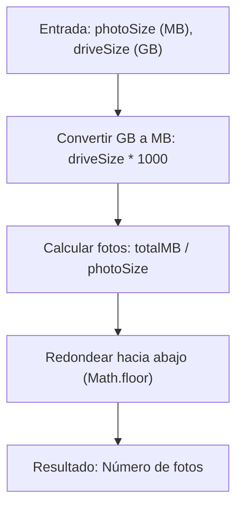

## Photo Storage - Análisis y Explicación

## Enunciado del Problema

Dado el tamaño de una foto en megabytes (MB) y la capacidad de un disco duro en gigabytes (GB), el objetivo es determinar cuántas fotos completas se pueden almacenar en el disco siguiendo estas reglas:

- $1$ gigabyte (GB) es igual a $1000$ megabytes (MB).
- Se debe devolver el número de fotos enteras (sin decimales).

## Análisis Inicial

### Comprensión del Problema

La lógica requiere convertir la capacidad del disco de GB a MB y luego dividir ese total por el tamaño de cada foto. Dado que solo nos interesan las fotos completas, debemos redondear el resultado hacia abajo.

### Visualización del Proceso



### Casos de Prueba Identificados

1. **Básico:** `photoSize = 1`, `driveSize = 1` $\rightarrow$ $1000$ fotos.
2. **División exacta:** `photoSize = 2`, `driveSize = 1` $\rightarrow$ $500$ fotos.
3. **Con decimales:** `photoSize = 3.5`, `driveSize = 5.5` $\rightarrow$ $\lfloor \frac{5.5 \times 1000}{3.5} \rfloor = 1571$ fotos.
4. **Caso Edge:** Si el tamaño de la foto es $0$ o negativo, debemos evitar la división por cero.

## Desarrollo de la Solución

### Enfoque Elegido

Utilizaremos una fórmula aritmética directa. Es importante realizar la conversión de unidades primero y luego aplicar la función de redondeo de JavaScript para asegurar que el resultado sea un número entero.

### Implementación

```typescript
/**
 * Calcula cuántas fotos completas caben en un disco duro.
 * @param photoSizeMb Tamaño de cada foto en MB.
 * @param hardDriveSizeGb Capacidad del disco en GB.
 * @returns Cantidad de fotos enteras.
 */
function numberOfPhotos(photoSizeMb: number, hardDriveSizeGb: number): number {
  if (photoSizeMb <= 0)
    return 0

  const totalMb = hardDriveSizeGb * 1000
  return Math.floor(totalMb / photoSizeMb)
}
```

## Análisis de Complejidad

### Complejidad Temporal

$O(1)$. La función realiza un número constante de operaciones aritméticas básicas, independientemente de la magnitud de los valores de entrada.

### Complejidad Espacial

$O(1)$. No se requiere almacenamiento adicional que dependa de la entrada; solo se utilizan variables locales constantes.

## Casos Edge y Consideraciones

- **División por cero:** Validamos que `photoSizeMb` sea mayor a cero para evitar errores de ejecución o resultados infinitos.
- **Conversión de unidades:** El reto especifica $1$ GB = $1000$ MB. Aunque en informática a veces se usa $1024$, debemos ceñirnos a los requisitos del enunciado.
- **Precisión:** Al trabajar con números de punto flotante en JavaScript, `Math.floor` es la forma más segura de obtener la parte entera requerida.

## Reflexiones y Aprendizajes

### Conceptos Aplicados

- **Conversión de Unidades:** Transformación de escalas para operar con la misma magnitud.
- **Redondeo Controlado:** Uso de `Math.floor` para cumplir con la restricción de "fotos completas".

### Posibles Mejoras

En un entorno real, se podrían añadir validaciones para asegurar que las entradas sean números positivos y manejar posibles errores de precisión en números decimales muy largos, aunque para este desafío la solución directa es óptima.

## Recursos y Referencias

- [MDN - Math.floor()](https://developer.mozilla.org/es/docs/Web/JavaScript/Reference/Global_Objects/Math/floor)
- [Conversión de Unidades Digitales](https://es.wikipedia.org/wiki/Gigabyte)
