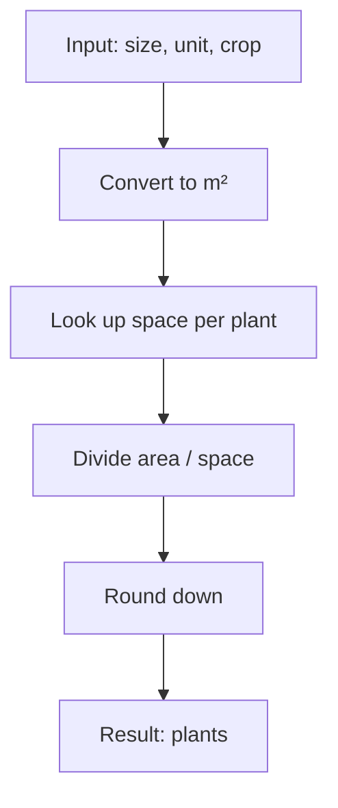

## Plant The Crop - Analysis and Explanation

## Problem Statement

Given:
- A number representing the size of a field
- A unit of measurement ('acres' or 'hectares')
- A crop type

Determine how many plants of that crop fit in the field.

**Unit conversion:**
- 1 acre = 4046.86 m²
- 1 hectare = 10,000 m²

**Space required per plant:**
| Crop      | m² per plant |
|-----------|:------------|
| corn      | 1           |
| wheat     | 0.1         |
| soybeans  | 0.5         |
| tomatoes  | 0.25        |
| lettuce   | 0.2         |

Return the number of plants that fit, rounded down.

## Initial Analysis

### What does the challenge ask?
Convert the field area to square meters, look up the space required per plant for the crop, and divide. The result is rounded down.

### Test Cases

```js
getNumberOfPlants(1, 'acres', 'corn') // 4046
getNumberOfPlants(2, 'hectares', 'lettuce') // 100000
getNumberOfPlants(20, 'acres', 'soybeans') // 161874
getNumberOfPlants(3.75, 'hectares', 'tomatoes') // 150000
getNumberOfPlants(16.75, 'acres', 'tomatoes') // 271139
```

## Solution Development

### Approach and Diagram
1. Convert the area to m² according to the unit.
2. Look up the space per plant for the crop.
3. Divide total area by space per plant.
4. Round down.



## JavaScript Implementation

```js
function getNumberOfPlants(size, unit, crop) {
  const unitToM2 = {
    acres: 4046.86,
    hectares: 10000,
    hectáreas: 10000, // just in case
  }
  const cropToM2 = {
    corn: 1,
    wheat: 0.1,
    soybeans: 0.5,
    tomatoes: 0.25,
    lettuce: 0.2,
  }
  const area = size * unitToM2[unit]
  const space = cropToM2[crop]
  return Math.floor(area / space)
}
```

## Complexity Analysis

- **Time:** $O(1)$ (dictionary access and basic arithmetic)
- **Space:** $O(1)$ (scalar variables and small dictionaries)

## Edge Cases and Considerations

- If the unit or crop does not exist, returns `NaN` or `undefined` (assume valid input).
- If the size is 0, returns 0.
- If the size is negative, returns negative or `NaN` (not handled).
- If the space per plant is greater than the area, returns 0.

## Reflections and Learnings

- Dictionaries to map units and crops.
- Unit conversion and basic arithmetic.
- Rounding down to avoid exceeding real capacity.

**What could be improved?**
- Validate unrecognized or negative inputs.
- Internationalize units if needed.

## Resources and References

- [Plant density (Wikipedia)](https://en.wikipedia.org/wiki/Plant_density)
- [Acre (Wikipedia)](https://en.wikipedia.org/wiki/Acre)
- [Hectare (Wikipedia)](https://en.wikipedia.org/wiki/Hectare)
