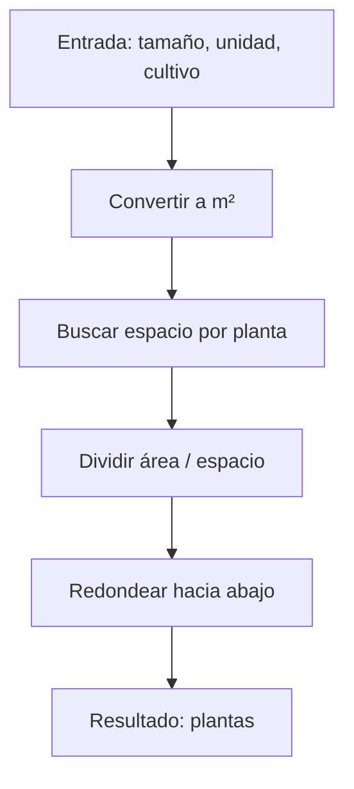

## Plant The Crop - Análisis y Explicación

## Enunciado del Problema

Dado:

- Un número que representa el tamaño de un campo agrícola
- Una unidad de medida ('acres' o 'hectáreas')
- Un tipo de cultivo

Determina cuántas plantas de ese cultivo caben en el campo.

**Conversión de unidades:**

- 1 acre = 4046,86 m²
- 1 hectárea = 10.000 m²

**Espacio requerido por planta:**

| Cultivo    | m² por planta |
|------------|:-------------|
| corn       | 1            |
| wheat      | 0.1          |
| soybeans   | 0.5          |
| tomatoes   | 0.25         |
| lettuce    | 0.2          |

Devuelve el número de plantas que caben, redondeado hacia abajo.

## Análisis Inicial

### ¿Qué pide el reto?

Convertir el área del campo a metros cuadrados, buscar el espacio requerido por planta según el cultivo, y dividir. El resultado se redondea hacia abajo.

### Casos de Prueba

```js
getNumberOfPlants(1, 'acres', 'corn') // 4046
getNumberOfPlants(2, 'hectares', 'lettuce') // 100000
getNumberOfPlants(20, 'acres', 'soybeans') // 161874
getNumberOfPlants(3.75, 'hectares', 'tomatoes') // 150000
getNumberOfPlants(16.75, 'acres', 'tomatoes') // 271139
```

## Desarrollo de la Solución

### Enfoque y Diagrama

1. Convertir el área a m² según la unidad.
2. Buscar el espacio por planta del cultivo.
3. Dividir área total entre espacio por planta.
4. Redondear hacia abajo.



## Implementación en JavaScript

```js
function getNumberOfPlants(size, unit, crop) {
  const unitToM2 = {
    acres: 4046.86,
    hectáreas: 10000,
    hectareas: 10000, // por si acaso
  }
  const cropToM2 = {
    corn: 1,
    wheat: 0.1,
    soybeans: 0.5,
    tomatoes: 0.25,
    lettuce: 0.2,
  }
  const area = size * unitToM2[unit]
  const space = cropToM2[crop]
  return Math.floor(area / space)
}
```

## Análisis de Complejidad

- **Temporal:** $O(1)$ (acceso a diccionario y aritmética básica)
- **Espacial:** $O(1)$ (variables escalares y diccionarios pequeños)

## Casos Edge y Consideraciones

- Si la unidad o el cultivo no existen, retorna `NaN` o `undefined` (se asume entrada válida).
- Si el tamaño es 0, retorna 0.
- Si el tamaño es negativo, retorna negativo o `NaN` (no contemplado).
- Si el espacio por planta es mayor que el área, retorna 0.

## Reflexiones y Aprendizajes

- Diccionarios para mapear unidades y cultivos.
- Conversión de unidades y aritmética básica.
- Redondeo hacia abajo para no exceder la capacidad real.

**¿Qué se podría mejorar?**

- Validar entradas no reconocidas o negativas.
- Internacionalizar unidades si se requiere.

## Recursos y Referencias

- [Acre (Wikipedia)](https://en.wikipedia.org/wiki/Acre)
- [Hectárea (Wikipedia)](https://en.wikipedia.org/wiki/Hectare)
