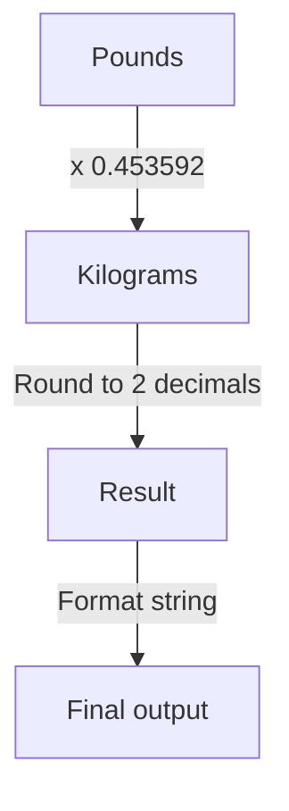

## Problem Statement

Given a weight in pounds as a number, return the string:

`(lbs) pounds equals (kgs) kilograms.`

Where:

- `(lbs)` is replaced by the input number.
- `(kgs)` is replaced by the value converted to kilograms, rounded and formatted to two decimals.
- 1 pound equals **0.453592** kilograms.
- If the input is 1, use "pound" instead of "pounds".
- If the converted value is 1, use "kilogram" instead of "kilograms".

## Initial Analysis

### Understanding the Problem

The function receives a number representing a weight in pounds and must convert it to kilograms using the equivalence **1 pound = 0.453592 kg**. The result should be a string formatted as:

`(lbs) pounds equals (kgs) kilograms.`

Decimal formatting and correct singular/plural usage must be handled.

### Identified Test Cases

The following test cases ensure correct functionality:

- Input: **1** → "1 pound equals 0.45 kilograms." (singular)
- Input: **0** → "0 pounds equals 0.00 kilograms." (zero)
- Input: **100** → "100 pounds equals 45.36 kilograms." (large value)
- Input: **2.5** → "2.5 pounds equals 1.13 kilograms." (decimal)
- Input: **2.20462** → "2.20462 pounds equals 1.00 kilogram." (converted value equals 1)

## Solution Development

### Approach

The conversion is done by multiplying the value in pounds by the factor **0.453592** to obtain the weight in kilograms. The result is rounded and formatted to two decimals. Singular or plural is used as appropriate.

### Conversion Diagram



### Implementation

```javascript
function poundsToKilograms(lbs) {
  const kgs = lbs * 0.453592;
  const roundedKgs = kgs.toFixed(2);
  const poundWord = lbs === 1 ? "pound" : "pounds";
  const kilogramWord = parseFloat(roundedKgs) === 1 ? "kilogram" : "kilograms";
  return `${lbs} ${poundWord} equals ${roundedKgs} ${kilogramWord}.`;
}
```

## Complexity Analysis

**Time complexity:** O(1) (constant operations)

**Space complexity:** O(1) (no additional structures)

## Edge Cases and Considerations

- Input equal to 0: "0 pounds equals 0.00 kilograms."
- Input equal to 1: "1 pound equals ... kilograms."
- Converted value equal to 1: "... equals ... kilogram."
- Decimal and large numbers: correct formatting and rounding.
- The result should always show two decimals.

## Reflections and Learnings

**Applied concepts:**

- Unit conversion and number formatting.
- Conditionals for singular/plural.
- Rounding and decimal formatting.

**Possible improvements:**
The function is optimal in performance. Readability could be improved or the logic reused in other contexts.

## Resources and References

- [Number.prototype.toFixed() on MDN](https://developer.mozilla.org/en-US/docs/Web/JavaScript/Reference/Global_Objects/Number/toFixed)
- [Unit conversion on Wikipedia](https://en.wikipedia.org/wiki/Conversion_of_units)
