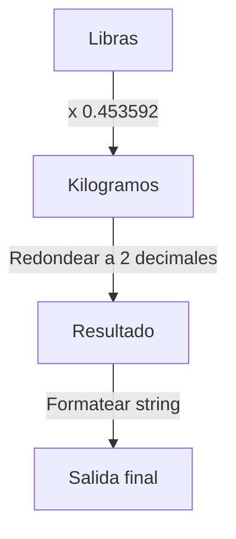

## Enunciado del Problema

Dado un peso en libras como número, devuelve el string:

`(lbs) pounds equals (kgs) kilograms.`

Donde:

- `(lbs)` se reemplaza por el número de entrada.
- `(kgs)` se reemplaza por el valor convertido a kilogramos, redondeado y formateado con dos decimales.
- 1 libra equivale a **0.453592** kilogramos.
- Si la entrada es 1, se usa "pound" en lugar de "pounds".
- Si el valor convertido es 1, se usa "kilogram" en lugar de "kilograms".

## Análisis Inicial

### Comprensión del Problema

La función recibe un número que representa un peso en libras y debe convertirlo a kilogramos usando la equivalencia **1 libra = 0.453592 kg**. El resultado debe ser un string con el formato:

`(lbs) pounds equals (kgs) kilograms.`

Se debe cuidar el formato de decimales y el uso correcto de singular/plural.

### Casos de Prueba Identificados

Los siguientes casos de prueba aseguran el correcto funcionamiento:

- Entrada: **1** → "1 pound equals 0.45 kilograms." (singular)
- Entrada: **0** → "0 pounds equals 0.00 kilograms." (cero)
- Entrada: **100** → "100 pounds equals 45.36 kilograms." (valor grande)
- Entrada: **2.5** → "2.5 pounds equals 1.13 kilograms." (decimal)
- Entrada: **2.20462** → "2.20462 pounds equals 1.00 kilogram." (resultado convertido igual a 1)

## Desarrollo de la Solución

### Enfoque

La conversión se realiza multiplicando el valor en libras por el factor **0.453592** para obtener el peso en kilogramos. El resultado se redondea y formatea a dos decimales. Se utiliza el singular o plural según corresponda.

### Diagrama de Conversión



### Implementación

```javascript
function poundsToKilograms(lbs) {
  const kgs = lbs * 0.453592;
  const roundedKgs = kgs.toFixed(2);
  const poundWord = lbs === 1 ? "pound" : "pounds";
  const kilogramWord = parseFloat(roundedKgs) === 1 ? "kilogram" : "kilograms";
  return `${lbs} ${poundWord} equals ${roundedKgs} ${kilogramWord}.`;
}
```

## Análisis de Complejidad

**Complejidad temporal:** O(1) (operaciones constantes)

**Complejidad espacial:** O(1) (sin estructuras adicionales)

## Casos Especiales y Consideraciones

- Entrada igual a 0: "0 pounds equals 0.00 kilograms."
- Entrada igual a 1: "1 pound equals ... kilograms."
- Resultado convertido igual a 1: "... equals ... kilogram."
- Números decimales y grandes: formato y redondeo correcto.
- El resultado siempre debe mostrar dos decimales.

## Reflexiones y Aprendizajes

**Conceptos aplicados:**

- Conversión de unidades y formateo de números.
- Condicionales para singular/plural.
- Redondeo y formateo de decimales.

**Posibles mejoras:**
La función es óptima en rendimiento. Se podría mejorar la legibilidad o reutilizar la lógica en otros contextos.

## Recursos y Referencias

- [Number.prototype.toFixed() en MDN](https://developer.mozilla.org/en-US/docs/Web/JavaScript/Reference/Global_Objects/Number/toFixed)
- [Conversión de unidades en Wikipedia](https://es.wikipedia.org/wiki/Conversi%C3%B3n_de_unidades)
