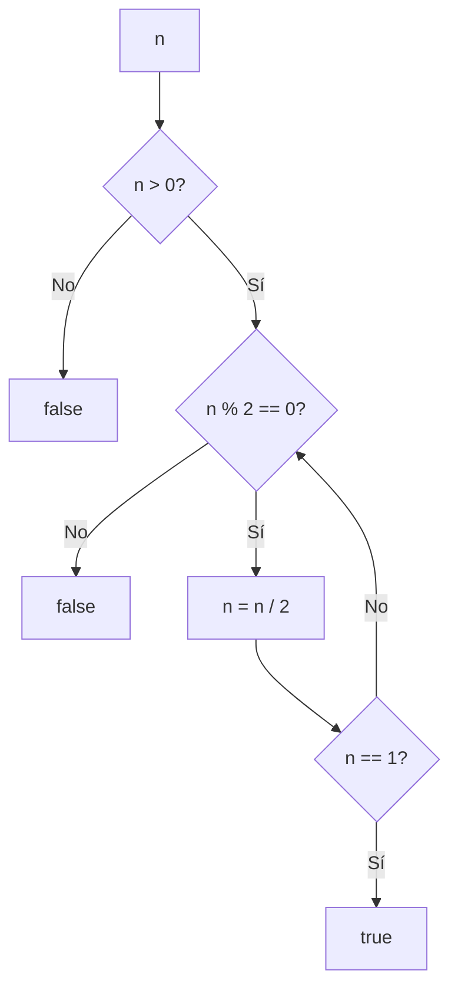

## Introduction

I chose to start the blog with this problem because it's simple with multiple possible solutions and the opportunity to use bitwise operators, which are very attractive to learn.

## Problem Statement

> Given an integer `n`, return `true` if it is a power of two. Otherwise, return `false`.

A power of two is any number that can be expressed as `2^k`, where `k` is a non-negative integer. Examples: `1 (2^0)`, `2 (2^1)`, `4 (2^2)`, `8 (2^3)`, etc.

## Approach 1: Iterative Method

An intuitive solution is to repeatedly divide the number by 2 until reaching 1. If at any point it's not divisible by 2, it's not a power of two.



**Complexity**: O(log n) - For a number like 1,000,000 we need ~20 divisions.

```javascript
function isPowerOfTwoIterative(n) {
  if (n <= 0)
    return false

  while (n > 1) {
    if (n % 2 !== 0)
      return false
    n = n / 2
  }

  return true
}
```

## Approach 2: Bitwise Property (Optimal Solution)

### What are Bitwise Operators?

Bitwise operators are operations that work directly with the individual bits of binary numbers. They are powerful tools for manipulating data at the bit level, very useful in optimization algorithms and low-level problems.

**Main operators:**

- `&` (AND): 1 if both bits are 1
- `|` (OR): 1 if at least one bit is 1
- `^` (XOR): 1 if the bits are different
- `~` (NOT): Inverts all bits
- `<<` (left shift)
- `>>` (right shift)

**Availability:** They are available in most modern programming languages (JavaScript, Python, Java, C++, Go, Rust, etc.), although the syntax may vary slightly. In JavaScript they are written the same as in C/C++.

These operators are especially efficient because they operate directly at the hardware level, without needing costly conversions.

### The Mathematical Property

Powers of two have a unique binary representation: **only one bit set to 1**, the rest are 0.

**Mathematical formula**: If $n$ is a power of 2, then $n \& (n-1) = 0$

Where:

- $n$: number to verify
- $\&$: bitwise AND operator
- $(n-1)$: number before $n$

Binary examples:

- `1` = `0001` → $2^0$
- `2` = `0010` → $2^1$
- `4` = `0100` → $2^2$
- `8` = `1000` → $2^3$
- `16` = `10000` → $2^4$

### What happens with n-1?

When we subtract 1 from a power of two, we get an interesting pattern in binary:

- `1 - 1 = 0` → `0000`
- `2 - 1 = 1` → `0001`
- `4 - 1 = 3` → `0011`
- `8 - 1 = 7` → `0111`
- `16 - 1 = 15` → `01111`

**Observation**: All bits to the right of the original bit become 1, and the original bit becomes 0.

### The Trick: n & (n-1)

**What's the trick?**

The idea is simple but powerful: **if `n` is a power of two, then `n & (n-1)` always results in `0`**.

What if `n` is NOT a power of two? Then `n & (n-1)` will give a number different from zero.

**Why does this work?**

As we saw in the previous section, when we subtract 1 from a power of two:

- The single bit that is 1 becomes 0
- All bits to the right become 1

When we apply the `&` (AND) operator between `n` and `n-1`:

- `n` has only one bit set to 1
- `n-1` has all bits to the right of that bit set to 1
- The result is 0 because no bit is set to 1 in both positions

**Practical examples:**

```javascript
// Powers of two
4 & 3 // 0100 & 0011 = 0000 (0)
8 & 7 // 1000 & 0111 = 0000 (0)
16 & 15 // 10000 & 01111 = 00000 (0)

// Not powers of two
6 & 5 // 0110 & 0101 = 0100 (4 ≠ 0)
10 & 9 // 1010 & 1001 = 1000 (8 ≠ 0)
```

**The complete formula:**

```javascript
function isPowerOfTwo(n) {
  return n > 0 && (n & (n - 1)) === 0
}
```

This trick is incredibly efficient: a single bitwise operation tells us if a number is a power of two.

## Test Cases

```javascript
console.log(isPowerOfTwo(1)) // true  (2^0)
console.log(isPowerOfTwo(2)) // true  (2^1)
console.log(isPowerOfTwo(3)) // false
console.log(isPowerOfTwo(4)) // true  (2^2)
console.log(isPowerOfTwo(6)) // false
console.log(isPowerOfTwo(8)) // true  (2^3)
console.log(isPowerOfTwo(0)) // false (edge case)
console.log(isPowerOfTwo(-2)) // false (negative numbers)
```

## Conclusion

I found this to be an entertaining problem with a solution that isn't intuitive at first glance but turns out to be very efficient using bitwise operations.
Have you solved this problem in another way? Share your approach in the comments!
