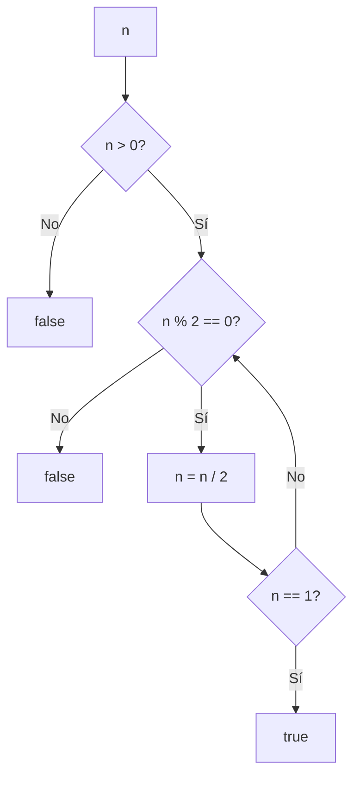

<!-- Commit de prueba - Radike Cosa -->

## Prologo

Elegi comenzar el blog con este problema porque es un problema simple con multiples posibles soluciones y posibilidad de usar operadores bitwise que son muy atractivos para aprender.

## Enunciado del Problema

> Dado un entero `n`, devuelve `true` si es una potencia de dos. De lo contrario, devuelve `false`.

Una potencia de dos es cualquier número que puede expresarse como `2^k`, donde `k` es un entero no negativo. Ejemplos: `1 (2^0)`, `2 (2^1)`, `4 (2^2)`, `8 (2^3)`, etc.

## Enfoque 1: Método Iterativo

Una solución intuitiva es dividir repetidamente el número entre 2 hasta llegar a 1. Si en algún momento no es divisible por 2, no es potencia de dos.



**Complejidad**: O(log n) - Para un número como 1,000,000 necesitamos ~20 divisiones.

```javascript
function isPowerOfTwoIterative(n) {
  if (n <= 0)
    return false

  while (n > 1) {
    if (n % 2 !== 0)
      return false
    n = n / 2
  }

  return true
}
```

## Enfoque 2: Propiedad Bitwise (Solución Óptima)

### ¿Qué son los Operadores Bitwise?

Los operadores bitwise son operaciones que trabajan directamente con los bits individuales de los números binarios. Son herramientas poderosas para manipular datos a nivel de bits, muy útiles en algoritmos de optimización y problemas de bajo nivel.

**Operadores principales:**

- `&` (AND): 1 si ambos bits son 1
- `|` (OR): 1 si al menos un bit es 1
- `^` (XOR): 1 si los bits son diferentes
- `~` (NOT): Invierte todos los bits
- `<<` (desplazamiento izquierda)
- `>>` (desplazamiento derecha)**Disponibilidad:** Están disponibles en la mayoría de lenguajes de programación modernos (JavaScript, Python, Java, C++, Go, Rust, etc.), aunque la sintaxis puede variar ligeramente. En JavaScript se escriben igual que en C/C++.

Estos operadores son especialmente eficientes porque operan directamente a nivel de hardware, sin necesidad de conversiones costosas.

### La Propiedad Matemática

Las potencias de dos tienen una representación binaria única: **solo un bit en 1**, el resto son 0.

**Fórmula matemática**: Si $n$ es potencia de 2, entonces $n \& (n-1) = 0$

Donde:

- $n$: número a verificar
- $\&$: operador AND bit a bit
- $(n-1)$: número anterior a $n$

Ejemplos en binario:

- `1` = `0001` → $2^0$
- `2` = `0010` → $2^1$
- `4` = `0100` → $2^2$
- `8` = `1000` → $2^3$
- `16` = `10000` → $2^4$

### ¿Qué pasa con n-1?

Cuando restamos 1 a una potencia de dos, obtenemos un patrón interesante en binario:

- `1 - 1 = 0` → `0000`
- `2 - 1 = 1` → `0001`
- `4 - 1 = 3` → `0011`
- `8 - 1 = 7` → `0111`
- `16 - 1 = 15` → `01111`

**Observación**: Todos los bits a la derecha del bit original se vuelven 1, y el bit original se vuelve 0.

### El Truco: n & (n-1)

**¿Cuál es el truco?**

La idea es simple pero poderosa: **si `n` es una potencia de dos, entonces `n & (n-1)` siempre da como resultado `0`**.

¿Y si `n` NO es una potencia de dos? Entonces `n & (n-1)` dará un número diferente de cero.

**¿Por qué funciona esto?**

Como vimos en la sección anterior, cuando restamos 1 a una potencia de dos:

- El bit único en 1 se vuelve 0
- Todos los bits a la derecha se vuelven 1

Cuando aplicamos el operador `&` (AND) entre `n` y `n-1`:

- `n` tiene un solo bit en 1
- `n-1` tiene todos los bits a la derecha de ese bit en 1
- El resultado es 0 porque ningún bit está en 1 en ambas posiciones

**Ejemplos prácticos:**

```javascript
// Potencias de dos
4 & 3 // 0100 & 0011 = 0000 (0)
8 & 7 // 1000 & 0111 = 0000 (0)
16 & 15 // 10000 & 01111 = 00000 (0)

// No son potencias de dos
6 & 5 // 0110 & 0101 = 0100 (4 ≠ 0)
10 & 9 // 1010 & 1001 = 1000 (8 ≠ 0)
```

**La fórmula completa:**

```javascript
function isPowerOfTwo(n) {
  return n > 0 && (n & (n - 1)) === 0
}
```

Este truco es increíblemente eficiente: una sola operación bitwise nos dice si un número es potencia de dos.

## Casos de Prueba

```javascript
console.log(isPowerOfTwo(1)) // true  (2^0)
console.log(isPowerOfTwo(2)) // true  (2^1)
console.log(isPowerOfTwo(3)) // false
console.log(isPowerOfTwo(4)) // true  (2^2)
console.log(isPowerOfTwo(6)) // false
console.log(isPowerOfTwo(8)) // true  (2^3)
console.log(isPowerOfTwo(0)) // false (caso borde)
console.log(isPowerOfTwo(-2)) // false (números negativos)
```

## Conclusión

Me parecio un problema con una solucion entretenida con una solucion que no es intuitiva a primera vista pero que resulta muy eficiente usando operaciones bitwise.
¿Has resuelto este problema de otra manera? ¡Comparte tu enfoque en los comentarios!
