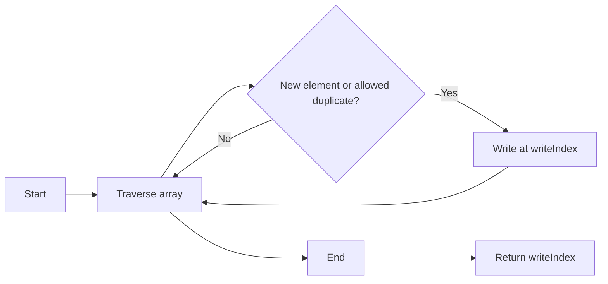

## Introduction

In LeetCode's Top Interview 150 series, problem #80 challenges us to modify a sorted array so that each element appears at most twice, all **in-place** and without extra space. We use the two pointers pattern as the main strategy to solve it efficiently.

## Problem Statement

Given an integer array `nums` sorted in non-decreasing order, remove some duplicates **in-place** so that each unique element appears at most twice. The relative order must be maintained. The function should return the new length `k`, and the first `k` elements of `nums` should contain the result.

**Constraints:**

- $1 \leq \text{nums.length} \leq 3 \times 10^4$
- $-10^4 \leq \text{nums}[i] \leq 10^4$
- `nums` is sorted in non-decreasing order.

**Example 1:**

```plaintext
Input: nums = [1,1,1,2,2,3]
Output: k = 5, nums = [1,1,2,2,3,_]
Explanation: The first 5 elements are [1,1,2,2,3] with at most 2 of each number.
```

**Example 2:**

```plaintext
Input: nums = [0,0,1,1,1,1,2,3,3]
Output: k = 7, nums = [0,0,1,1,2,3,3,_,_]
Explanation: Of 4 consecutive ones, only 2 remain.
```

## Approach & Analysis

The array is sorted, so duplicates are consecutive. This allows us to use the **two pointers** pattern:

- **Read pointer** (`i`): traverses the array.
- **Write pointer** (`writeIndex`): indicates where to place the next valid element.
- **Counter** (`count`): tracks how many times we've seen the current element.

**Step-by-step algorithm:**

```typescript
function removeDuplicates(nums: number[]): number {
  let count = 0
  let writeIndex = 0

  for (let i = 0; i < nums.length; i++) {
    if (i === 0 || nums[i] !== nums[i - 1]) {
      count = 1
      nums[writeIndex] = nums[i]
      writeIndex++
    }
    else if (count < 2) {
      count++
      nums[writeIndex] = nums[i]
      writeIndex++
    }
  }

  return writeIndex
}
```

### Algorithm states

1. **New element**: `nums[i] !== nums[i-1]` → reset count, write element
2. **First duplicate**: `count = 1` → increment count, write element
3. **Excessive duplicate**: `count >= 2` → just advance, do not write
4. **In-place modification**: The array `nums` is modified directly, and `writeIndex` at the end indicates the new length `k`.
5. **Alternative optimization**: Instead of using a counter, we can compare with the element at `nums[writeIndex - 2]` to decide whether to write or not:

```typescript
if (writeIndex < 2 || nums[i] > nums[writeIndex - 2]) {
  nums[writeIndex] = nums[i]
  writeIndex++
}
```

## Algorithm Visualization



## Complexity

- **Time:** $O(n)$, where $n$ is the length of the array `nums`. We traverse the array once.
- **Space:** $O(1)$, since we do not use significant extra space, only auxiliary variables.

## Conclusion

The challenge in this problem is handling the allowed duplicates. Using the two pointers pattern and a counter, we can modify the array **in-place** efficiently, meeting the problem's constraints. The alternative solution with `nums[w-2]` offers a more concise way to achieve the same goal.

### Resources

- [Two Pointers Technique - GeeksforGeeks](https://www.geeksforgeeks.org/two-pointers-technique/)
- [In-Place Operations](https://damely-tineo.medium.com/in-place-operations-javascript-array-edition-c0ae40d9ad81)
