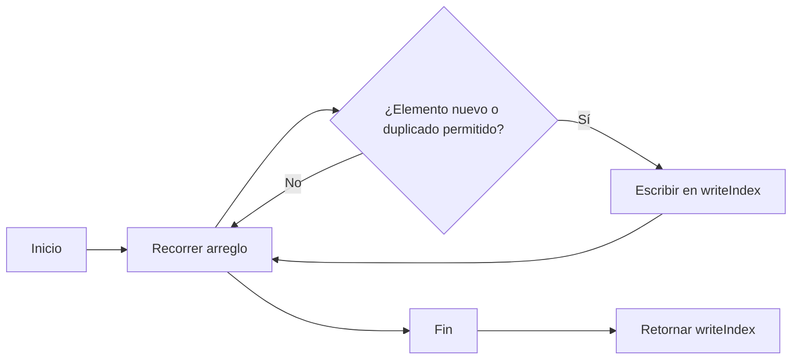

## Introducción

En la serie Top Interview 150 de LeetCode, el problema #80 nos reta a modificar un arreglo ordenado para que cada elemento aparezca como máximo dos veces, todo **in-place** y sin usar espacio extra. Usamos el patron two pointers como estrategia principal para resolverlo eficientemente.

## Enunciado del Problema

Dado un arreglo de enteros `nums` ordenado en orden no decreciente, elimina algunos duplicados **in-place** de modo que cada elemento único aparezca como máximo dos veces. El orden relativo debe mantenerse. La función debe devolver la nueva longitud `k` y los primeros `k` elementos de `nums` deben contener el resultado.

**Restricciones:**

- $1 \leq \text{nums.length} \leq 3 \times 10^4$
- $-10^4 \leq \text{nums}[i] \leq 10^4$
- `nums` está ordenado en orden no decreciente.

**Ejemplo 1:**

```plaintext
Input: nums = [1,1,1,2,2,3]
Output: k = 5, nums = [1,1,2,2,3,_]
Explicación: Los primeros 5 elementos son [1,1,2,2,3] con máximo 2 de cada número.
```

**Ejemplo 2:**

```plaintext
Input: nums = [0,0,1,1,1,1,2,3,3]
Output: k = 7, nums = [0,0,1,1,2,3,3,_,_]
Explicación: De 4 unos consecutivos, solo 2 permanecen.
```

## Enfoque y Análisis

El array está ordenado, así que los duplicados son consecutivos. Esto permite usar el patrón de **two-pointers**:

- **Puntero de lectura** (`i`): recorre el arreglo.
- **Puntero de escritura** (`writeIndex`): indica dónde colocar el siguiente elemento válido.
- **Contador** (`count`): rastrea cuántas veces hemos visto el elemento actual.

**Algoritmo paso a paso:**

```typescript
function removeDuplicates(nums: number[]): number {
  let count = 0
  let writeIndex = 0

  for (let i = 0; i < nums.length; i++) {
    if (i === 0 || nums[i] !== nums[i - 1]) {
      count = 1
      nums[writeIndex] = nums[i]
      writeIndex++
    }
    else if (count < 2) {
      count++
      nums[writeIndex] = nums[i]
      writeIndex++
    }
  }

  return writeIndex
}
```

### Estados del algoritmo

1. **Elemento nuevo**: `nums[i] !== nums[i-1]` → resetear count, escribir elemento
2. **Primer duplicado**: `count = 1` → incrementar count, escribir elemento
3. **Duplicado excesivo**: `count >= 2` → solo avanzar, no escribir
4. **Modificación in-place**: El arreglo `nums` se modifica directamente, y `writeIndex` al final indica la nueva longitud `k`.
5. **Optimización alternativa**: En lugar de usar un contador, podemos comparar con el elemento en `nums[writeIndex - 2]` para decidir si escribir o no:

```typescript
if (writeIndex < 2 || nums[i] > nums[writeIndex - 2]) {
  nums[writeIndex] = nums[i]
  writeIndex++
}
```

## Visualización del Algoritmo



## Complejidad

- **Tiempo:** $O(n)$, donde $n$ es la longitud del arreglo `nums`. Recorremos el arreglo una vez.
- **Espacio:** $O(1)$, ya que no usamos espacio adicional significativo, solo variables auxiliares.

## Conclusión

La dificultad de este problema esta en manejar los duplicados permitidos. Usando el patrón two-pointers y un contador, podemos modificar el arreglo **in-place** eficientemente, cumpliendo con las restricciones del problema. La solución alternativa con `nums[w-2]` ofrece una forma más concisa de lograr el mismo objetivo.

### Recursos

- [Two Pointers Technique - GeeksforGeeks](https://www.geeksforgeeks.org/two-pointers-technique/)
- [In-Place Operations](https://damely-tineo.medium.com/in-place-operations-javascript-array-edition-c0ae40d9ad81)
