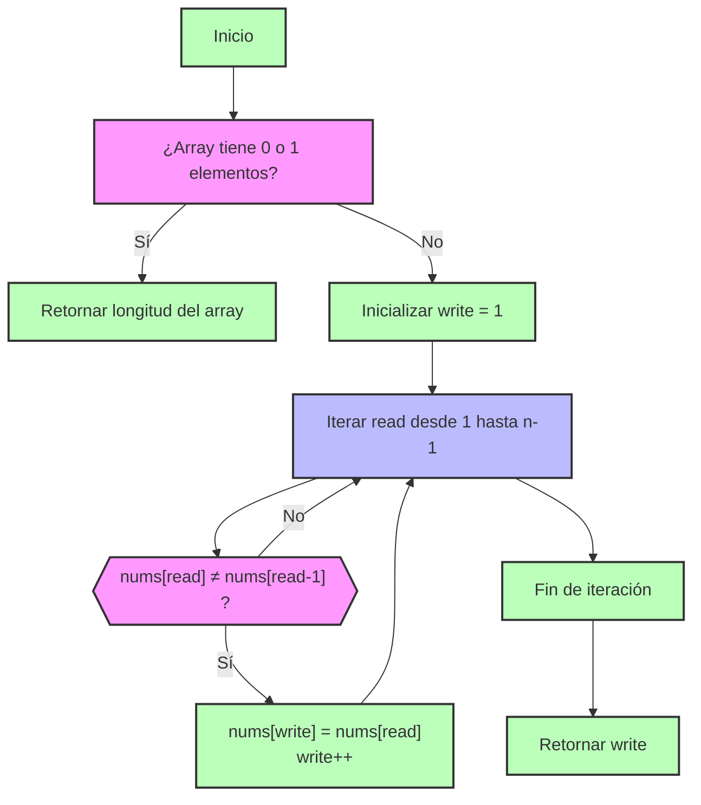

## Introducción

En entrevistas técnicas y desafíos de programación, los problemas de manipulación de arreglos son muy frecuentes. El reto de hoy, el tercero de la serie Top Interview 150 de LeetCode, nos invita a eliminar duplicados de un arreglo ordenado **in situ**, devolviendo la nueva longitud del arreglo sin duplicados. Este tipo de ejercicio es fundamental para practicar técnicas como el patrón de dos punteros y la optimización de espacio.

## Enunciado del Problema

Dado un arreglo de enteros `nums` ordenado en orden no decreciente, elimina los duplicados **in situ** de manera que cada elemento único aparezca solo una vez. El orden relativo de los elementos debe mantenerse igual.

Devuelve el número de elementos únicos `k`. Los primeros `k` elementos de `nums` deben contener los números únicos en orden. Los elementos restantes pueden ser ignorados.

**Restricciones:**

- $1 \leq \text{nums.length} \leq 3 \times 10^4$
- $-100 \leq \text{nums}[i] \leq 100$
- `nums` está ordenado en orden no decreciente.

**Ejemplo 1:**

```plaintext
Input: nums = [1,1,2]
Output: 2, nums = [1,2,_]
Explicación: La función retorna k = 2, con los dos primeros elementos de nums siendo 1 y 2 respectivamente.
```

**Ejemplo 2:**

```plaintext
Input: nums = [0,0,1,1,1,2,2,3,3,4]
Output: 5, nums = [0,1,2,3,4,_,_,_,_,_]
Explicación: La función retorna k = 5, con los cinco primeros elementos de nums siendo 0, 1, 2, 3 y 4 respectivamente.
```

## Análisis y Observaciones Iniciales

1. **Arreglo Ordenado**: Dado que el arreglo está ordenado, los duplicados estarán agrupados juntos. Esto nos permite comparar cada elemento con su predecesor para identificar duplicados.
2. **Modificación In Situ**: No podemos usar espacio adicional significativo, lo que nos obliga a modificar el arreglo original.
3. **Solo los primeros k elementos importan**: Después de eliminar duplicados, solo necesitamos asegurarnos de que los primeros k elementos sean únicos; el resto del arreglo puede contener cualquier valor.
4. **Mantener el Orden Relativo**: Los elementos únicos deben mantener su orden original en el arreglo.

## Enfoque y Estrategia de Solución

Para abordar este problema de manera eficiente, utilizamos el patrón de **dos punteros**:

- El puntero `read` recorre el arreglo buscando elementos únicos.
- El puntero `write` indica la posición donde se debe escribir el siguiente elemento único encontrado.

El algoritmo sigue estos pasos:

1. Si el arreglo tiene 0 o 1 elementos, simplemente retornamos su longitud.
2. Inicializamos `write = 1`, ya que el primer elemento siempre es único.
3. Iteramos desde `read = 1` hasta el final del arreglo.
4. Si `nums[read]` es diferente de `nums[read-1]`, hemos encontrado un nuevo elemento único:
   - Lo copiamos en la posición `write`.
   - Incrementamos `write`.
5. Al finalizar, retornamos el valor de `write`, que representa la cantidad de elementos únicos.

Esta estrategia aprovecha el hecho de que el arreglo está ordenado, lo que garantiza que los duplicados estén agrupados y facilita su eliminación en una sola pasada.

## Implementación y Explicación del Código

La solución utiliza dos punteros para recorrer y modificar el arreglo en una sola pasada. El puntero `read` identifica elementos únicos y el puntero `write` los coloca en su posición correspondiente. Así, el arreglo se actualiza in-place y se retorna la cantidad de elementos únicos.

A continuación, el código con comentarios explicativos:

```typescript
export function removeDuplicates(nums: number[]): number {
  // Caso base: arreglos de 0 o 1 elemento no tienen duplicados
  if (nums.length <= 1)
    return nums.length

  // 'write' apunta a la posición donde se escribirá el próximo valor único
  let write = 1

  // Recorremos el arreglo desde la segunda posición
  for (let read = 1; read < nums.length; read++) {
    // Si encontramos un valor distinto al anterior, es único
    if (nums[read] !== nums[read - 1]) {
      nums[write] = nums[read] // Escribimos el valor único
      write++ // Avanzamos el puntero de escritura
    }
  }

  // Retornamos la cantidad de valores únicos encontrados
  return write
}
```

Este enfoque garantiza eficiencia tanto en tiempo como en espacio, cumpliendo con las restricciones del problema.

**Trace del Ejemplo 1: `[1,1,2]`**

```
Inicial: [1,1,2], write=1
read=1: nums[1]=1 === nums[0]=1 → no escribir
read=2: nums[2]=2 !== nums[1]=1 → escribir en write=1
        [1,2,2], write=2
Resultado: k=2, primeros 2 elementos = [1,2] ✓
```

**Trace del Ejemplo 2: `[0,0,1,1,1,2,2,3,3,4]`**

```
Inicial: [0,0,1,1,1,2,2,3,3,4], write=1
read=1: 0===0 → no escribir
read=2: 1!==0 → escribir en write=1 → [0,1,1,1,1,2,2,3,3,4], write=2
read=3: 1===1 → no escribir
read=4: 1===1 → no escribir
read=5: 2!==1 → escribir en write=2 → [0,1,2,1,1,2,2,3,3,4], write=3
read=6: 2===2 → no escribir
read=7: 3!==2 → escribir en write=3 → [0,1,2,3,1,2,2,3,3,4], write=4
read=8: 3===3 → no escribir
read=9: 4!==3 → escribir en write=4 → [0,1,2,3,4,2,2,3,3,4], write=5
Resultado: k=5, primeros 5 elementos = [0,1,2,3,4] ✓
```

## Visualización del Algoritmo



## Complejidad Algorítmica

- **Tiempo**: O(n) - una sola pasada por el array
- **Espacio**: O(1) - solo variables adicionales, modificación in-place

## Casos Edge y Pruebas

### Casos Edge

- **Array de un elemento**: `[1]` → retorna `1`
- **Todos elementos iguales**: `[1,1,1,1]` → retorna `1`
- **Sin duplicados**: `[1,2,3,4]` → retorna `4`
- **Dos elementos iguales**: `[1,1]` → retorna `1`
- **Dos elementos diferentes**: `[1,2]` → retorna `2`

## Conclusiones y Aprendizajes

Este problema es un excelente ejemplo de cómo aprovechar las propiedades de los datos (en este caso, el orden del arreglo) para diseñar soluciones eficientes. El patrón de dos punteros permite modificar el arreglo in-place y mantener la eficiencia tanto en tiempo como en espacio.

Además, practicar este tipo de ejercicios ayuda a fortalecer la habilidad de identificar patrones recurrentes en problemas de arrays y a pensar en optimizaciones que respeten las restricciones de memoria.

**¿Cuándo aplicar este enfoque?**
Siempre que debas eliminar duplicados de un arreglo ordenado sin usar espacio adicional, el patrón de dos punteros es una opción robusta y eficiente.
