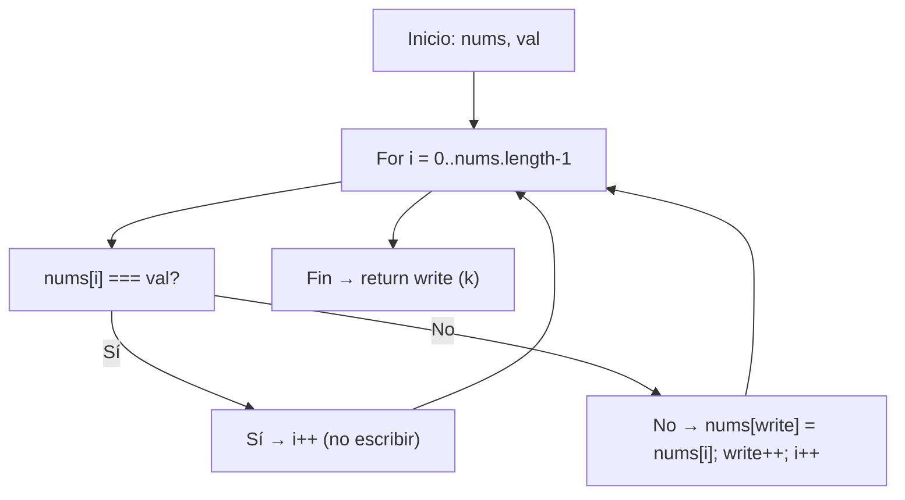

## Remover Elementos — LeetCode 27 (Top Interview 2/150)

El problema Remove Element pide, dado un array de enteros `nums` y un entero `val`, "remover" todas las ocurrencias de `val` **in-place** y devolver el número de elementos que no son `val`. Importante: here "remover" no significa reducir la longitud del array en memoria, sino reorganizarlo de modo que los primeros `k` elementos sean los válidos.

En este post explico una solución simple y eficiente basada en la técnica Two Pointers, con visualizaciones y ejemplos para que quede claro qué ocurre con el array.

---

## 🧾 Enunciado resumido

- Entrada: `nums` (array de enteros), `val` (entero)
- Requerimiento: modificar `nums` de forma in-place para que las primeras `k` posiciones contengan los elementos que no son `val`.
- Retornar `k` (cantidad de elementos != `val`).
- El orden relativo de los elementos restantes no importa.
- Restricciones relevantes: `0 <= nums.length <= 100`.

---

## 🧠 Idea principal (Two Pointers)

Usamos dos índices:

- `i` (read pointer): recorre todo el array.
- `write` (write pointer): indica la próxima posición donde escribir un elemento válido.

Cada vez que `nums[i] !== val` copiamos `nums[i]` en `nums[write]` y avanzamos `write`. Al final `write` es exactamente `k`.

---

## 🔁 Visualización del flujo (Mermaid - vertical)



---

## ✅ Implementación (TypeScript / JavaScript)

Esta es la función usada en el repositorio:

```ts
export function removeElement(nums: number[], val: number): number {
  let write = 0 // posición donde escribir el siguiente elemento válido

  for (let i = 0; i < nums.length; i++) {
    if (nums[i] !== val) {
      nums[write] = nums[i]
      write++
    }
    // si nums[i] === val lo tratamos como "non-existent" y no lo copiamos
  }

  return write // k: número de elementos válidos
}
```

---

## 🔍 Ejemplo paso a paso

Entrada: `nums = [0,1,2,2,3,0,4,2]`, `val = 2`

- Inicial: `write = 0`
- i=0: nums[0]=0 != 2 → nums[0]=0, write=1
- i=1: nums[1]=1 != 2 → nums[1]=1, write=2
- i=2: nums[2]=2 == 2 → skip
- i=3: nums[3]=2 == 2 → skip
- i=4: nums[4]=3 != 2 → nums[2]=3, write=3
- i=5: nums[5]=0 != 2 → nums[3]=0, write=4
- i=6: nums[6]=4 != 2 → nums[4]=4, write=5
- i=7: nums[7]=2 == 2 → skip

Resultado: `k = 5`, primeros 5 elementos (en cualquier orden válido) → `[0,1,3,0,4]`. El array completo puede ser algo como `[0,1,3,0,4,0,4,2]`, pero solo las primeras `k` importan.

---

## 🧪 Tests (ejemplos prácticos)

Los tests incluidos en el repo validan los casos principales:

- `removeElement([3,2,2,3], 3) → 2` y `nums.slice(0,2) === [2,2]`
- `removeElement([0,1,2,2,3,0,4,2], 2) → 5` y `nums.slice(0,5) === [0,1,3,0,4]`
- Edge cases:
  - Array vacío → retorna `0`.
  - Todos los elementos son `val` → retorna `0`.
  - Ningún elemento es `val` → retorna `nums.length`.

---

## ⚙️ Complejidad

- Tiempo: O(n) — una sola pasada sobre el array.
- Espacio: O(1) — in-place, uso constante de memoria adicional.

---

## ⚠️ Aclaraciones frecuentes

- "Remover" no implica cambiar la longitud del array en memoria: el array conserva su tamaño; solo se reorganizan los primeros `k` elementos.
- El orden relativo de los elementos válidos no es un requisito; por eso basta con copiarlos al inicio.
- Este patrón es ideal cuando el espacio extra está limitado.

---

## 🧩 Patrones y aprendizaje

- Patrón fundamental: Two Pointers (read/write).
- Útil para: eliminación in-place, particionado de arrays, filtrado sin memoria extra.
- Ventaja: simple, robusto y eficiente.

---
