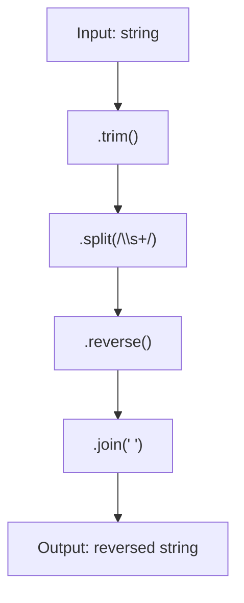

## Reverse Sentence — Analysis & Explanation 🚀

### Problem Statement

Given a string of words, return a new string with the words in reverse order. For example, the first word should be at the end and the last word at the beginning.

**Conditions:**
- Words may be separated by one or more spaces.
- The returned string must have only one space between each word.

## Initial Analysis

### What does the challenge ask?

Reverse the order of the words and normalize spaces. That is:

1. Correctly split the words (ignoring extra spaces).
2. Reorder and print them in reverse order, separated by a single space.

For this, JavaScript's `split`, `reverse`, and `join` methods are ideal.

### Key Test Cases

- Input: `"world hello"` → Output: `"hello world"`
- Input: `"push   commit git"` → Output: `"git commit push"`
- Input: `"npm    install   sudo"` → Output: `"sudo install npm"`
- Input: `"import   default function   export"` → Output: `"export function default import"`

All cases normalize spaces and reverse the word order.

## Solution Development

### Strategy

1. **Split** using `.split(/\s+/)` to get only words.
2. **Reverse** the array.
3. **Join** with `.join(' ')` to ensure a single space.

<details>
<summary>📝 <b>Flowchart (Mermaid)</b></summary>


</details>

### JavaScript Implementation

```javascript
function reverseSentence(sentence) {
  return sentence
    .trim() // Remove leading/trailing spaces
    .split(/\s+/) // Split into words, ignore extra spaces
    .reverse() // Reverse the array
    .join(' ') // Join with a single space
}
```

## Complexity Analysis

### Time

Each operation (`trim`, `split`, `reverse`, `join`) traverses the string or array once: $$O(n)$$

### Space

Auxiliary arrays proportional to the input size are created: $$O(n)$$

## Edge Cases & Considerations

- **Empty string or only spaces:** returns "" (empty).
- **Leading/trailing spaces:** are removed.
- **Multiple spaces between words:** normalized to one.
- **Single word:** returns the same, no extra spaces.

## Reflections & Learnings

🔹 **Strings & arrays:** efficient manipulation in JS.
🔹 **Regular expressions:** robust against "messy" input.
🔹 **Functional composition:** readable and compact code.

💡 The solution is optimal and readable. No further optimizations needed.

## Resources & References

- [String.prototype.split() - MDN](https://developer.mozilla.org/en-US/docs/Web/JavaScript/Reference/Global_Objects/String/split)
- [Array.prototype.reverse() - MDN](https://developer.mozilla.org/en-US/docs/Web/JavaScript/Reference/Global_Objects/Array/reverse)
- [Array.prototype.join() - MDN](https://developer.mozilla.org/en-US/docs/Web/JavaScript/Reference/Global_Objects/Array/join)

---

### Publication Checklist ✅

- [x] Direct, filler-free sentences
- [x] No redundancies
- [x] Clear step-by-step explanation
- [x] Visuals and examples included
- [x] Correct frontmatter and tags
