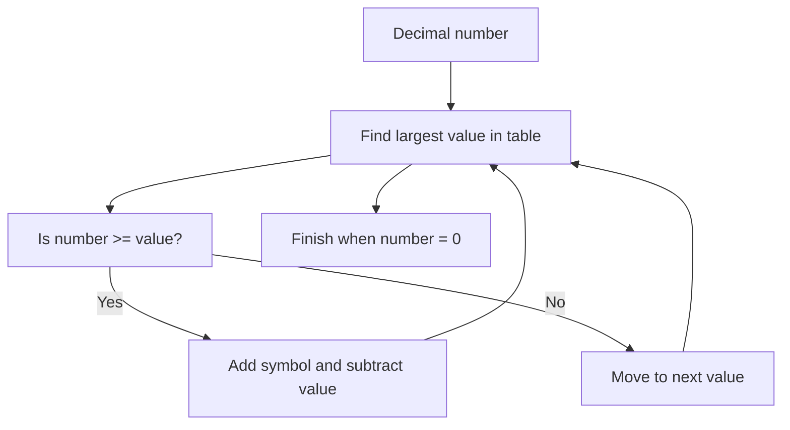

## Roman Numeral Builder

## Problem Statement

Given an integer, return its equivalent in Roman numerals.

### Roman Symbols

| Symbol | Value |
|--------|-------|
| I      | 1     |
| V      | 5     |
| X      | 10    |
| L      | 50    |
| C      | 100   |
| D      | 500   |
| M      | 1000  |

#### Main Rules

- Symbols are written from largest to smallest, left to right.
- **Addition:** If a symbol is followed by another equal or smaller, they are added. Example: 18 → XVIII.
- **Subtraction:** If a smaller symbol appears before a larger one, it is subtracted. Example: 19 → XIX.
- No symbol is repeated more than three times in a row. Thus, 4 is written as IV, not IIII.
- The maximum representable number is 3999.

Example: 1464 → MCDLXIV

## Initial Analysis

How do you convert a decimal number to Roman without getting lost in the rules? 🤔

### Key Test Cases

- Only addition: 18 → XVIII
- Subtraction: 19 → XIX
- Combination: 1464 → MCDLXIV
- Large numbers: 2025 → MMXXV
- Upper limit: 3999 → MMMCMXCIX

These examples cover the most important scenarios and help validate the function.

## Solution Development

### Flowchart



### Approach

We use an ordered table of value-symbol pairs (including subtraction cases like 900, 400, etc.). We iterate from largest to smallest, and while the number is greater than or equal to the value, we add the symbol and subtract the value. This efficiently builds the Roman numeral without errors.

### Step-by-Step Implementation

```js
// Value-symbol table, ordered from largest to smallest
const romanMap = [
  { value: 1000, symbol: 'M' },
  { value: 900, symbol: 'CM' },
  { value: 500, symbol: 'D' },
  { value: 400, symbol: 'CD' },
  { value: 100, symbol: 'C' },
  { value: 90, symbol: 'XC' },
  { value: 50, symbol: 'L' },
  { value: 40, symbol: 'XL' },
  { value: 10, symbol: 'X' },
  { value: 9, symbol: 'IX' },
  { value: 5, symbol: 'V' },
  { value: 4, symbol: 'IV' },
  { value: 1, symbol: 'I' },
]

function toRoman(num) {
  let result = ''
  for (const { value, symbol } of romanMap) {
    // While the number is greater or equal to the current value
    while (num >= value) {
      result += symbol // Add the symbol
      num -= value // Subtract the value
    }
  }
  return result
}
```

**Why does it work?**
The algorithm always picks the largest possible value at each step, avoiding repetitions and applying subtraction rules automatically.

## Complexity Analysis

### Time

$O(1)$: The loop iterates over a fixed table of 13 pairs, regardless of the input number.

### Space

$O(1)$: Only space for the result string and the table, both of constant size.

## Edge Cases and Considerations

- Minimum value: 1 → I
- Maximum value: 3999 → MMMCMXCIX
- Numbers outside the standard Roman range are not accepted.
- The algorithm assumes valid input.

## Reflections and Learnings

What did we learn?

- Using a lookup table simplifies the logic.
- The greedy pattern is ideal for this type of conversion.
