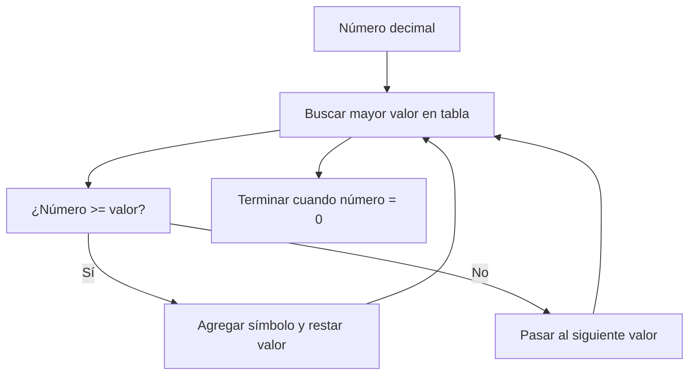

## Roman Numeral Builder

## Enunciado

Dado un número entero, devuelve su equivalente en números romanos.

### Símbolos Romanos

| Símbolo | Valor |
|---------|-------|
| I       | 1     |
| V       | 5     |
| X       | 10    |
| L       | 50    |
| C       | 100   |
| D       | 500   |
| M       | 1000  |

#### Reglas principales

- Los símbolos se escriben de mayor a menor, de izquierda a derecha.
- **Adición:** Si un símbolo es seguido por otro igual o menor, se suman. Ejemplo: 18 → XVIII.
- **Sustracción:** Si un símbolo menor aparece antes de uno mayor, se resta. Ejemplo: 19 → XIX.
- Ningún símbolo se repite más de tres veces seguidas. Por eso, 4 se escribe IV y no IIII.
- El número máximo representable es 3999.

Ejemplo: 1464 → MCDLXIV

## Análisis Inicial

¿Cómo convertir un número decimal en romano sin perderse en las reglas? 🤔

### Casos de Prueba Clave

- Solo suma: 18 → XVIII
- Sustracción: 19 → XIX
- Combinación: 1464 → MCDLXIV
- Números grandes: 2025 → MMXXV
- Límite superior: 3999 → MMMCMXCIX

Estos ejemplos cubren los escenarios más importantes y ayudan a validar la función.

## Desarrollo de la Solución

### Diagrama de Flujo



### Enfoque

Usamos una tabla ordenada de pares valor-símbolo (incluyendo los de sustracción como 900, 400, etc.). Recorremos la tabla de mayor a menor y, mientras el número sea mayor o igual al valor, agregamos el símbolo y restamos el valor. Así se construye el número romano de forma eficiente y sin errores.

### Implementación Paso a Paso

```js
// Tabla de valores y símbolos, ordenada de mayor a menor
const romanMap = [
  { value: 1000, symbol: 'M' },
  { value: 900, symbol: 'CM' },
  { value: 500, symbol: 'D' },
  { value: 400, symbol: 'CD' },
  { value: 100, symbol: 'C' },
  { value: 90, symbol: 'XC' },
  { value: 50, symbol: 'L' },
  { value: 40, symbol: 'XL' },
  { value: 10, symbol: 'X' },
  { value: 9, symbol: 'IX' },
  { value: 5, symbol: 'V' },
  { value: 4, symbol: 'IV' },
  { value: 1, symbol: 'I' },
]

function toRoman(num) {
  let result = ''
  for (const { value, symbol } of romanMap) {
    // Mientras el número sea mayor o igual al valor actual
    while (num >= value) {
      result += symbol // Agrega el símbolo
      num -= value // Resta el valor
    }
  }
  return result
}
```

**¿Por qué funciona?**
El algoritmo siempre elige el mayor valor posible en cada paso, evitando repeticiones y aplicando las reglas de sustracción automáticamente.

## Análisis de Complejidad

### Temporal

$O(1)$: El ciclo recorre una tabla fija de 13 pares, sin importar el número de entrada.

### Espacial

$O(1)$: Solo se usa espacio para la cadena resultado y la tabla, ambos de tamaño constante.

## Casos Edge y Consideraciones

- Valor mínimo: 1 → I
- Valor máximo: 3999 → MMMCMXCIX
- No se aceptan números fuera del rango estándar romano.
- El algoritmo asume que la entrada es válida.

## Reflexiones y Aprendizajes

¿Qué aprendimos?

- El uso de una tabla de búsqueda simplifica la lógica.
- El patrón greedy es ideal para este tipo de conversión.
