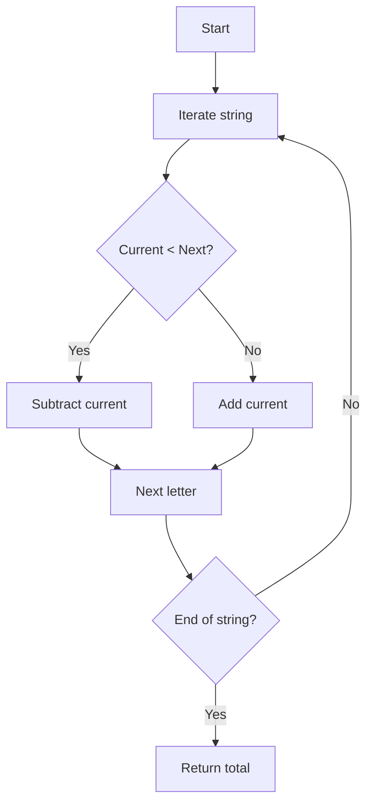

## Roman Numeral Parser: Analysis & Solution

### 1. Problem Statement

Given a string representing a Roman numeral, return its integer value. Example: "MCMXCIV" → 1994.

| Letter | Value |
|--------|-------|
| I      | 1     |
| V      | 5     |
| X      | 10    |
| L      | 50    |
| C      | 100   |
| D      | 500   |
| M      | 1000  |

**Key rule:** If a smaller letter comes before a larger one, subtract it; otherwise, add it.

---

### 2. Initial Analysis

- What’s required? Convert Roman numerals to integers, following sum/subtract rules.

#### Test Cases

| Input      | Expected Output |
|------------|----------------|
| III        | 3              |
| IV         | 4              |
| IX         | 9              |
| LVIII      | 58             |
| MCMXCIV    | 1994           |
| XLII       | 42             |
| CDXLIV     | 444            |
| MMXXI      | 2021           |
| DCCC       | 800            |

---

### 3. Solution & Code

**Strategy:**

1. Map each letter to its value.
2. Iterate the string left to right.
3. If the current value is less than the next, subtract; else, add.

```ts
// Value mapping
const values: Record<string, number> = {
  I: 1,
  V: 5,
  X: 10,
  L: 50,
  C: 100,
  D: 500,
  M: 1000
}

function parseRoman(s: string): number {
  let total = 0
  for (let i = 0; i < s.length; i++) {
    const current = values[s[i]]
    const next = values[s[i + 1]] ?? 0
    if (current < next) {
      total -= current
    }
    else {
      total += current
    }
  }
  return total
}
```

#### Flowchart



---

### 4. Complexity

- **Time:** $O(n)$, single pass through the string.
- **Space:** $O(1)$, fixed map.

---

### 5. Edge Cases

- Empty string → 0
- Invalid input: assume always valid
- Very long numerals: still efficient

---

### 6. Reflections

- Simple mapping and conditional logic solve the problem.
- The "look-ahead" pattern is useful in parsing.
- Can be adapted for validation or other numeral systems.

---

### 7. Resources

- [FreeCodeCamp - Roman Numeral Parser](https://www.freecodecamp.org/learn/daily-coding-challenge/2025-09-07/)
- [Wikipedia - Roman Numerals](https://en.wikipedia.org/wiki/Roman_numerals)
