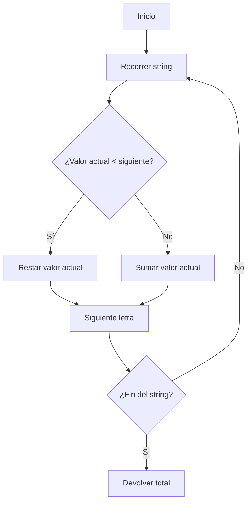

## Parseador de Números Romanos: Análisis y Solución

### 1. Enunciado

Dado un string con un número romano, devuelve su valor entero. Ejemplo: "MCMXCIV" → 1994.

| Letra | Valor |
|-------|-------|
| I     | 1     |
| V     | 5     |
| X     | 10    |
| L     | 50    |
| C     | 100   |
| D     | 500   |
| M     | 1000  |

**Regla clave:** Si una letra menor precede a una mayor, se resta; si no, se suma.

---

### 2. Análisis Inicial

- ¿Qué pide? Convertir números romanos a enteros, respetando reglas de suma/resta.

#### Casos de prueba

| Entrada    | Salida esperada |
|------------|-----------------|
| III        | 3               |
| IV         | 4               |
| IX         | 9               |
| LVIII      | 58              |
| MCMXCIV    | 1994            |
| XLII       | 42              |
| CDXLIV     | 444             |
| MMXXI      | 2021            |
| DCCC       | 800             |

---

### 3. Solución y Código

**Estrategia:**

1. Mapear cada letra a su valor.
2. Recorrer el string de izquierda a derecha.
3. Si el valor actual es menor que el siguiente, restar; si no, sumar.

```ts
// Mapeo de valores
const valores: Record<string, number> = {
  I: 1,
  V: 5,
  X: 10,
  L: 50,
  C: 100,
  D: 500,
  M: 1000
}

function parsearRomano(s: string): number {
  let total = 0
  for (let i = 0; i < s.length; i++) {
    const actual = valores[s[i]]
    const siguiente = valores[s[i + 1]] ?? 0
    if (actual < siguiente) {
      total -= actual
    }
    else {
      total += actual
    }
  }
  return total
}
```

#### Diagrama de flujo



---

### 4. Complejidad

- **Temporal:** $O(n)$, una pasada por el string.
- **Espacial:** $O(1)$, el mapa es fijo.

---

### 5. Casos Edge

- String vacío → 0
- Entrada inválida: asumimos siempre válida
- Números muy largos: sigue siendo eficiente

---

### 6. Reflexiones

- Mapeo y lógica condicional simple resuelven el problema.
- El patrón de "mirar adelante" es útil en parsing.
- Se puede adaptar para validación o extensión a otros sistemas numéricos.

---

### 7. Recursos

- [FreeCodeCamp - Roman Numeral Parser](https://www.freecodecamp.org/learn/daily-coding-challenge/2025-09-07/)
- [Wikipedia - Roman Numerals](https://en.wikipedia.org/wiki/Roman_numerals)
