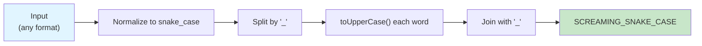

## Problem Statement

Convert a variable name from any of these formats:

- **camelCase**: `"thisIsVariable"`
- **PascalCase**: `"ThisIsVariable"`
- **snake_case**: `"this_is_variable"`
- **kebab-case**: `"this-is-variable"`

To **SCREAMING_SNAKE_CASE**:

- All letters in uppercase
- Words separated by underscores (`_`)

## Initial Analysis

### Goal

Identify individual words regardless of the original format:

- **Dashes**: `-` or `_` mark word boundaries
- **Uppercase letters**: indicate the start of a new word in camelCase/PascalCase

Then join with `_` and convert to uppercase.

### Test Cases

| Input | Output | Format |
|---------|--------|---------|
| `"userEmail"` | `"USER_EMAIL"` | camelCase |
| `"UserPassword"` | `"USER_PASSWORD"` | PascalCase |
| `"user_id"` | `"USER_ID"` | snake_case |
| `"user-address"` | `"USER_ADDRESS"` | kebab-case |
| `"username"` | `"USERNAME"` | simple word |

### Strategy: Normalize → Transform



## Implementation

```javascript
function toScreamingSnakeCase(variableName) {
  // 1. Insert _ before uppercase: "userEmail" → "user_Email"
  const withUnderscores = variableName.replace(/([a-z])([A-Z])/g, '$1_$2')

  // 2. Normalize dashes: "user-address" → "user_address"
  const normalized = withUnderscores.replace(/-/g, '_')

  // 3. Split: "user_Email" → ["user", "Email"]
  const words = normalized.split('_')

  // 4. Uppercase + join: ["user", "Email"] → "USER_EMAIL"
  return words.map(word => word.toUpperCase()).join('_')
}
```

## Complexity Analysis

### Time: $O(n)$

Each operation traverses the string linearly:

| Operation | Complexity | Description |
|-----------|-------------|-------------|
| `replace` (regex) | $O(n)$ | Examines each character once |
| `replace` (dashes) | $O(n)$ | Traverses the entire string |
| `split('_')` | $O(n)$ | Splits the string |
| `map().join()` | $O(n)$ | Iterates words and rebuilds |

**Total**: $O(n) + O(n) + O(n) + O(n) = O(n)$

### Space: $O(n)$

Auxiliary structures created:

- Intermediate strings (`withUnderscores`, `normalized`)
- `words` array with extracted words
- Output string

All proportional to the input length.

## Edge Cases

### ✅ Handled Correctly

| Input | Output | Note |
|-------|--------|------|
| `""` | `""` | Empty string |
| `"username"` | `"USERNAME"` | Simple word |
| `"aB"` | `"A_B"` | Individual letters |
| `"mixedFormat_case"` | `"MIXED_FORMAT_CASE"` | Combined formats |

### ⚠️ Limitations

**Acronyms**: `"XMLParser"` → `"X_M_L_PARSER"` (each uppercase generates separation)

**Numbers**: `"user2Email"` → `"USER2EMAIL"` (current regex doesn't detect numbers as boundaries)

**Consecutive underscores**: `"user__email"` → `"USER__EMAIL"` (preserved)

## Reflections

### Key Concepts

- **Regex with capture groups**: `/([a-z])([A-Z])/g` + `'$1_$2'` inserts characters between groups
- **Data normalization**: Converting multiple formats to an intermediate one reduces complexity
- **Functional pipeline**: `replace → split → map → join` is declarative and readable
- **Simple vs. complex regex**: A single regex handling all cases would be harder to maintain. Clarity over brevity.

### What I Learned

✨ Normalizing first simplifies the problem
✨ Regex with `$1`, `$2` enables precise insertions
✨ `split → map → join` is a common pattern in text transformations

## Resources and References

- [MDN - String.prototype.replace()](https://developer.mozilla.org/en-US/docs/Web/JavaScript/Reference/Global_Objects/String/replace)
- [MDN - Regular Expressions](https://developer.mozilla.org/en-US/docs/Web/JavaScript/Guide/Regular_Expressions)
- [MDN - String.prototype.split()](https://developer.mozilla.org/en-US/docs/Web/JavaScript/Reference/Global_Objects/String/split)
- [MDN - Array.prototype.map()](https://developer.mozilla.org/en-US/docs/Web/JavaScript/Reference/Global_Objects/Array/map)
- [Naming Conventions in Programming](https://en.wikipedia.org/wiki/Naming_convention_(programming))
